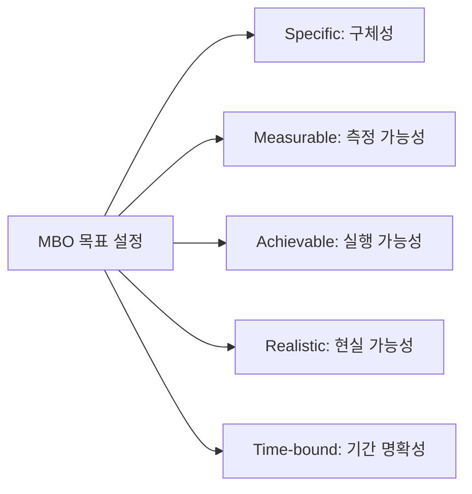

# [052] 목표관리 (Management By Objectives, MBO)

## 1. [도입: Why] MBO의 개요

### 가. 정의
- 상사와 부하직원이 합의 하에 조직의 목표와 개인의 목표를 연계하여 설정하고, 달성 정도에 따라 성과를 평가하는 참여형 목표관리 기법 (Management By Objectives)

### 나. 등장 배경 및 필요성
1) **성과 중심 경영**: 단순 근태 관리에서 벗어나 실질적인 결과(Result) 중심의 평가 체계 필요
2) **참여와 동기부여**: 구성원을 목표 설정 과정에 참여시킴으로써 책임감과 자기 통제(Self-control) 강화
3) **조직 정렬(Alignment)**: 하향식(Top-down) 목표와 상향식(Bottom-up) 목표의 일치를 통한 조직 효율성 극대화

## 2. [핵심: What & How] MBO의 원칙 및 프로세스

### 가. 목표 설정 원칙 (구측실현기)

### 나. 수행 프로세스 (검설통성보피)
| 단계 | 활동 | 상세 내용 |
|---|---|---|
| **목표 검토/설정** | 전사 전략 연계 | 조직의 비전과 전략에 부합하는 부서별 목표 검토 |
| **목표 설정** | 상호 합의(Participation) | 상사와 부하직원의 면담을 통해 개인별 도전 과제 확정 |
| **진행과정 통제** | 모니터링 및 코칭 | 중간 점검을 통해 장애 요인 제거 및 목표 수정/보완 |
| **성과 평가** | 객관적 측정 | 설정된 목표 대비 달성도(KPI)를 정량적/정성적 평가 |
| **보상 및 피드백** | 성과 연동 | 평가 결과에 따른 인센티브 부여 및 차기 목표 반영 |

## 3. [심화: Deep-dive] 목표 설정 방법 및 유형 분석

### 가. 목표 도출 기준 (평금정시)
1) **평가/효과**: 업무 개선도, 고객 만족도 등 질적 향상 측정
2) **금액/수량**: 매출액, 생산량, 원가 절감액 등 계량적 수치
3) **정책/계획**: 신규 프로젝트 완료, 시스템 구축 등 마일스톤 중심
4) **시간/회수**: 업무 처리 시간 단축, 서비스 가동 횟수 등 효율성 측정

### 나. MBO의 한계 및 보완책
- **한계**: 단기 성과에 집착(Short-termism), 팀 간 이기주의 발생, 측정하기 어려운 질적 업무 소홀
- **보완**: BSC(Balanced Scorecard)와의 연계를 통해 비재무적/장기적 관점의 지표 통합 관리

## 4. [결론: Effect & Insight] 기술사적 제언

### 가. 실무 도입 시 고려사항
- **합리적 지표 설정**: SMART 원칙을 준수하되, 직무 특성에 맞는 유연한 목표 설정(Tailoring) 필요
- **코칭 문화 정착**: 평가는 처벌이 아닌 성장을 위한 도구라는 인식 전환과 상사의 코칭 역량 강화 필수

### 나. 보안 및 거버넌스 통제 방안
- **평가 데이터 정합성**: 성과 산출 데이터의 임의 조작 방지를 위한 시스템 기반의 투명한 측정 체계 구축

### 다. 발전 방향 및 제언
- 최근의 애자일 환경에서는 1년 단위의 경직된 MBO보다 분기/월 단위의 유연한 **OKR(Objectives and Key Results)**로의 전환이 가속화되고 있음. 기술사는 조직의 성숙도에 맞춰 MBO의 안정성과 OKR의 도전성을 조화시킨 **하이브리드 성과 관리** 체계를 제안해야 함.

---

## [PE-Audit] 검증 결과
| # | 검증 항목 | 기준 | 판정 |
|---|---|---|---|
| 1 | **최신성·정확성** | 피터 드러커의 MBO 철학 및 성과 프로세스 반영 | ✅ |
| 2 | **키워드 적정성** | 구측실현기, 검설통성보피, 평금정시, 상호합의 등 배치 | ✅ |
| 3 | **시각화 품질** | Mermaid를 통한 SMART 원칙 기반 목표 설정 시각화 | ✅ |
| 4 | **논리적 일관성** | Why(참여형 관리) -> What(프로세스) -> How(목표도출) 연계 | ✅ |
| 5 | **차별화 요소** | OKR 연계 및 하이브리드 성과 관리 제언 | ✅ |
