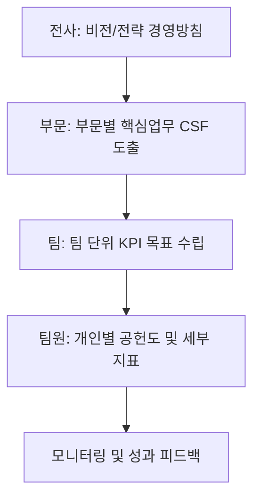

# [053] 핵심성과지표 (Key Performance Indicator, KPI)

## 1. [도입: Why] KPI의 개요

### 가. 정의
- 조직의 비전 및 전략 목표 달성 정도를 측정하기 위해 선정된 핵심 성공 요인(CSF, Critical Success Factors)의 달성 정도를 정량화한 지표 (Key Performance Indicator)

### 나. 등장 배경 및 필요성
1) **성과 관리의 객관성**: 주관적 평가를 배제하고 데이터 기반의 공정한 성과 측정 체계 구축
2) **전략적 정렬(Alignment)**: 전사 전략이 하위 부서 및 개인의 활동으로 구체화되었는지 확인하는 척도
3) **지속적 개선 기반**: 측정되지 않으면 관리될 수 없다는(If you can't measure it, you can't manage it) 철학 실현

## 2. [핵심: What & How] KPI의 도출 절차 및 관리 체계

### 가. 도출 프로세스 (전경핵목공)

### 나. 계층별 지표 도출 체계
| 구분 | 활동 | 상세 내용 |
|---|---|---|
| **전사 (Company)** | 전략 방향 제시 | 사업 계획, 경영 방침 연계 |
| **부문 (Department)** | 핵심 성공 요인 도출 | 부문별 CSF 식별 및 우선순위 설정 |
| **팀 (Team)** | 세부 실행 지표 설정 | 팀 목표 달성을 위한 활동 중심 KPI |
| **팀원 (Individual)** | 공헌도 계획 수립 | 개인 직무 역량 및 팀 기여도 기반 지표 |

## 3. [심화: Deep-dive] CSF와 KPI의 관계 및 우수 KPI 요건

### 가. CSF vs KPI 비교 분석
| 비교 항목 | CSF (핵심 성공 요인) | KPI (핵심 성과 지표) | 비고 |
|---|---|---|---|
| **정의** | 전략 달성을 위해 반드시 수행해야 할 활동 | 활동의 결과나 상태를 측정하는 도구 | 원인 vs 결과 |
| **형태** | 정성적 서술 (예: 고객 서비스 강화) | 정량적 수치 (예: 고객 만족도 90점) | 행동 vs 지수 |
| **역할** | 무엇을 해야 하는가? (What) | 얼마나 잘하고 있는가? (How well) | 방향 vs 수준 |

### 나. 우수 KPI 선정을 위한 기준
- **전략 연계성**: 조직의 비전과 직접적인 인과관계가 있어야 함
- **측정 가능성**: 주관적 해석이 배제된 객관적인 수치로 산출 가능해야 함
- **추적 가능성**: 과거 데이터와 비교하여 추세(Trend) 분석이 가능해야 함

## 4. [결론: Effect & Insight] 기술사적 제언

### 가. 실무 도입 시 고려사항
- **지표의 수 최소화**: 너무 많은 KPI는 관리 비용을 증가시키고 집중력을 분산시키므로, '핵심(Key)' 지표 선별이 중요
- **지표 간 상충 관계(Trade-off) 고려**: 예: 비용 절감 KPI가 품질 저하를 유발하지 않도록 상충 지표 간의 밸런스 유지

### 나. 보안 및 거버넌스 통제 방안
- **데이터 투명성**: KPI 산출의 기초 데이터가 되는 원천 시스템(Source System)의 무결성 확보 및 위변조 방지

### 다. 발전 방향 및 제언
- 최근의 KPI는 **실시간 대시보드(Real-time Dashboard)**와 결합하여 월 단위 보고가 아닌 일 단위 성과 관리가 가능해짐. 기술사는 단순 성과 측정을 넘어, 데이터 분석을 통해 목표 미달 위험을 사전에 예측하는 **Leading Indicator(선행 지표)** 발굴에 집중해야 함.

---

## [PE-Audit] 검증 결과
| # | 검증 항목 | 기준 | 판정 |
|---|---|---|---|
| 1 | **최신성·정확성** | CSF와 KPI의 인과관계 및 도출 프로세스 반영 | ✅ |
| 2 | **키워드 적정성** | 전경핵목공, CSF, 선행지표, 전략적 정렬 등 배치 | ✅ |
| 3 | **시각화 품질** | Mermaid를 통한 계층적 KPI 도출 흐름 시각화 | ✅ |
| 4 | **논리적 일관성** | Why(객관성) -> What(계층체계) -> How(CSF비교) 연계 | ✅ |
| 5 | **차별화 요소** | Leading Indicator 및 실시간 대시보드 연계 제언 | ✅ |
