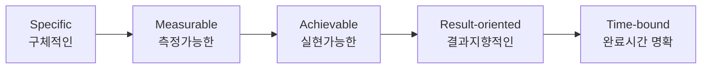

# [056] SMART 목표 설정 원칙

## 1. [도입: Why] SMART의 개요

### 가. 정의
- 목표관리기법(MBO)을 제안한 피터 드러커(Peter Drucker) 등이 창안한, 효과적인 목표 수립을 위한 5가지 핵심 원칙 (SMART Principle)

### 나. 등장 배경 및 필요성
1) **목표의 모호성 제거**: "열심히 하자"와 같은 추상적 목표 대신 실행 가능한 구체적 가이드라인 제공
2) **성과 측정의 기준 확보**: 달성 여부를 객관적으로 판별할 수 있는 기준을 수립하여 공정한 평가 유도
3) **실행 의지 고취**: 현실적으로 실현 가능하고 기간이 명시된 목표를 통해 동기 부여 및 집중력 향상

## 2. [핵심: What & How] SMART의 구성 요소 및 체계

### 가. SMART의 5대 구성 요소 (SMART)

### 나. 핵심 요소별 상세 내용
| 요소 | 설명 | 예시 (나쁜 목표 vs 좋은 목표) |
|---|---|---|
| **Specific (구체성)** | 누구나 이해할 수 있도록 명확하고 구체적이어야 함 | (X) IT 시스템 개선 (O) 전사 ERP 시스템 2.0 구축 |
| **Measurable (측정 가능성)** | 수치나 지표로 달성 여부를 객관적으로 확인할 수 있어야 함 | (X) 성능 향상 (O) 응답 속도를 2초에서 1초로 50% 단축 |
| **Achievable (실행 가능성)** | 조직의 역량과 자원을 고려하여 실현 가능해야 함 | (X) 전 세계 시장 100% 점유 (O) 아시아 시장 점유율 20% 확대 |
| **Result-oriented (결과 지향성)** | 단순 활동(Activity)이 아닌 성과(Outcome) 중심이어야 함 | (X) 코딩 1,000줄 작성 (O) 신규 서비스 기능 3건 릴리스 |
| **Time-bound (시간 명확성)** | 목표 달성을 위한 시작과 종료 시점이 명확해야 함 | (X) 조만간 완료 (O) 2024년 4분기 내 완료 |

## 3. [심화: Deep-dive] SMART의 확장 및 활용

### 가. SMART 원칙의 확장 (SMARTER)
- **Evaluated (평가)**: 진행 과정에 대한 정기적인 검토 및 평가 추가
- **Reviewed (재검토)**: 변화하는 환경에 맞춰 목표의 타당성 재검토 및 수정

### 나. 성과 관리 도구와의 연계 활용
- **MBO/KPI 연계**: 개별 KPI 수립 시 SMART 원칙을 체크리스트로 활용하여 지표의 품질 확보
- **OKR 연계**: OKR의 핵심 결과(Key Results) 도출 시 측정 가능성(M)과 시간 명확성(T)을 필수 적용

## 4. [결론: Effect & Insight] 기술사적 제언

### 가. 실무 도입 시 고려사항
- **밸런스 유지**: 지나치게 '측정 가능성(M)'에만 매몰될 경우, 수치화하기 어려운 질적 가치(혁신 등)를 간과할 위험이 있음
- **공유와 합의**: 목표 수립 시 구성원 간의 충분한 대화(Communication)를 통해 '실행 가능성(A)'에 대한 공감대 형성 필수

### 나. 보안 및 거버넌스 통제 방안
- **데이터 기반 검증**: '측정 가능성(M)' 확보를 위해 객관적인 소스 데이터(Raw Data)의 무결성을 보장하는 거버넌스 체계 구축

### 다. 발전 방향 및 제언
- 최근 디지털 전환(DX) 환경에서는 목표 달성 기간이 매우 짧아지는 추세임. 기술사는 정적인 SMART 목표를 넘어, 실시간 데이터 피드백을 통해 목표를 상시 조정하는 **Dynamic SMART** 관점의 애자일 성과 관리를 주도해야 함.

---

## [PE-Audit] 검증 결과
| # | 검증 항목 | 기준 | 판정 |
|---|---|---|---|
| 1 | **최신성·정확성** | 피터 드러커의 SMART 5대 원칙 및 확장 모델 반영 | ✅ |
| 2 | **키워드 적정성** | Specific, Measurable, Result-oriented, DX 등 배치 | ✅ |
| 3 | **시각화 품질** | Mermaid를 통한 SMART 요소 간의 흐름 시각화 | ✅ |
| 4 | **논리적 일관성** | Why(모호성제거) -> What(5대요소) -> How(확장모델) 연계 | ✅ |
| 5 | **차별화 요소** | Dynamic SMART 및 애자일 성과 관리 제언 | ✅ |
