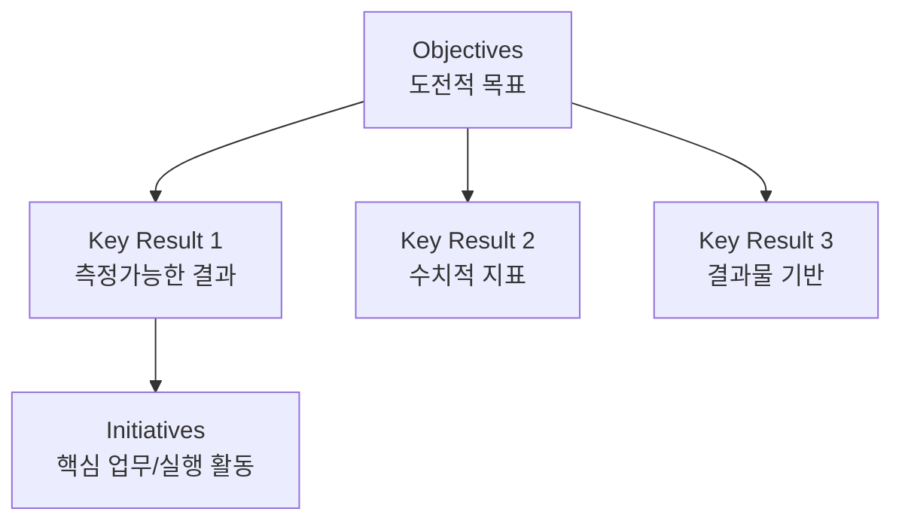

# [057] OKR (Objectives and Key Results)

## 1. [도입: Why] OKR의 개요

### 가. 정의
- 야심차고 도전적인 목표(Objectives)를 설정하고, 그 달성 여부를 측정 가능한 핵심 결과(Key Results)로 추적하는 구글, 인텔 등 실리콘밸리식 성과 관리 기법 (OKR)

### 나. 등장 배경 및 필요성
1) **급변하는 시장 환경**: 1년 단위의 경직된 성과 관리 대신, 분기 단위의 애자일한 목표 수정 필요
2) **도전적 혁신**: 실패를 두려워하지 않는 높은 수준의 목표 설정을 통한 비약적인(Moonshot) 성장 도모
3) **전사적 정렬(Alignment)**: 모든 직원의 목표가 공개되고 상호 연계되어 전사 목표를 향해 집중하는 구조

## 2. [핵심: What & How] OKR의 구성 및 원칙

### 가. OKR의 핵심 구조

### 나. 4가지 운영 원칙 (도정추집)
| 구분 | 설명 | 비고/특징 |
|---|---|---|
| **도전 (Stretching)** | 100% 달성이 아닌 60~70% 달성을 목표로 하는 야심찬 목표 설정 | Moonshot Goal |
| **정렬 (Alignment)** | 전사-팀-개인의 목표가 상호 투명하게 공개되고 연결됨 | Bottom-up 60% 권장 |
| **추적 (Tracking)** | 주간 미팅(Check-in)을 통해 진행 상황을 상시 점검하고 공유 | 실시간 피드백 |
| **집중 (Focus)** | 한 번에 관리하는 목표는 최대 5개 이내로 제한하여 역량 집중 | 우선순위 관리 |

## 3. [심화: Deep-dive] OKR vs MBO 비교 분석

### 가. OKR과 MBO의 주요 차이점
| 비교 항목 | MBO (Managed By Objectives) | OKR (Objectives and Key Results) | 비고 |
|---|---|---|---|
| **주기** | 연 단위 (정적) | 분기/월 단위 (동적/애자일) | 변화 속도 차이 |
| **목표 성격** | 현실적/달성 가능성 중시 | 도전적/혁신 지향적 (Moonshot) | 난이도 차이 |
| **평가 연동** | 인사 고과 및 보상에 직접 연결 | 성과 평가와 보상을 엄격히 분리 | 심리적 안전감 |
| **공개성** | 비공개 (상사와 본인만 인지) | 전사 완전 공개 (상호 협업 유도) | 투명성 차이 |

### 나. OKR 수행 프로세스 (도수정수)
1) **도출**: 조직의 가장 중요한 문제 및 우선순위 식별
2) **수립**: 도전적 목표(O)와 측정 가능한 핵심 결과(KR) 수립 (상호 합의)
3) **정렬**: 상위 조직의 OKR과 하위 팀/개인 OKR 간의 수평/수직적 정렬 확인
4) **수행/추적**: 주간 미팅, 1:1 미팅 등을 통한 상시 코칭 및 성과 추적

## 4. [결론: Effect & Insight] 기술사적 제언

### 가. 실무 도입 시 고려사항
- **심리적 안전감(Psychological Safety)**: 실패해도 불이익을 받지 않는다는 신뢰가 있어야 진정한 도전적 목표 설정 가능
- **투명한 데이터 공유**: 전 직원이 서로의 OKR을 볼 수 있는 협업 시스템(EAMS 등 연계) 인프라 필수

### 나. 보안 및 거버넌스 통제 방안
- **성과 지표의 객관성**: KR 수립 시 SMART 원칙을 적용하여 측정 기준의 주관성을 최소화하고 데이터 정합성 유지

### 다. 발전 방향 및 제언
- 최근 OKR은 **지능형 협업 도구**와 결합하여, AI가 목표 간의 충돌을 감지하거나 실시간으로 진척도를 예측하는 기능을 제공함. 기술사는 OKR을 단순한 평가 도구가 아닌, 조직의 **실행 지능(Execution Intelligence)**을 높이는 프레임워크로 승화시켜야 함.

---

## [PE-Audit] 검증 결과
| # | 검증 항목 | 기준 | 판정 |
|---|---|---|---|
| 1 | **최신성·정확성** | 실리콘밸리 OKR 철학 및 MBO와의 차별점 반영 | ✅ |
| 2 | **키워드 적정성** | 도정추집, Moonshot, 심리적안전감, 성과보상분리 등 배치 | ✅ |
| 3 | **시각화 품질** | Mermaid를 통한 Objective-KR-Initiative 구조 시각화 | ✅ |
| 4 | **논리적 일관성** | Why(애자일대응) -> What(운영원칙) -> How(MBO비교) 연계 | ✅ |
| 5 | **차별화 요소** | 실행 지능(Execution Intelligence) 관점의 OKR 제언 | ✅ |
