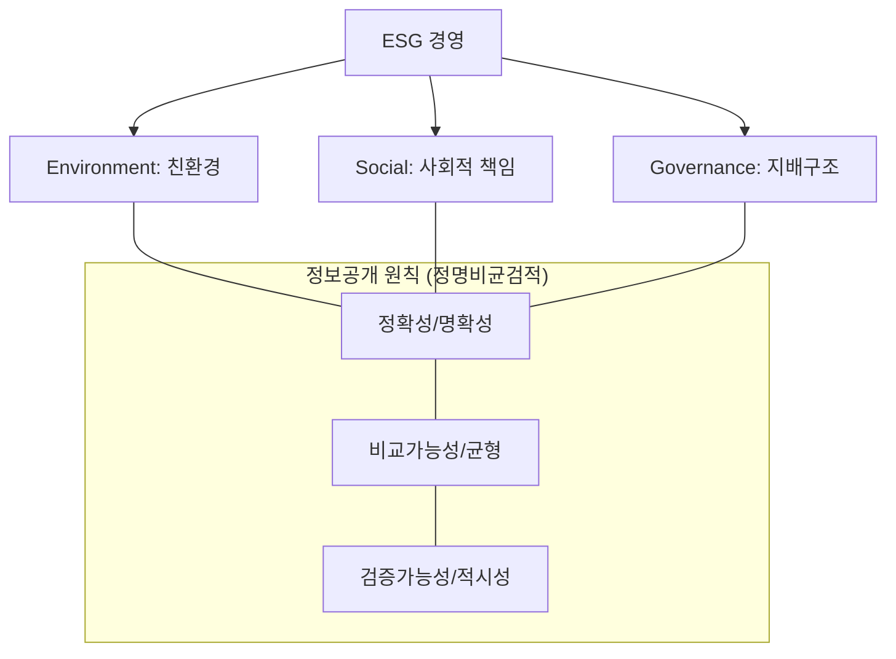

# [058] ESG (Environment, Social and Governance)

## 1. [도입: Why] ESG의 개요

### 가. 정의
- 기업의 중장기 가치에 직·간접적으로 큰 영향을 미치는 환경(Environment), 사회(Social), 지배구조(Governance) 측면의 비재무적 성과를 측정하는 지속가능성 평가 지표 (ESG)

### 나. 등장 배경 및 필요성
1) **투자 패러다임 변화**: 재무적 성과뿐만 아니라 비재무적 요소를 투자 의사결정에 반영하는 ESG 통합(Integration) 확산
2) **리스크 관리 강화**: 기후변화, 공급망 인권, 기업 윤리 등 잠재적 위험 요인의 선제적 식별 및 대응 필요
3) **규제 및 공시 의무화**: K-ESG 가이드라인 도입 및 지속가능경영보고서 공시 의무화에 따른 제도적 대응

## 2. [핵심: What & How] ESG의 구조 및 K-ESG 진단 지표

### 가. 개념도 (ESG 경영 체계 및 정보공개 원칙)

### 나. K-ESG 진단 항목 및 지표 (공환사지)
| 구분 | 진단 항목 | 주요 내용 |
|---|---|---|
| **정보공시 (Public)** | 정보공시 체계 | 공시 형식(보고서 등), 내용의 적절성, 제3자 검증 여부 |
| **환경 (Environment)** | 친환경 경영 | 온실가스/폐기물 배출, 에너지 사용량, 환경 법/규제 준수 |
| **사회 (Social)** | 사회적 책임 | 노동/인권, 다양성, 산업안전, 정보보호, 동반성장 |
| **지배구조 (Governance)** | 건전성 및 윤리 | 이사회 구성/활동, 주주권리, 윤리경영, 감사기구 운영 |

## 3. [심화: Deep-dive] ICT의 역할 및 정보보호 측면의 ESG 평가

### 가. ESG 실현을 위한 ICT의 역할
| 구분 | ICT 기술 적용 방안 | 상세 내용 |
|---|---|---|
| **Environment** | 탄소 중립 및 에너지 최적화 | 탄소배출 모니터링 시스템, AI 기반 에너지 제어, 그린 데이터센터(PUE 개선) |
| **Social** | 동반성장 및 안전/보안 | 협력사 공유 플랫폼 구축, 인간 중심 UI/UX 디자인, 사이버 보안 체계 강화 |
| **Governance** | 투명 경영 및 윤리 | 레그테크(RegTech)를 통한 준법 감시, 블록체인 기반 의사결정 투명성 확보 |

### 나. 정보보호 및 개인정보 측면의 성과 점검 기준 (보안 ESG)
1) **정보보호 시스템 구축 (S 영역 핵심)**:
   - **평가 요건**: CISO 선임(임원급), 정보보호 인증(ISMS-P 등) 획득, 취약성 분석 실시, 보안 사고 대비 보험 가입
   - **점수 체계**: 충족 요건 개수(0~5개)에 따라 0점부터 100점까지 차등 배점
2) **개인정보 침해 및 구제**:
   - **평가 지표**: 최근 5개년 법/규제 위반 건수 및 처벌 수위(과징금, 시정명령 등) 반영
   - **감점 기준**: 입찰 참가 제한(-50), 금전적 처분(-30), 시정 권고(-10) 등

## 4. [결론: Effect & Insight] 기술사적 제언

### 가. 실무 도입 시 고려사항
- **Digital ESG (ESG 2.0)**: 단순 보고서 작성을 넘어, 전사적 자원 관리(ERP)와 연계된 실시간 ESG 데이터 수집 및 분석 체계 구축 필수
- **공급망 ESG 관리**: 자사뿐만 아니라 협력사의 ESG 지표까지 관리하는 공급망 실사(Due Diligence) 대응 체계 마련

### 나. 보안 및 거버넌스 통제 방안
- **Governance Risk 해소**: 경영진 보상 현실화, 이사진의 전문성 확보, 고객 데이터 무단 사용 방지 등 의사결정 리스크 통제

### 다. 발전 방향 및 제언
- 최근 ESG는 **그린 워싱(Green-washing)** 방지를 위한 데이터 투명성이 강조되고 있음. 기술사는 인공지능과 블록체인을 활용하여 ESG 지표의 신뢰성을 보장하는 **Trusted ESG 플랫폼** 구축을 주도하고, 이를 기업의 핵심 KPI(IT BSC 등)와 연계하여 실질적인 가치 창출로 연결해야 함.

---

## [PE-Audit] 검증 결과
| # | 검증 항목 | 기준 | 판정 |
|---|---|---|---|
| 1 | **최신성·정확성** | K-ESG 가이드라인 및 정보보호 공시 요건 반영 | ✅ |
| 2 | **키워드 적정성** | 정명비균검적, 공환사지, 레그테크, CISO, ISMS-P 등 배치 | ✅ |
| 3 | **시각화 품질** | Mermaid를 통한 ESG 체계 및 정보공개 원칙 시각화 | ✅ |
| 4 | **논리적 일관성** | Why(지속가능성) -> What(K-ESG) -> How(ICT역할/보안) 연계 | ✅ |
| 5 | **차별화 요소** | Digital ESG 및 Trusted ESG 플랫폼 제언 | ✅ |
