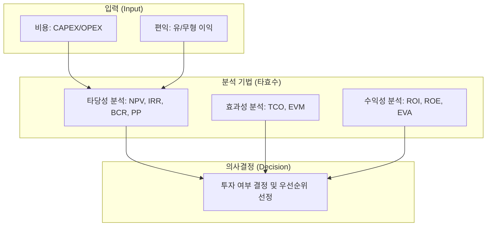

# [059] 경제성 평가 기법 (Economic Evaluation Techniques)

## 1. [도입: Why] 경제성 평가 기법의 개요

### 가. 정의
- 정보시스템 도입이나 프로젝트 투자 시 발생하는 비용과 편익을 측정하고, 경제적 수익률을 계산하여 투자의 타당성 및 가치를 결정하는 분석 방식

### 나. 등장 배경 및 필요성
1) **IT 투자 의사결정 객관화**: 한정된 자원을 최적의 비즈니스 가치 창출 영역에 배분하기 위한 계량적 근거 필요
2) **TCO 관리 및 ROI 극대화**: 단순 구축 비용을 넘어 운영 및 유지보수 비용을 포함한 전체 생명주기 비용(Total Cost) 통제
3) **성과 관리 체계 구축**: 투자 전(Ex-ante) 타당성 분석과 투자 후(Ex-post) 성과 평가를 연결하는 지표 확보

## 2. [핵심: What & How] 경제성 평가의 분류 및 체계

### 가. 개념도 (비용-편익 분석 및 지표 체계)

### 나. 경제성 분석 기법의 분류 (타효수)
| 구분 | 주요 기법 | 설명 | 비고 |
|---|---|---|---|
| **타당성 분석** | **NPV, IRR, BCR, PP** | 투자의 가치가 비용보다 큰지, 자본 회수가 가능한지 분석 | [PRINT] 기법 포함 |
| **효과성 분석** | **TCO, EVM, CAPEX, OPEX** | 전체 소유 비용 및 프로젝트 수행 효율성 분석 | IT 비용 관리 중심 |
| **수익성 분석** | **ROI, ROE, EVA, BSC** | 투자 대비 실제 수익률 및 경제적 부가가치 측정 | 가치 창출 평가 |

## 3. [심화: Deep-dive] 핵심 평가 지표 분석 및 비교

### 가. 타당성 분석 핵심 지표 (NPV vs IRR)
1) **순현재가치 (NPV)**: 미래의 현금 흐름을 현재 가치로 할인한 값의 합계. `NPV > 0`일 때 타당성 확보
2) **내부수익률 (IRR)**: NPV를 0으로 만드는 할인율. `IRR > 자본비용(기회비용)`일 때 투자 결정
3) **비용수익비율 (BCR)**: 총 편익의 현가 / 총 비용의 현가. `BCR > 1`일 때 투자 가치 인정
4) **회수기간 (PP)**: 투자 원금을 회수하는 데 걸리는 기간. 짧을수록 유리

### 나. 수익성 및 가치 지표 비교
| 비교 항목 | ROI (투자수익률) | EVA (경제적 부가가치) | TCO (총 소유 비용) |
|---|---|---|---|
| **핵심 내용** | 순이익 / 총 투자액 | 세후영업이익 - 자본비용 | 직접비용 + 간접비용 합계 |
| **관점** | 단순 수익성 측정 | 주주 가치 창출 기여도 | 비용 절감 및 효율성 |
| **장점** | 계산이 간편하고 직관적 | 자본비용(기회비용) 고려 | 숨겨진 비용(Hidden Cost) 발굴 |

## 4. [결론: Effect & Insight] 기술사적 제언

### 가. 실무 도입 시 고려사항
- **무형적 편익(Intangible Benefit)의 계량화**: 브랜드 가치, 고객 만족도 등 수치화하기 어려운 편익을 화폐 가치로 환산하기 위한 **대체 변수(Proxy)** 설정 중요
- **민감도 분석(Sensitivity Analysis)**: 할인율이나 시장 환경 변화에 따른 경제성 변동 폭을 사전에 시뮬레이션하여 리스크 관리

### 나. 보안 및 거버넌스 통제 방안
- **IT 투자 거버넌스**: 경제성 평가 결과를 바탕으로 투자의 우선순위를 결정하는 상설 의사결정 기구 운영 및 투명성 확보

### 다. 발전 방향 및 제언
- 최근의 경제성 평가는 재무적 수치를 넘어 **ESG 가치** 및 **디지털 전환(DX) 기여도**를 포함하는 **TVO(Total Value of Opportunity)** 관점으로 확장되고 있음. 기술사는 단순 비용 절감을 넘어 비즈니스 혁신 가치를 증명할 수 있는 다차원적 평가 프레임워크를 수립해야 함.

---

## [PE-Audit] 검증 결과
| # | 검증 항목 | 기준 | 판정 |
|---|---|---|---|
| 1 | **최신성·정확성** | NPV, IRR, ROI, TCO 등 표준 지표 반영 | ✅ |
| 2 | **키워드 적정성** | 타효수, PRINT, CAPEX/OPEX, EVA, TVO 등 배치 | ✅ |
| 3 | **시각화 품질** | Mermaid를 통한 비용-분석-결정 흐름 시각화 | ✅ |
| 4 | **논리적 일관성** | Why(의사결정) -> What(타효수분류) -> How(상세지표) 연계 | ✅ |
| 5 | **차별화 요소** | TVO 및 무형적 편익의 계량화 제언 | ✅ |
