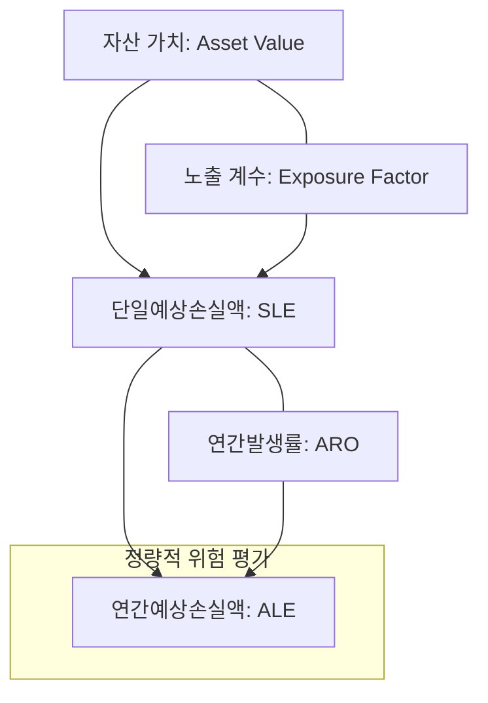

# [061] 연간예상손실액 (Annual Loss Expectancy, ALE)

## 1. [도입: Why] ALE의 개요

### 가. 정의
- 특정 위험 사건이 발생할 경우 연간 예상되는 손실의 평균적인 가치를 산출하는 정량적 위험 평가 지표 (Annual Loss Expectancy)

### 나. 등장 배경 및 필요성
1) **보안 투자 의사결정 객관화**: "얼마나 보안에 투자해야 하는가?"에 대한 답을 경제적 손실 가치 기반으로 제시
2) **리스크 기반 우선순위 설정**: 다양한 보안 위험 중 손실액이 큰 위험을 식별하여 대응 자원 집중 투입
3) **비용 대비 효과 분석(CBA)**: 보안 솔루션 도입 비용과 예상되는 ALE 감소액을 비교하여 투자 타당성 검토

## 2. [핵심: What & How] ALE의 산출 구조 및 구성 요소

### 가. 개념도 (ALE 산출 메커니즘)

### 나. 핵심 구성 요소 및 공식
| 구분 | 용어 | 설명 및 공식 | 비고 |
|---|---|---|---|
| **ALE** | **연간예상손실액** | **ALE = SLE × ARO** | 연간 평균 손실 기대치 |
| **SLE** | **단일예상손실액** | **SLE = AV × EF** | 1회 사고 발생 시 예상 손실 |
| **ARO** | **연간발생률** | 연간 해당 사고가 발생할 것으로 예상되는 빈도 | 통계적 확률값 |
| **AV** | **자산 가치** | 보호해야 할 정보자산의 재무적 가치 | HW, SW, 데이터 가치 |
| **EF** | **노출 계수** | 사고 발생 시 자산이 손실되는 비율 (0~100%) | 피해 심각도 |

## 3. [심화: Deep-dive] ALE 기반 위험 대응 전략

### 가. 정량적 위험 분석 vs 정성적 위험 분석 비교
| 비교 항목 | 정량적 분석 (ALE 중심) | 정성적 분석 | 비고 |
|---|---|---|---|
| **평가 방법** | 화폐 가치, 수치 산출 | 등급 (상/중/하), 설문 | 객관성 vs 주관성 |
| **장점** | 비용-편익 분석 용이, 명확한 근거 | 계산 복잡성 낮음, 신속한 평가 | 의사결정 지원 |
| **단점** | 데이터 확보 어려움, 산출 복잡 | 평가자의 주관 개입 가능성 | 데이터 신뢰도 |

### 나. 보안 투자 타당성 분석 사례 (ROI 연계)
- **도입 전 ALE**: 1억원 (예시)
- **보안 통제 도입 비용**: 2,000만원 (연간 유지비 포함)
- **도입 후 예상 ALE**: 3,000만원
- **성과(Saving)**: (1억 - 3,000만) - 2,000만 = **5,000만원 이득**

## 4. [결론: Effect & Insight] 기술사적 제언

### 가. 실무 도입 시 고려사항
- **ARO 데이터의 신뢰성**: 과거 침해 사고 통계 및 위협 인텔리전스를 활용하여 발생률(ARO)의 정확도 제고 필요
- **간접 손실 포함**: 단순 자산 파손 외에 브랜드 이미지 훼손, 법적 과징금 등 무형적 손실을 SLE에 반영하여 현실화

### 나. 보안 및 거버넌스 통제 방안
- **정기적 리스크 리뷰**: 비즈니스 환경 변화에 따라 자산 가치(AV)와 위협 빈도(ARO)가 변하므로 매년 ALE 재산정 필수

### 다. 발전 방향 및 제언
- 향후 ALE는 **사이버 보험(Cyber Insurance)**의 보험료 산정 기준 및 **ESG 공시**의 사이버 리스크 관리 지표로 활용될 것임. 기술사는 단순 계산을 넘어, 자동화된 리스크 관리 도구(GRC 솔루션)와 연계된 실시간 ALE 모니터링 체계를 구축해야 함.

---

## [PE-Audit] 검증 결과
| # | 검증 항목 | 기준 | 판정 |
|---|---|---|---|
| 1 | **최신성·정확성** | SLE, ARO, AV, EF 공식 및 산출 로직 반영 | ✅ |
| 2 | **키워드 적정성** | 정량적 위험평가, 비용-편익 분석, GRC, ESG 등 배치 | ✅ |
| 3 | **시각화 품질** | Mermaid를 통한 ALE 산출 단계 및 연계성 시각화 | ✅ |
| 4 | **논리적 일관성** | Why(투자객관화) -> What(공식/구성요소) -> How(대응전략) 연계 | ✅ |
| 5 | **차별화 요소** | 사이버 보험 및 실시간 GRC 연계 제언 | ✅ |
