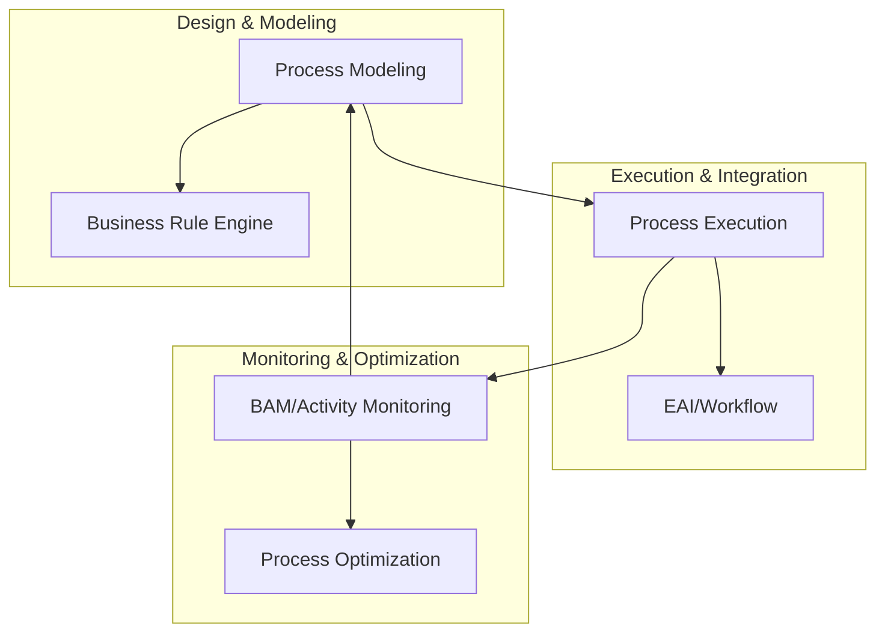

# [062] BPM (Business Process Management)

## 1. [도입: Why] BPM의 개요

### 가. 정의
- 기업의 비즈니스 프로세스를 가시화하고, 자동화·통합·최적화를 통해 업무의 효율성을 높이고 기업 가치를 극대화하는 관리 체계이자 기반 시스템 (Business Process Management)

### 나. 등장 배경 및 필요성
1) **프로세스 단절 해소**: 부서 간 업무 흐름의 단절(Silos)을 방지하고 전사적 관점의 유연한 프로세스 연계 필요
2) **민첩성(Agility) 확보**: 급변하는 경영 환경에 대응하여 프로세스를 신속하게 설계(Modeling)하고 실행(Execution)할 수 있는 인프라 요구
3) **지속적 개선(PDCA)**: 업무 활동 모니터링(BAM)을 통해 병목 지점을 파악하고 끊임없이 최적화(Optimization)하기 위함

## 2. [핵심: What & How] BPM의 구조 및 핵심 기술

### 가. 개념도 및 메커니즘

### 나. 핵심 기술 영역 및 구성 요소
| 구분 | 기술 영역 | 상세 설명 | 비고/특징 |
|---|---|---|---|
| **프로세스 관점** | **BPA, BRE, BAM** | 프로세스 분석(BPA), 비즈니스 규칙 엔진(BRE), 실시간 활동 모니터링(BAM) | 프로세스 지능화 |
| **통합 관점** | **EAI, Workflow** | 전사 어플리케이션 통합(EAI), 업무 흐름 자동화 엔진(Workflow) | 시스템 연계 |
| **BPM 엔진** | **Process Engine** | 설계된 모델에 따라 인스턴스를 생성하고 상태를 관리하는 핵심 커널 | 오케스트레이션 |

## 3. [심화: Deep-dive] BPM의 프로세스 매핑 및 라이프사이클

### 가. 프로세스 매핑 절차 (도속정표)
1) **프로세스 도출**: 기업의 핵심 성공 요인(CSF)과 연계된 주요 업무 프로세스 식별
2) **프로세스 속성 정의**: 담당자, 입력물(Input), 산출물(Output), 관련 규정 정의
3) **프로세스 정형화**: 논리적 흐름에 따라 순서도(Flowchart) 형태로 가시화
4) **프로세스 표준화**: 전사 공통 가이드라인을 수립하여 중복 배제 및 일관성 확보

### 나. BPM의 4대 목적 (가자최통)
- **가시화**: 업무 흐름의 투명성 확보 및 책임 소재 명확화
- **자동화**: 반복적이고 단순한 업무의 시스템 처리
- **최적화**: 모니터링 분석 결과 기반의 병목 제거 및 프로세스 개선
- **통합**: 사람, 시스템, 조직 간의 유기적 연결

## 4. [결론: Effect & Insight] 기술사적 제언

### 가. 실무 도입 시 고려사항
- **변화 관리(Change Management)**: 시스템 도입보다 중요한 것은 일하는 방식의 변화이며, 조직 구성원의 참여와 변화에 대한 공감대 형성 필수
- **유연한 아키텍처**: MSA(Microservices Architecture) 환경에서 API 기반의 서비스 오케스트레이션 도구로 BPM을 활용하여 결합도(Coupling)를 낮추어야 함

### 나. 보안 및 거버넌스 통제 방안
- **프로세스 무결성**: 인가되지 않은 프로세스 변경을 통제하기 위한 변경 관리 거버넌스 및 감사 이력(Audit Trail) 확보

### 다. 발전 방향 및 제언
- 최근 BPM은 AI와 결합하여 스스로 최적의 경로를 추천하는 **iBPM(Intelligent BPM)**이나, 실제 로그 데이터를 분석하여 프로세스를 역추적하는 **Process Mining** 기술로 진화하고 있음. 기술사는 단순 자동화를 넘어 데이터 기반의 프로세스 통찰력을 제공하는 방향으로 아키텍처를 설계해야 함.

---

## [PE-Audit] 검증 결과
| # | 검증 항목 | 기준 | 판정 |
|---|---|---|---|
| 1 | **최신성·정확성** | iBPM, Process Mining 등 트렌드 반영 | ✅ |
| 2 | **키워드 적정성** | 가자최통, 도속정표, BPA/BRE/BAM 등 배치 | ✅ |
| 3 | **시각화 품질** | Mermaid를 통한 BPM 순환 주기 및 계층 표현 | ✅ |
| 4 | **논리적 일관성** | Why(민첩성) -> What(기술영역) -> How(매핑절차) 연계 | ✅ |
| 5 | **차별화 요소** | Process Mining 및 iBPM 연계 제언 | ✅ |
