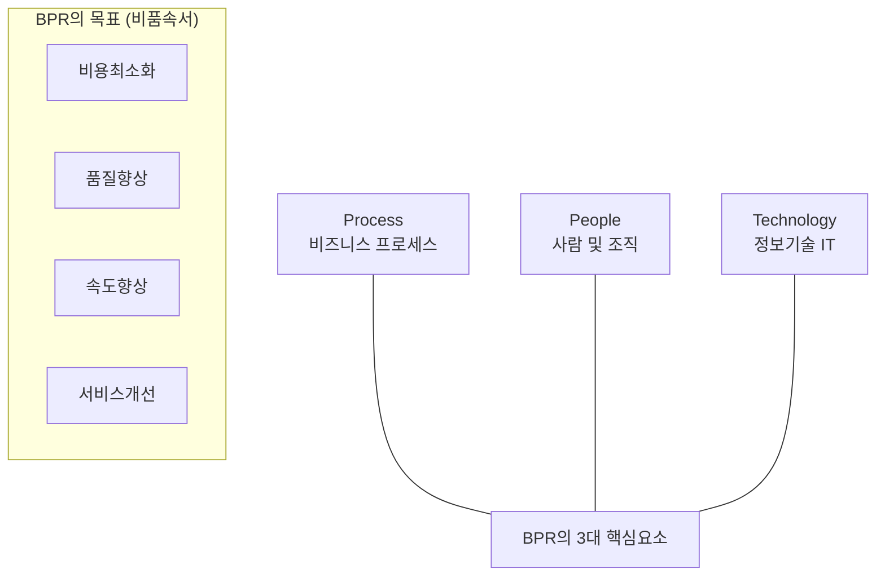

# [063] BPR (Business Process Reengineering)

## 1. [도입: Why] BPR의 개요

### 가. 정의
- 비용, 품질, 서비스, 속도와 같은 핵심적인 경영성과 지표들의 비약적인 향상을 위하여 비즈니스 프로세스를 근본적으로 재고려하고 급진적으로 재설계하는 경영 혁신 기법 (Business Process Reengineering)

### 나. 등장 배경 및 필요성
1) **경영 효율성 극대화**: 부서 간 파편화된 업무를 통합하여 낭비 요소를 제거하고 프로세스 전체 효율성 향상
2) **비즈니스 가치 증대**: 기존 방식의 부분적 개선이 아닌 '제로 베이스'에서의 파괴적 혁신을 통한 경쟁 우위 확보
3) **고객 중심의 가치 사슬 재편**: 내부 관리 중심에서 고객에게 가치를 전달하는 핵심 프로세스 중심으로 조직을 재구성

## 2. [핵심: What & How] BPR의 핵심 요소 및 수행 절차

### 가. 개념도 및 핵심 요소 (사기프)

### 나. 수행 절차 및 단계별 활동
| 단계 | 주요 활동 | 상세 내용 |
|---|---|---|
| **기획 단계** | 기업 목표 설정 | 경영 전략과 연계된 BPR 추진 목표 및 범위 정의 |
| **분석 단계** | 대상 프로세스 선정 | 비즈니스에 큰 영향을 미치는 핵심 프로세스 식별 및 선정 |
| **이해 단계** | 현행 프로세스 분석 | As-Is 분석을 통해 문제점 및 비효율성 도출 |
| **설계 단계** | 개선 프로세스 설계 | To-Be 프로세스 모델링 및 혁신 아이디어 도출 |
| **개발 단계** | 변화 모형 개발 | 조직 개편안, 정보 시스템 아키텍처 및 교육 계획 수립 |
| **실행 단계** | 구현 및 운영 | 시스템 구축, 신규 프로세스 적용 및 변화 관리 |

## 3. [심화: Deep-dive] BPR의 특징 및 성공 요인 분석

### 가. BPR의 4대 핵심 특징 (비품속서)
1) **비용(Cost)**: 중복 업무 제거 및 자동화를 통한 운영 비용의 획기적 절감
2) **품질(Quality)**: 오류 발생 가능성을 원천 차단하는 프로세스 설계를 통한 품질 혁신
3) **속도(Speed)**: 의사결정 계층 축소 및 병렬 처리를 통한 리드 타임(Lead Time) 단축
4) **서비스(Service)**: 고객 접점 일원화 및 신속한 대응을 통한 고객 만족도 제고

### 나. BPR vs BPM 비교
| 비교 항목 | BPR (재설계) | BPM (관리/개선) | 비고 |
|---|---|---|---|
| **접근 방식** | 파괴적, 급진적 (Clean Slate) | 점진적, 지속적 (Continuous) | 혁신 vs 개선 |
| **주요 목표** | 구조적 변혁, 비약적 성과 | 효율성 최적화, 프로세스 제어 | 전략 vs 운영 |
| **IT 역할** | 혁신을 가능케 하는 원동력(Enabler) | 운영을 지원하는 관리 인프라 | 역할의 차이 |

## 4. [결론: Effect & Insight] 기술사적 제언

### 가. 실무 도입 시 고려사항
- **기술 중심주의 경계**: IT 기술 도입 자체가 목적이 되어서는 안 되며, 비즈니스 가치 창출을 위한 수단으로 활용되어야 함
- **Top-down 리더십**: 전사적 혁신은 기존 권력 구조의 변화를 동반하므로 최고 경영진의 강력한 의지와 지원 필수

### 나. 보안 및 거버넌스 통제 방안
- **프로세스 재설계 시 보안 고려**: 속도 향상을 위해 보안 절차를 생략하지 않도록 'Security by Design' 관점의 통제 설계 필요

### 다. 발전 방향 및 제언
- 최근의 BPR은 단순 업무 재설계를 넘어 **Digital Transformation(DX)**과 결합한 **BDR(Business Digital Revolution)**로 진화하고 있음. 기술사는 클라우드, AI 등 신기술을 활용하여 비즈니스 모델 자체를 재정의하는 전략적 동반자 역할을 수행해야 함.

---

## [PE-Audit] 검증 결과
| # | 검증 항목 | 기준 | 판정 |
|---|---|---|---|
| 1 | **최신성·정확성** | BDR 및 DX 연계 개념 반영 | ✅ |
| 2 | **키워드 적정성** | 비품속서, 사기프, 급진적/파괴적 혁신 등 배치 | ✅ |
| 3 | **시각화 품질** | Mermaid를 통한 BPR 핵심 요소 및 목표 체계 시각화 | ✅ |
| 4 | **논리적 일관성** | Why(비약적향상) -> What(수행절차) -> How(특징분석) 연계 | ✅ |
| 5 | **차별화 요소** | BDR로의 발전 방향 및 Security by Design 제언 | ✅ |
