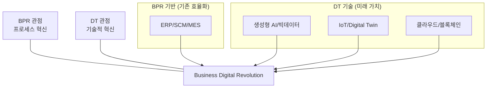

# [064] BDR (Business Digital Revolution)

## 1. [도입: Why] BDR의 개요

### 가. 정의
- 첨단 디지털 기술(GenAI, IoT, Cloud 등)을 활용하여 비즈니스 모델, 프로세스, 제품 및 전략을 근본적으로 재정의하고 파괴적으로 재설계하는 전사적 전략 이니셔티브 (Business Digital Revolution)

### 나. 등장 배경 및 필요성
1) **파괴적 혁신(Disruption)**: 신기술 기반의 신규 플레이어 등장으로 기존 비즈니스 모델의 존립 위협 극복
2) **초연결·초지능 사회**: 데이터와 AI를 기반으로 고객 경험을 극대화하고 새로운 가치 사슬 창출 필요
3) **비즈니스 회복탄력성**: 불확실한 시장 환경에서 유연하고 기민하게 대응할 수 있는 디지털 기반의 체질 개선 요구

## 2. [핵심: What & How] BDR의 구조 및 구성 요소

### 가. 개념도 및 구성 체계

### 나. 핵심 구성 요소
| 구분 | 주요 기술/시스템 | 비즈니스 가치 | 상세 내용 |
|---|---|---|---|
| **기존 최적화 (BPR)** | ERP, SCM, MES | 운영 효율성 | 전사 자원 및 제조/유통 프로세스의 통합 관리 |
| **디지털 기술 (DT)** | 생성형 AI, 빅데이터 | 의사결정 지능화 | 데이터 기반의 예측 경영 및 초개인화 서비스 제공 |
| **연결성 기반** | IoT, 클라우드 | 확장성 및 민첩성 | 실시간 데이터 수집 및 유연한 인프라 확보 |
| **신뢰 및 가상화** | 블록체인, Digital Twin | 신뢰 및 시뮬레이션 | 거래 투명성 확보 및 현실 세계의 정밀한 모니터링 |

## 3. [심화: Deep-dive] BPR에서 BDR로의 패러다임 전환

### 가. BPR vs DT vs BDR 비교 분석
| 비교 항목 | BPR (Process Reengineering) | Digital Transformation (DT) | BDR (Digital Revolution) |
|---|---|---|---|
| **핵심 목표** | 업무 효율성 및 속도 향상 | 디지털 기술 내재화 | 비즈니스 모델의 근본적 재정의 |
| **추진 동력** | 프로세스 통폐합 | 기술 도입 및 디지털화 | 데이터 가치 및 생태계 창출 |
| **결과물** | 최적화된 내부 프로세스 | 디지털 역량을 갖춘 조직 | 새로운 산업 패러다임 선도 |

### 나. BDR 추진을 위한 전략적 기술 (Generative AI & Digital Twin)
- **생성형 AI**: 단순 자동화를 넘어 창의적 콘텐츠 생성 및 복잡한 의사결정 지원을 통한 가치 혁명
- **Digital Twin**: 현실 자산의 디지털 복제본을 통한 사전 시뮬레이션으로 혁신의 리스크 최소화

## 4. [결론: Effect & Insight] 기술사적 제언

### 가. 실무 도입 시 고려사항
- **데이터 거버넌스**: 혁명의 원천은 데이터이므로, 데이터의 품질, 표준화 및 활용 체계를 선제적으로 수립해야 함
- **조직 문화의 수용성**: 급진적인 기술 도입에 따른 구성원의 저항을 최소화하기 위한 디지털 리터러시 교육 필수

### 나. 보안 및 거버넌스 통제 방안
- **지능형 보안(AI Security)**: AI 기반의 지능형 위협에 대응하기 위해 탐지 및 방어 체계에도 AI를 적용하는 대응 전략 필요

### 다. 발전 방향 및 제언
- BDR은 단순한 시스템 구축이 아니라 기업의 **생존 전략**임. 기술사는 기술적 구현 능력을 넘어 비즈니스 도메인 지식과 디지털 기술을 결합하여 가치를 창출하는 **Digital Strategist**로서 혁신을 주도해야 함.

---

## [PE-Audit] 검증 결과
| # | 검증 항목 | 기준 | 판정 |
|---|---|---|---|
| 1 | **최신성·정확성** | 생성형 AI, Digital Twin 등 최신 기술 반영 | ✅ |
| 2 | **키워드 적정성** | BPR+DT, 비즈니스 모델 재정의, 파괴적 혁신 등 배치 | ✅ |
| 3 | **시각화 품질** | Mermaid를 통한 BDR의 구성 체계 시각화 | ✅ |
| 4 | **논리적 일관성** | Why(파괴적혁신) -> What(구성요소) -> How(패러다임전환) 연계 | ✅ |
| 5 | **차별화 요소** | Digital Strategist의 역할 및 AI Security 제언 | ✅ |
