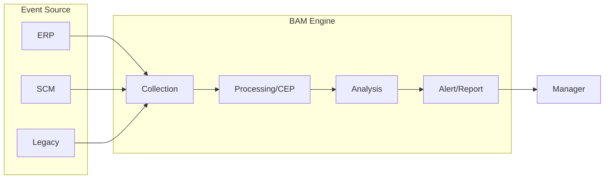

# [065] BAM (Business Activity Monitoring)

## 1. [도입: Why] BAM의 개요

### 가. 정의
- 다양한 애플리케이션 및 시스템에서 발생하는 주요 비즈니스 이벤트를 실시간으로 수집·분석하여 관리자에게 실시간 현황 리포팅 및 경보를 제공하는 활동 감시 체계 (Business Activity Monitoring)

### 나. 등장 배경 및 필요성
1) **실시간 의사결정(Real-time Decision)**: 사후 분석 중심의 전통적인 BI 한계를 극복하고, 현재 진행 중인 프로세스의 문제를 즉시 인지하여 대응하기 위함
2) **비즈니스 가시성 확보**: 산재된 레거시 시스템 간의 통합된 프로세스 흐름을 모니터링하여 전체적인 비즈니스 상태 파악
3) **능동적 대응 체계**: 지연 시간(Latency)을 최소화하여 잠재적인 장애나 비즈니스 기회 상실을 사전에 차단

## 2. [핵심: What & How] BAM의 기능 및 기술 체계

### 가. 개념도 및 메커니즘

### 나. 주요 기능 및 적용 기술
| 구분 | 주요 기능 | 연관 기술 | 상세 내용 |
|---|---|---|---|
| **데이터 수집** | 실시간 이벤트 획득 | EAI, B2Bi, ESB | 어플리케이션 간 메시지 전송 및 실시간 연동 |
| **분석/가시화** | 지표 분석 및 리포팅 | BI, Reporting Tool | 주요 성과 지표(KPI) 및 데이터 마이닝 분석 |
| **상세 분석** | 다차원 분석 | DW, OLAP | 정밀한 트렌드 분석 및 근본 원인 파악 |
| **인프라 관리** | 네트워크 및 서버 모니터링 | NSM | 시스템 인프라의 안정성 보장 |

## 3. [심화: Deep-dive] BAM의 주요 기술 요소 상세 분석

### 가. BAM 핵심 기능 4요소
1) **비즈니스 이벤트**: 개별 거래나 상태 변화 등 분석 대상이 되는 최소 단위 정보
2) **조합 이벤트(Complex Event)**: 여러 이벤트를 조합하여 특정 패턴을 감지하는 복합 이벤트 처리(CEP)
3) **BAM 모델링**: 모니터링 대상 지표 및 임계치(Threshold) 설정
4) **경보(Alerts)**: 임계치 초과 시 이메일, SMS, 메신저 등을 통한 즉각적인 상황 전파

### 나. BAM vs BI 비교
| 비교 항목 | Business Intelligence (BI) | Business Activity Monitoring (BAM) | 비고 |
|---|---|---|---|
| **시간 관점** | 과거 데이터 분석 (Historical) | 현재 진행 데이터 감시 (Real-time) | 시점의 차이 |
| **주요 목적** | 장기 전략 수립, 패턴 파악 | 즉각적 운영 대응, 위기 관리 | 전략 vs 운영 |
| **데이터 형태** | 대량의 배치 데이터 (DW) | 연속적인 이벤트 스트림 | 데이터 특성 |

## 4. [결론: Effect & Insight] 기술사적 제언

### 가. 실무 도입 시 고려사항
- **임계치 설정의 적정성**: 너무 잦은 경보(Alert Fatigue)는 관리자의 피로도를 높이므로 비즈니스 영향도에 따른 중요 알람 선별 필요
- **제로 레이턴시(Zero Latency)**: 데이터 수집부터 분석, 전파까지의 시간을 최소화하기 위한 고성능 이벤트 처리 엔진 확보 필수

### 나. 보안 및 거버넌스 통제 방안
- **이상 징후 탐지**: BAM 기술을 보안 관제와 결합하여 내부 부정 거래나 권한 남용 등의 비정상 행위를 실시간 탐지

### 다. 발전 방향 및 제언
- 최근 BAM은 **지능형 이벤트 처리(Intelligent BAM)**로 진화하여 AI가 이상 징후를 스스로 학습하고 자가 조치(Self-healing)까지 제안하는 수준에 이르고 있음. 기술사는 단순 모니터링을 넘어 **예측적 유지보수(Predictive Maintenance)** 관점의 비즈니스 가치를 창출해야 함.

---

## [PE-Audit] 검증 결과
| # | 검증 항목 | 기준 | 판정 |
|---|---|---|---|
| 1 | **최신성·정확성** | CEP, 제로 레이턴시 등 최신 개념 반영 | ✅ |
| 2 | **키워드 적정성** | 복합이벤트처리, 실시간 가시성, 임계치, Alert 등 배치 | ✅ |
| 3 | **시각화 품질** | Mermaid를 통한 BAM 엔진의 처리 흐름 시각화 | ✅ |
| 4 | **논리적 일관성** | Why(실시간대응) -> What(기능/기술) -> How(BI비교) 연계 | ✅ |
| 5 | **차별화 요소** | Alert Fatigue 해결 및 지능형 BAM 발전 방향 제언 | ✅ |
