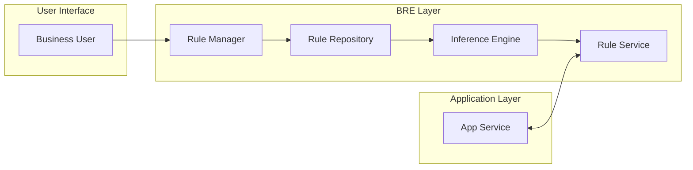

# [066] BRE (Business Rule Engine)

## 1. [도입: Why] BRE의 개요

### 가. 정의
- 복잡한 비즈니스 규칙(Rule)을 어플리케이션 소스 코드(Hard-coding)로부터 분리하여 독립적으로 관리하고, 실행 시점에 동적으로 규칙을 추론 및 적용하는 소프트웨어 엔진 (Business Rule Engine)

### 나. 등장 배경 및 필요성
1) **업무 유연성 확보**: 잦은 비즈니스 로직 변경 시 프로그램 재컴파일이나 재배포 없이 실시간으로 룰을 수정하여 즉각 적용 가능
2) **비즈니스 가시성 제고**: 소스 코드 속에 숨겨진(Embedded) 복잡한 조건식을 직관적인 의사결정표(Decision Table)나 자연어 형태로 가시화
3) **협업 효율성 증대**: IT 개발자가 아닌 현업 전문가가 직접 비즈니스 룰을 정의하고 검증할 수 있는 환경 제공

## 2. [핵심: What & How] BRE의 구조 및 핵심 요소

### 가. 개념도 및 메커니즘 (로직 분리 구조)

### 나. 핵심 구성 요소
| 구분 | 구성 요소 | 상세 설명 | 비고/특징 |
|---|---|---|---|
| **관리 영역** | **Rule Manager** | 비즈니스 룰의 생성, 수정, 삭제 및 버전 관리 인터페이스 | UI 기반 도구 |
| **저장 영역** | **Rule Repository** | 정의된 룰을 정형화된 메타 데이터 형태로 저장하는 저장소 | DB 또는 XML 등 |
| **실행 영역** | **Inference Engine** | 입력 데이터에 대해 등록된 룰을 검색하고 실행 순서를 결정하는 추론 엔진 | Rete 알고리즘 등 활용 |
| **서비스 영역** | **Rule Service** | 어플리케이션과 연동하여 실시간으로 룰 실행 결과를 반환하는 API | Interface Engine 연계 |
| **감시 영역** | **Rule Monitoring** | 실행 중인 룰의 성능 및 결과값을 모니터링하고 로그 분석 수행 | 통계 및 이력 관리 |

## 3. [심화: Deep-dive] BRE의 상세 특징 및 알고리즘

### 가. BRE의 주요 특징 및 장점
- **신속한 대응**: 로직 변경 주기가 짧은 금융 상품, 보험 요율 산정, 포인트 정책 등에 최적화
- **정확성 및 일관성**: 전사적으로 공통된 룰셋을 공유함으로써 시스템별 로직 불일치(Inconsistency) 문제 해결
- **재사용성**: 한 번 정의된 룰을 다양한 채널이나 시스템에서 서비스 형태로 호출하여 재사용 가능

### 나. 핵심 알고리즘 (Rete 알고리즘)
- **개요**: 수많은 룰 중에서 현재 데이터에 부합하는 룰을 빠르게 찾기 위한 패턴 매칭 알고리즘
- **원리**: 룰을 네트워크 형태(Node)로 미리 컴파일하여 중복되는 조건 검사를 최소화함으로써 대량의 룰 처리 성능 보장

## 4. [결론: Effect & Insight] 기술사적 제언

### 가. 실무 도입 시 고려사항
- **비즈니스 규칙의 파악**: 소스 코드에서 분리할 핵심 비즈니스 로직(Core Logic)과 시스템 제어 로직을 명확히 구분하는 초기 컨설팅 단계 중요
- **성능 영향 분석**: 룰의 개수가 급격히 늘어날 경우 추론 엔진의 성능 저하가 발생할 수 있으므로 최적화된 룰 설계 필수

### 나. 보안 및 거버넌스 통제 방안
- **룰 변경 권한 관리**: 현업이 직접 룰을 수정하므로, 잘못된 룰 적용이 시스템 장애로 이어지지 않도록 승인 워크플로우(Approval Workflow) 반드시 적용

### 다. 발전 방향 및 제언
- 최근 BRE는 AI/ML과 결합하여 데이터로부터 룰을 자동 추출하는 **Rule Discovery**나, 예측 모델의 결과를 룰과 결합하여 의사결정을 자동화하는 **BRMS(Business Rule Management System)**로 고도화되고 있음. 기술사는 단순한 조건 분기 처리를 넘어 지능형 의사결정 체계로의 발전을 주도해야 함.

---

## [PE-Audit] 검증 결과
| # | 검증 항목 | 기준 | 판정 |
|---|---|---|---|
| 1 | **최신성·정확성** | Rete 알고리즘, BRMS 고도화 개념 반영 | ✅ |
| 2 | **키워드 적정성** | 로직 분리, 추론 엔진, 패턴 매칭, 현업 참여 등 배치 | ✅ |
| 3 | **시각화 품질** | Mermaid를 통한 앱과 BRE 레이어 간의 연동 체계 시각화 | ✅ |
| 4 | **논리적 일관성** | Why(유연성) -> What(구성요소) -> How(Rete알고리즘) 연계 | ✅ |
| 5 | **차별화 요소** | 승인 워크플로우 및 Rule Discovery 발전 방향 제언 | ✅ |
