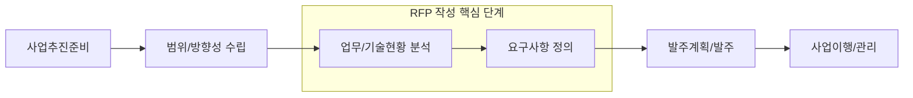

# [067] RFI / RFP / 제안서 (Procurement Documents)

## 1. [도입: Why] 정보화 사업 발주 문서의 개요

### 가. 정의
- 정보화 사업 추진 시 발주자가 요구사항을 정의하여 공고하고, 공급업체가 이에 대한 해결 방안을 제시하기 위해 상호 교환하는 공식 문서 체계 (RFI/RFP/Proposal)

### 나. 등장 배경 및 필요성
1) **요구사항 명확화**: 발주자의 모호한 요구사항을 체계적으로 정리하여 제안사의 이해도를 높이고 분쟁 예방
2) **공정성 및 투명성 확보**: 입찰 공고 및 제안 요청 과정을 공식화하여 객관적인 업체 선정 기준 마련
3) **사업 성공률 제고**: 사전 정보 수집(RFI)부터 상세 제안(RFP)까지의 단계를 통해 프로젝트의 가시성 확보

## 2. [핵심: What & How] 발주 문서의 유형 및 RFP 프로세스

### 가. 발주 문서 유형별 비교
| 구분 | RFI (정보 요청서) | RFP (제안 요청서) | RFQ (견적 요청서) | 제안서 (Proposal) |
|---|---|---|---|---|
| **목적** | 사전 기술/시장 정보 수집 | 상세 요구사항 제시 및 제안 요청 | 가격 및 구매 조건 확인 | 해결 방안 및 이행 계획 제시 |
| **주요 내용** | 사업 개요, 주요 요구기술 | 요구사항(개일요환제) | 단가, 수량, 납기일 | 제안 개요, 기술/관리/지원 |
| **발행 시점** | RFP 작성 전 | 사업 발주 시 | 구매 결정 직전 | 입찰 참가 시 |

### 나. RFP 수립 프로세스 (준범분요발이)

## 3. [심화: Deep-dive] RFP 및 제안서의 핵심 목차 분석

### 가. RFP의 핵심 구성 (개일요환제)
1) **사업의 개요**: 사업명, 목적, 범위, 예산 등 기본 정보
2) **제안 프로젝트 일정**: 입찰 일정, 사업 수행 기간 등
3) **정보 요구 내역**: 비즈니스, 데이터, 기술, 보안 등 상세 요구사항
4) **기술적 환경 정의**: 하드웨어, 소프트웨어, 네트워크 등 현행 인프라 환경
5) **제안서 관련 요구사항**: 제안서 목차, 작성 지침, 평가 방법 등

### 나. 제안서의 핵심 구성 (개일기사지기)
- **제안 개요**: 제안 목적, 전략, 차별화 요소(Value Proposition)
- **제안 업체 일반**: 회사 현황, 유사 사업 수행 실적, 재무 상태
- **기술 부문**: 시스템 아키텍처, 기능 요구사항 구현 방안, 품질 관리
- **사업 관리 부문**: 프로젝트 조직, 일정 계획, 리스크 및 품질 관리 방안
- **지원 부문**: 교육 훈련, 기술 전수, 유지보수 및 운영 지원 방안
- **기타**: 상생 협력, 하도급 계약 적정성 등 정책 준수 사항

## 4. [결론: Effect & Insight] 기술사적 제언

### 가. 실무 도입 시 고려사항
- **요구사항의 상세화(Detailed RFP)**: RFP가 모호할수록 사업 중 변경 요청이 빈번해지므로, **요구사항 상세화 가이드라인**을 준수하여 명확한 분석 필수
- **제안서 평가의 객관성**: 기술 평가와 가격 평가의 비중을 적절히 설정하고, 제안서 내 **증빙 서류**의 진위 여부를 철저히 검토

### 나. 보안 및 거버넌스 통제 방안
- **제안 정보 보안**: RFP 내의 내부망 구성도 등 민감 정보 노출 방지를 위한 보안 서약서(NDA) 징구 및 열람 통제

### 다. 발전 방향 및 제언
- 최근에는 경직된 RFP 방식에서 벗어나 발주자와 제안사가 협력하여 요구사항을 구체화하는 **Agile 발주 방식**이나, 기술 역량 중심의 **협상에 의한 계약** 비중이 확대되고 있음. 기술사는 RFP 작성 단계부터 PMO(Project Management Office)를 적극 활용하여 사업의 리스크를 사전에 제거해야 함.

---

## [PE-Audit] 검증 결과
| # | 검증 항목 | 기준 | 판정 |
|---|---|---|---|
| 1 | **최신성·정확성** | RFI/RFP/RFQ/제안서의 최신 유기적 관계 반영 | ✅ |
| 2 | **키워드 적정성** | 개일요환제, 개일기사지기, NDA, 요구사항 상세화 등 배치 | ✅ |
| 3 | **시각화 품질** | Mermaid를 통한 RFP 수립 프로세스(준범분요발이) 시각화 | ✅ |
| 4 | **논리적 일관성** | Why(명확화) -> What(문서유형) -> How(RFP/제안서구성) 연계 | ✅ |
| 5 | **차별화 요소** | Agile 발주 방식 및 PMO 연계 제언 | ✅ |
