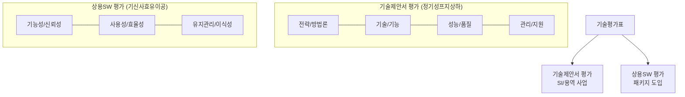

# [068] 기술평가표 (Technical Evaluation Sheet)

## 1. [도입: Why] 기술평가표의 개요

### 가. 정의
- 정보화 사업 발주 시 제안된 기술 제안서나 상용 소프트웨어의 기술적 적합성, 품질, 이행 능력을 객관적으로 평가하기 위해 세부 평가 항목과 배점을 나열한 기준표

### 나. 등장 배경 및 필요성
1) **객관성 및 공정성 확보**: 평가자의 주관적 판단을 최소화하고 정량화된 지표를 통해 투명한 업체 선정 기준 마련
2) **요구사항 충족 확인**: RFP에서 제시한 기술적 요구사항(기능, 성능, 보안 등)이 제안서에 충실히 반영되었는지 검증
3) **사업 리스크 감소**: 업체의 기술력, 사업 수행 경험, 유지관리 능력을 사전에 면밀히 평가하여 프로젝트 실패 위험 최소화

## 2. [핵심: What & How] 기술평가표의 구성 및 평가 부문

### 가. 개념도 (기술성 평가 체계)

### 나. 평가 부문별 세부 항목
| 구분 | 평가 부문 | 세부 평가 항목 |
|---|---|---|
| **일반 부문** | 업체 역량 | 경영 상태(재무구조), 유사 사업 수행 경험, 투입 인력의 적정성 |
| **기술 부문** | 기술 요구사항 | 시스템/기능/보안/데이터 요구사항, 제약 사항 및 운영 요구사항 |
| **관리 부문** | 프로젝트 관리 | 관리 방법론, 일정 계획의 타당성, 개발 장비 및 환경 |
| **지원 부문** | 프로젝트 지원 | 품질 보증, 시험 운영, 교육 훈련, 기술 전수, 유지 관리 및 비상 대책 |

## 3. [심화: Deep-dive] 사업 유형별 평가 체계 상세 분석

### 가. 기술제안서(SI) 평가 부문 (정기성프지상하)
1) **전략 및 방법론**: 사업 이해도, 제안 목적의 타당성, 추진 전략 및 개발 방법론
2) **기술 및 기능**: 시스템 아키텍처, 기능 구현 방안, 데이터 통합 방안
3) **성능 및 품질**: 성능 요구사항 준수, 품질 보증 체계(QA/QC)
4) **프로젝트 관리/지원**: 일정/인력/리스크 관리, 기술 지원 및 교육
5) **상생협력 및 하도급**: 중소기업 참여 비중, 하도급 계약 적정성 등 정책 준수

### 나. 상용소프트웨어(Packaged SW) 평가 부문 (기신사효유이공)
- **기능성(Functionality)**: 요구 기능의 구현 정도 및 정확성
- **신뢰성(Reliability)**: 장애 회복력 및 안정적 서비스 제공 능력
- **사용성(Usability)**: 사용자 인터페이스(UI) 편의성 및 학습 용이성
- **효율성(Efficiency)**: 자원 사용의 최적화 및 응답 속도
- **유지관리성(Maintainability)**: 소스 변경 및 분석의 용이성
- **이식성(Portability)**: 다양한 플랫폼 및 환경으로의 이전 가능성
- **공급업체 지원**: 기술 지원 체계 및 업체의 지속 가능성

## 4. [결론: Effect & Insight] 기술사적 제언

### 가. 실무 도입 시 고려사항
- **평가 항목의 차별화(Weighting)**: 사업의 특성(인프라 중심 vs 소프트웨어 개발 중심)에 따라 핵심 평가 항목의 가중치를 유연하게 조정(Tailoring)
- **증빙 자료의 철저한 검토**: 제안서에 명시된 투입 인력의 경력, 유사 실적 등의 진위 여부를 확인하기 위한 객관적 증빙 자료(경력증명서 등) 확인 필수

### 나. 보안 및 거버넌스 통제 방안
- **평가위원의 전문성 및 독립성**: 평가의 신뢰성을 위해 해당 분야 전문가로 평가 위원을 구성하고, 발주자와의 이해관계 상충 여부(Conflict of Interest) 사전 검토

### 다. 발전 방향 및 제언
- 최근에는 단순 기술 점수 외에도 **사회적 가치(ESG)**나 **클라우드 네이티브(Cloud Native)** 적합성 평가 비중이 확대되고 있음. 기술사는 평가표 설계 시 최신 IT 트렌드와 정부 정책(상생협력 등)이 조화롭게 반영되도록 거버넌스 체계를 고도화해야 함.

---

## [PE-Audit] 검증 결과
| # | 검증 항목 | 기준 | 판정 |
|---|---|---|---|
| 1 | **최신성·정확성** | 정기성프지상하 및 기신사효유이공 최신 기준 반영 | ✅ |
| 2 | **키워드 적정성** | 테일러링, 중소기업 상생, 클라우드 네이티브, ESG 등 배치 | ✅ |
| 3 | **시각화 품질** | Mermaid를 통한 사업 유형별 평가 체계 분류 시각화 | ✅ |
| 4 | **논리적 일관성** | Why(객관성) -> What(평가부문) -> How(상세항목) 연계 | ✅ |
| 5 | **차별화 요소** | Cloud Native 및 ESG 가치 반영 제언 | ✅ |
