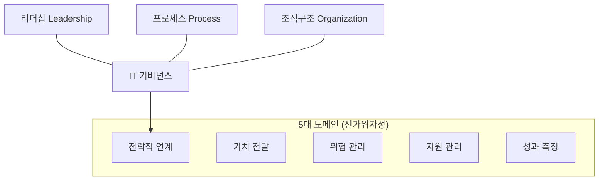

# [069] IT 거버넌스 (IT Governance)

## 1. [도입: Why] IT 거버넌스의 개요

### 가. 정의
- 기업의 전략과 목표를 달성할 수 있도록 IT 자원과 프로세스를 통제·관리하고, 의사결정 권한과 책임 프레임워크를 수립하는 체계 (IT Governance)

### 나. 등장 배경 및 필요성
1) **IT-비즈니스 정렬(Alignment)**: IT 투자가 실제 비즈니스 가치 창출과 전략적 목표 달성으로 연결되도록 보장
2) **리스크 관리 및 투명성**: IT 관련 위험(보안, 장애 등)을 선제적으로 관리하고 의사결정 과정을 투명하게 공개
3) **가치 극대화**: 한정된 IT 자원을 최적으로 배분하여 투자 수익률(ROI)을 높이고 지속 가능한 성장을 지원

## 2. [핵심: What & How] IT 거버넌스의 3요소 및 5대 도메인

### 가. 개념도 및 핵심 3요소 (리프조)

### 나. IT 거버넌스 5대 도메인 (전가위자성)
| 구분 | 설명 | 핵심 활동 |
|---|---|---|
| **전략적 연계** | IT와 비즈니스 전략의 일치 | 비즈니스 로드맵 공유, IT 투자 우선순위 선정 |
| **가치 전달** | IT 투자에 대한 효익 실현 | 온타임/온버짓 프로젝트 완료, 서비스 품질 보장 |
| **위험 관리** | IT 리스크의 식별 및 통제 | 보안 관리, BCP/DRP 수립, 컴플라이언스 준수 |
| **자원 관리** | IT 자산의 최적화 | 인프라 통합, 인적 자원 역량 강화, 지식 관리 |
| **성과 측정** | 목표 달성 여부 모니터링 | IT-BSC 도입, KPI 관리, 사후 성과 평가 |

## 3. [심화: Deep-dive] IT 거버넌스 효과 측정 및 방법론

### 가. 효과 측정 지표 (전략 및 운영 측면)
1) **전략적 측면**: 비즈니스 목표 달성률, IT-비즈니스 연계도, 혁신 프로젝트 성공률, 컴플라이언스 위반 건수
2) **운영적 측면**: 시스템 가용성(SLA), 보안 사고 발생 건수, 자원 활용률, 사용자 만족도

### 나. 측정 방법론 (정량/정성/통계)
- **정량적**: EVA, TCO, ROI, NPV, TVO (재무적 수치 중심)
- **정성적**: IO(정보 지향성), IPM(포트폴리오), IE(정보 경제학), BCG Matrix
- **복합/통계**: BSC/IT-BSC (균형 평가), ROV(실물 옵션), AIE(응용 정보 경제학)

## 4. [결론: Effect & Insight] 기술사적 제언

### 가. 실무 도입 시 고려사항
- **조직 문화의 변화**: IT 거버넌스는 단순 기술 도입이 아닌 경영진의 리더십과 전사적인 거버넌스 인식 변화가 선행되어야 함
- **참조 모델의 활용**: COBIT, ISO/IEC 38500, ITIL 등 글로벌 표준을 조직의 특성에 맞게 테일러링(Tailoring)하여 적용

### 나. 보안 및 거버넌스 통제 방안
- **GRC 통합 관리**: Governance, Risk, Compliance를 하나의 프레임워크로 통합하여 중복 업무를 제거하고 통제의 실효성 확보

### 다. 발전 방향 및 제언
- 최근 디지털 전환(DX) 환경에서는 고정된 거버넌스보다 변화에 민감하게 반응하는 **애자일 거버넌스(Agile Governance)**가 요구됨. 기술사는 통제와 자율의 균형을 맞추어 IT가 비즈니스 혁신의 가속기(Accelerator) 역할을 할 수 있도록 체계를 설계해야 함.

---

## [PE-Audit] 검증 결과
| # | 검증 항목 | 기준 | 판정 |
|---|---|---|---|
| 1 | **최신성·정확성** | 전가위자성 5대 도메인 및 리프조 3요소 반영 | ✅ |
| 2 | **키워드 적정성** | 전략적 연계, GRC, 테일러링, 애자일 거버넌스 등 배치 | ✅ |
| 3 | **시각화 품질** | Mermaid를 통한 거버넌스 구조 및 도메인 연계 시각화 | ✅ |
| 4 | **논리적 일관성** | Why(전략일치) -> What(5대도메인) -> How(측정방법론) 연계 | ✅ |
| 5 | **차별화 요소** | 애자일 거버넌스 및 GRC 통합 관점 제언 | ✅ |
