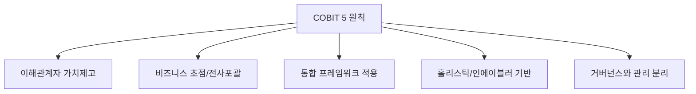

# [070] COBIT 5 (Control Objectives for Information and related Technology 5)

## 1. [도입: Why] COBIT 5의 개요

### 가. 정의
- IT 거버넌스와 관리를 위한 목적 달성을 지원하기 위해 COBIT 4.1, Risk IT, Val IT를 통합한 종합적인 IT 거버넌스 프레임워크 (COBIT 5)

### 나. 등장 배경 및 필요성
1) **통합 가이드라인 부재**: 기존의 분산된 프레임워크(4.1, Val, Risk)를 하나로 결합하여 일관된 관리 체계 필요
2) **전사적 IT 거버넌스 (GEIT)**: IT 부서만의 관리가 아닌 조직 전체의 비즈니스 가치 창출을 위한 거버넌스 요구
3) **인에이블러(Enabler) 기반 접근**: 정보, 조직, 문화 등 다양한 요소를 유기적으로 연결하여 목표 달성 지원

## 2. [핵심: What & How] COBIT 5의 5대 원칙 및 7대 인에이블러

### 가. 5대 원칙 (통이 비인거)

### 나. 핵심 구성 요소 (5대 원칙 & 7대 인에이블러)
| 구분 | 상세 내용 | 설명 |
|---|---|---|---|
| **5대 원칙** | **이해관계자 가치제고** | 가치 창출(Benefit), 리스크 최적화, 자원 효율화 |
| (통이 비인거) | **거버넌스와 관리 분리** | 거버넌스(EDM)와 관리(APO/BAI/DSS/MEA) 역할 명확화 |
| **7대 인에이블러** | **원칙/정책/프레임워크** | 거버넌스 및 관리를 위한 기본 가이드라인 |
| (원프조문 정서인) | **프로세스/조직구조** | 활동의 집합 및 의사결정 체계 |
| | **문화/행동/윤리** | 조직 구성원의 가치관과 행동 양식 |
| | **정보/서비스/인프라** | 거버넌스 수행을 위한 물리적/논리적 자산 |
| | **인력/스킬/전문성** | 목표 달성을 위한 역량 확보 |

## 3. [심화: Deep-dive] COBIT 5의 프로세스 영역 및 성숙도

### 가. 주요 프로세스 영역 (애들아빠바이댄스미)
1) **거버넌스 영역 (EDM)**: Evaluate(평가), Direct(지휘), Monitor(모니터링)
2) **관리 영역 (PBRM)**:
    - **APO**: Align, Plan, Organize (연계, 계획, 조직화)
    - **BAI**: Build, Acquire, Implement (구축, 도입, 구현)
    - **DSS**: Deliver, Service, Support (제공, 서비스, 지원)
    - **MEA**: Monitor, Evaluate, Assess (모니터, 평가, 진단)

### 나. 프로세스 역량 평가 (ISO/IEC 15504 기반)
- **0단계 (부재)** -> **1단계 (수행)** -> **2단계 (관리)** -> **3단계 (정의)** -> **4단계 (예측/통제)** -> **5단계 (최적화)**

## 4. [결론: Effect & Insight] 기술사적 제언

### 가. 실무 도입 시 고려사항
- **거버넌스와 관리의 명확한 역할 분담**: 거버넌스(이사회/경영진)와 관리(현업/IT팀)의 책임을 명확히 구분하여 의사결정의 효율성 제고
- **조직 문화의 내재화**: 7대 인에이블러 중 특히 '문화와 윤리'를 강조하여 거버넌스가 규제가 아닌 문화로 정착되도록 유도

### 나. 보안 및 거버넌스 통제 방안
- **통합 위험 관리**: Risk IT와 결합된 구조를 활용하여 보안 리스크를 비즈니스 리스크 관점에서 통합 통제

### 다. 발전 방향 및 제언
- COBIT 5는 현재 **COBIT 2019**로 진화하며 더 유연한 설계 가이드라인을 제공하고 있음. 기술사는 COBIT 5의 기초 체력을 바탕으로 디지털 전환 시대에 맞는 **Customized Governance System**을 구축해야 함.

---

## [PE-Audit] 검증 결과
| # | 검증 항목 | 기준 | 판정 |
|---|---|---|---|
| 1 | **최신성·정확성** | COBIT 5의 5대 원칙 및 7대 인에이블러 반영 | ✅ |
| 2 | **키워드 적정성** | 통이 비인거, 원프조문 정서인, EDM/APO/BAI/DSS/MEA 등 배치 | ✅ |
| 3 | **시각화 품질** | Mermaid를 통한 5대 원칙 시각화 | ✅ |
| 4 | **논리적 일관성** | Why(통합관리) -> What(원칙/인에이블러) -> How(프로세스역량) 연계 | ✅ |
| 5 | **차별화 요소** | 거버넌스와 관리의 역할 분리 및 COBIT 2019 연계 제언 | ✅ |
