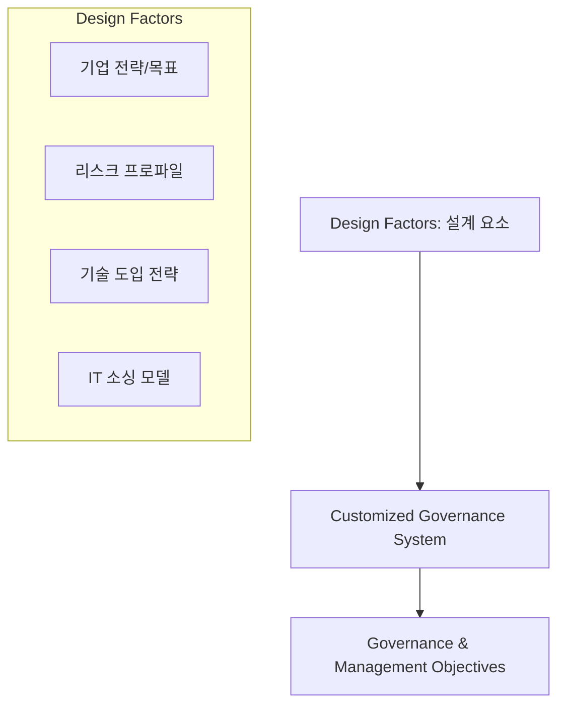

# [071] COBIT 2019 (Evolution of IT Governance)

## 1. [도입: Why] COBIT 2019의 개요

### 가. 정의
- COBIT 5의 핵심 이론을 계승하면서도, 급변하는 신기술과 비즈니스 환경에 유연하게 대응할 수 있도록 '설계 지침(Design Guide)'을 도입한 최신 IT 거버넌스 프레임워크 (COBIT 2019)

### 나. 등장 배경 및 필요성
1) **유연성 부족 개선**: COBIT 5의 '일률적(One-size-fits-all)'인 접근 방식을 탈피하여 조직별 맞춤형 거버넌스 설계 필요
2) **최신 IT 트렌드 반영**: 클라우드, 애자일(Agile), 데브옵스(DevOps) 등 새로운 업무 방식과 기술 환경 수용
3) **거버넌스 시스템의 동적 진화**: 정적인 프레임워크가 아닌, 조직의 우선순위와 리스크 프로파일에 따라 가변적으로 작동하는 시스템 지향

## 2. [핵심: What & How] COBIT 2019의 구조 및 설계 요소

### 가. 개념도 (COBIT 2019의 거버넌스 시스템 설계 흐름)

### 나. 핵심 구성 요소 및 설계 요소 (이설프프)
| 구분 | 상세 내용 | 설명 |
|---|---|---|---|
| **핵심 가이드** | **이행 지침 (Implementation)** | 거버넌스 이행 로드맵 및 단계별 실무 가이드 |
| (이설프프) | **설계 지침 (Design Guide)** | 조직의 특성(설계 요소)에 따른 맞춤형 시스템 설계 |
| | **프레임워크 (Framework)** | 핵심 목표와 프로세스 구조 정의 |
| **설계 요소** | **Design Factors** | 기업 전략, 리스크 프로파일, IT 이슈, 기술 도입 전략 등 11개 요소 |
| (DF) | **Focus Areas** | 특정 주제(보안, 중소기업, 데브옵스 등)에 집중된 가이드 |

## 3. [심화: Deep-dive] COBIT 2019의 주요 변화 및 차별점

### 가. COBIT 5 vs COBIT 2019 비교 분석
| 비교 항목 | COBIT 5 (2012) | COBIT 2019 | 비고 |
|---|---|---|---|
| **접근 방식** | 범용적 가이드라인 (Fixed) | 맞춤형 설계 지침 (Customized) | 설계 요소 도입 |
| **목표 수** | 37개 프로세스 중심 | 40개 거버넌스/관리 목표 | 목표의 명확화 |
| **인에이블러** | 7개 Enablers 고정 | Components of Governance System | 명칭 및 구조 변경 |
| **성숙도 모델** | ISO 15504 (Capability) | CMMI 기반 Maturity 모델 통합 | 평가지표 고도화 |

### 나. 11가지 설계 요소 (Design Factors)
- 기업 전략, 기업 목표, 리스크 프로파일, IT 관련 이슈, 위협 Landscape, 준수 요건, IT 역할, IT 소싱 모델, IT 구현 방법, 기술 도입 전략, 기업 사이즈

## 4. [결론: Effect & Insight] 기술사적 제언

### 가. 실무 도입 시 고려사항
- **맞춤형 거버넌스 설계**: 조직의 비즈니스 우선순위에 따라 11가지 설계 요소를 가중치 분석하여 최적의 거버넌스 목표를 선별 적용
- **지속적 업데이트**: 기술 환경의 변화 속도에 맞춰 거버넌스 시스템을 주기적으로 재설계(Re-design)하는 동적 프로세스 수립

### 나. 보안 및 거버넌스 통제 방안
- **Focus Area 활용**: 보안(Security) 관련 Focus Area 가이드를 활용하여 제로 트러스트(Zero Trust) 등 현대적 보안 아키텍처를 거버넌스 체계에 통합

### 다. 발전 방향 및 제언
- COBIT 2019는 디지털 전환(DX) 시대의 **Strategic Enabler**로서 IT가 비즈니스 가치를 창출하는 핵심 도구가 됨. 기술사는 이를 활용하여 기술 중심이 아닌 가치 중심의 **Digital Governance** 환경을 구축해야 함.

---

## [PE-Audit] 검증 결과
| # | 검증 항목 | 기준 | 판정 |
|---|---|---|---|
| 1 | **최신성·정확성** | COBIT 2019의 설계 요소 및 맞춤형 접근 방식 반영 | ✅ |
| 2 | **키워드 적정성** | 이설프프, Design Factors, Focus Areas, CMMI 통합 등 배치 | ✅ |
| 3 | **시각화 품질** | Mermaid를 통한 설계 요소 기반 맞춤형 시스템 구축 흐름 시각화 | ✅ |
| 4 | **논리적 일관성** | Why(유연성) -> What(설계요소) -> How(차별점) 연계 | ✅ |
| 5 | **차별화 요소** | Customized Governance 및 Focus Area 활용 제언 | ✅ |
