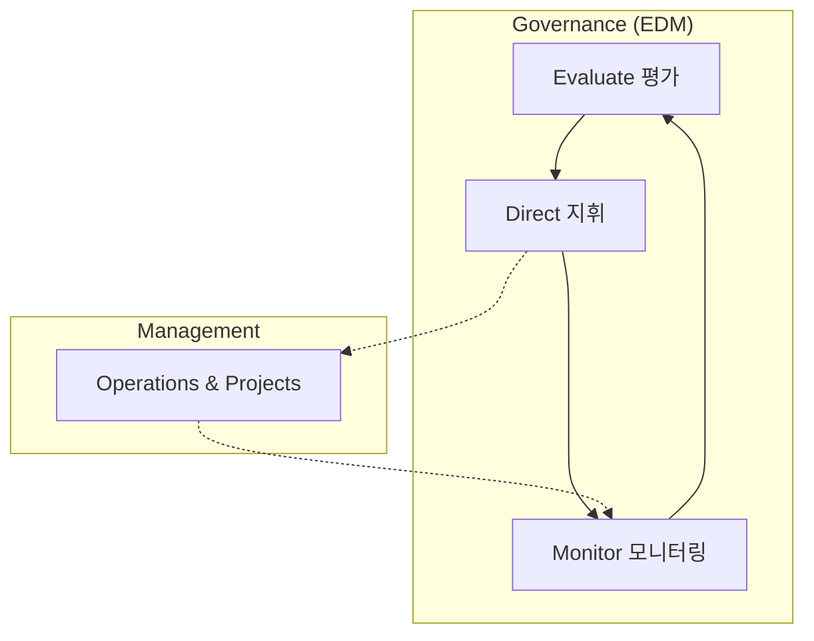

# [072] ISO/IEC 38500 (Corporate Governance of IT)

## 1. [도입: Why] ISO/IEC 38500의 개요

### 가. 정의
- 조직의 경영진(이사회)이 IT 활용을 평가(Evaluate), 지휘(Direct), 모니터링(Monitor)할 수 있도록 IT 거버넌스의 원칙과 프레임워크를 제시하는 국제 표준 (ISO/IEC 38500)

### 나. 등장 배경 및 필요성
1) **경영진의 책임성 강화**: IT가 비즈니스의 핵심 요소가 됨에 따라, IT 활용에 대한 이사회의 감독 및 관리 책임(Accountability) 규정 필요
2) **IT 거버넌스의 표준화**: 조직의 규모나 업종에 관계없이 보편적으로 적용 가능한 거버넌스 6대 원칙과 EDM 모델 제시
3) **비즈니스 가치 창출**: IT 투자가 전략과 정렬되고, 리스크를 적절히 통제하여 최상의 성과를 내도록 유도

## 2. [핵심: What & How] ISO/IEC 38500의 EDM 모델 및 6대 원칙

### 가. 개념도 (EDM 순환 모델)

### 나. 거버넌스 수행을 위한 6대 원칙 (책준전구성인)
| 원칙 | 상세 설명 | 핵심 내용 |
|---|---|---|---|
| **책임 (Responsibility)** | 의사결정 권한과 책임 할당 | IT 관련 업무에 대한 책임과 권한의 명확한 정의 |
| **전략 (Strategy)** | IT와 비즈니스 전략의 연계 | 현재와 미래의 비즈니스 목표를 지원하는 IT 전략 수립 |
| **획득/구매 (Acquisition)** | 타당성 기반의 IT 자산 확보 | 가치 분석을 통한 투명한 IT 자원 획득 프로세스 |
| **성과 (Performance)** | 비즈니스 가치 전달 및 성과 평가 | IT 투자가 목표한 효익을 창출하는지 지속 측정 |
| **준거 (Conformance)** | 법적/규제적 요건의 준수 | 내외부 규정 및 표준에 대한 준거성 확보 |
| **인간 행동 (Human Behaviour)** | 사용자 및 구성원의 행동 고려 | IT 활용 시 인간적 요인 및 문화적 측면 존중 |

## 3. [심화: Deep-dive] EDM 모델의 단계별 활동 (평지모)

### 가. 평가 (Evaluate)
- IT의 현재 및 미래 활용 방안에 대한 지속적인 평가
- 비즈니스 목표 달성을 위한 IT의 기여도 및 리스크 수준 판단

### 나. 지휘 (Direct)
- 평가 결과를 바탕으로 IT 전략 수립 및 리스크 대응 지시
- 자원 배분 및 프로젝트 우선순위 결정, 책임 할당

### 다. 모니터링 (Monitor)
- IT 성과가 계획대로 달성되고 있는지, 규제는 준수되는지 감시
- 실제 결과와 목표 간의 차이를 분석하여 평가 단계로 피드백

## 4. [결론: Effect & Insight] 기술사적 제언

### 가. 실무 도입 시 고려사항
- **경영진의 실무적 개입**: 단순 보고를 받는 수준을 넘어, EDM 모델에 따라 전략적 의사결정에 이사회가 직접 참여해야 함
- **타 프레임워크와의 시너지**: COBIT, ITIL, ISO/IEC 27001 등 구체적인 관리 모델과 병행하여 실행력 강화

### 나. 보안 및 거버넌스 통제 방안
- **책임성과 준거성 강화**: 정보보호 관련 사고 발생 시 경영진의 책임을 법적으로 규정하는 추세에 맞춰, ISO/IEC 38500 기반의 보안 거버넌스 정립 필수

### 다. 발전 방향 및 제언
- 최근 디지털 거버넌스는 단순 IT 통제를 넘어 **데이터 거버넌스(Data Governance)** 및 **AI 거버넌스**로 확장되고 있음. 기술사는 ISO/IEC 38500을 근간으로 지능형 자산에 대한 경영진의 감독 체계를 고도화해야 함.

---

## [PE-Audit] 검증 결과
| # | 검증 항목 | 기준 | 판정 |
|---|---|---|---|
| 1 | **최신성·정확성** | EDM(평지모) 모델 및 6대 원칙(책준전구성인) 반영 | ✅ |
| 2 | **키워드 적정성** | 책임성, 전략적 연계, 준거성, 인간 행동 등 배치 | ✅ |
| 3 | **시각화 품질** | Mermaid를 통한 거버넌스와 관리 레이어 간의 EDM 모델 시각화 | ✅ |
| 4 | **논리적 일관성** | Why(경영진책임) -> What(6대원칙) -> How(평지모활동) 연계 | ✅ |
| 5 | **차별화 요소** | AI 거버넌스 확장 및 경영진의 실무적 참여 제언 | ✅ |
