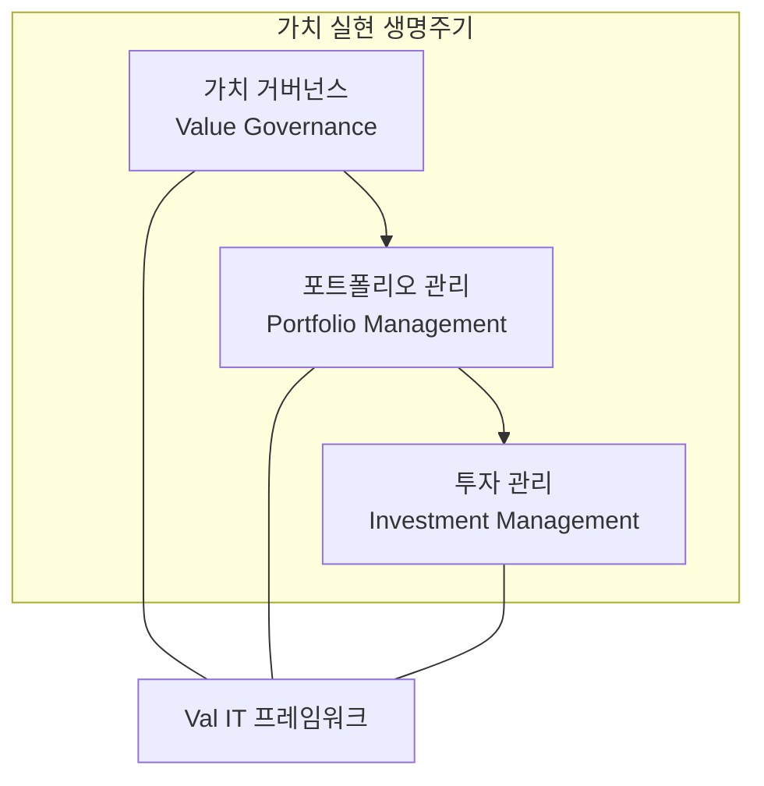

# [073] Val IT (IT Value Realization Framework)

## 1. [도입: Why] Val IT의 개요

### 가. 정의
- IT 관련 투자로부터 최상의 비즈니스 가치를 실현하기 위해, 가치 창출 과정을 측정·감시·최적화할 수 있는 프레임워크 (Val IT)

### 나. 등장 배경 및 필요성
1) **IT 투자 성과 증명**: 막대한 IT 비용 투입 대비 실질적인 비즈니스 효익(Benefit)이 발생하는지 가시적 증명 필요
2) **가치 실현의 사후 관리**: 투자의 타당성 검토에만 그치지 않고, 구축 이후 실제 가치 실현 단계까지 전 과정 관리
3) **거버넌스와 가치 경영의 결합**: COBIT이 통제(Control) 중심이라면, Val IT는 가치 창출(Value Creation)에 집중하여 보완

## 2. [핵심: What & How] Val IT의 3대 도메인 및 구조

### 가. 개념도 (Val IT의 3대 핵심 영역)

### 나. 핵심 구성 요소 및 도메인
| 도메인 | 설명 | 핵심 활동 |
|---|---|---|---|
| **가치 거버넌스 (VG)** | 전사적 가치 관리 체계 수립 | 가치 관리 전략 수립, 책임 및 역할 정의, 성과 측정 지표 개발 |
| **포트폴리오 관리 (PM)** | 최적의 투자 조합 구성 | 투자 대안 평가 및 우선순위 선정, 자원 배분 최적화, 포트폴리오 모니터링 |
| **투자 관리 (IM)** | 개별 투자 사업의 가치 실현 | 비즈니스 케이스(Business Case) 수립, 효익 실현 단계별 관리, 사후 성과 평가 |

## 3. [심화: Deep-dive] Val IT와 COBIT의 관계 및 핵심 원칙

### 가. Val IT vs COBIT 비교
| 비교 항목 | COBIT (Control Focused) | Val IT (Value Focused) | 비고 |
|---|---|---|---|
| **핵심 목적** | IT 위험 통제 및 관리 효율성 | IT 투자 가치 실현 및 극대화 | 상호 보완 |
| **주요 대상** | IT 프로세스 및 자원 | 비즈니스 케이스 및 투자 포트폴리오 | 가치 사슬 중심 |
| **주요 질문** | IT를 올바르게 수행하고 있는가? | 올바른 IT를 수행하고 가치를 얻고 있는가? | 경영진 관점 |

### 나. 가치 실현을 위한 7대 원칙
- 모든 IT 투자는 포트폴리오 관점에서 관리, 비즈니스 가치에 기반한 투자 결정, 전 생명주기 관리, 지속적인 성과 측정 등

## 4. [결론: Effect & Insight] 기술사적 제언

### 가. 실무 도입 시 고려사항
- **비즈니스 케이스(Business Case) 내실화**: 단순 비용 산출이 아닌, 정성적 효익을 화폐 가치로 환산하는 정교한 모델 수립 필수
- **사후 성과 분석 체계**: 프로젝트 종료 후 실제 비즈니스에 미친 영향을 측정하는 '사후 정산' 문화 정착 필요

### 나. 보안 및 거버넌스 통제 방안
- **리스크 기반 가치 평가**: 가치 창출 과정에서 발생할 수 있는 보안 리스크가 가치 훼손으로 이어지지 않도록 리스크 관리 비용 반영

### 다. 발전 방향 및 제언
- 최근의 가치 관리는 **FinOps**와 결합하여 클라우드 비용 대비 비즈니스 가치를 실시간으로 최적화하는 방향으로 진화 중임. 기술사는 Val IT 프레임워크를 현대적 IT 운영 모델(Agile, DevOps)에 맞게 경량화하고 데이터 기반의 실시간 가치 경영 체계를 구축해야 함.

---

## [PE-Audit] 검증 결과
| # | 검증 항목 | 기준 | 판정 |
|---|---|---|---|
| 1 | **최신성·정확성** | 3대 도메인(VG, PM, IM) 및 COBIT과의 관계 반영 | ✅ |
| 2 | **키워드 적정성** | 비즈니스 케이스, 효익 실현, 포트폴리오 관리 등 배치 | ✅ |
| 3 | **시각화 품질** | Mermaid를 통한 Val IT 도메인 및 생명주기 시각화 | ✅ |
| 4 | **논리적 일관성** | Why(가치증명) -> What(3대도메인) -> How(COBIT비교) 연계 | ✅ |
| 5 | **차별화 요소** | FinOps 결합 및 데이터 기반 가치 경영 제언 | ✅ |
