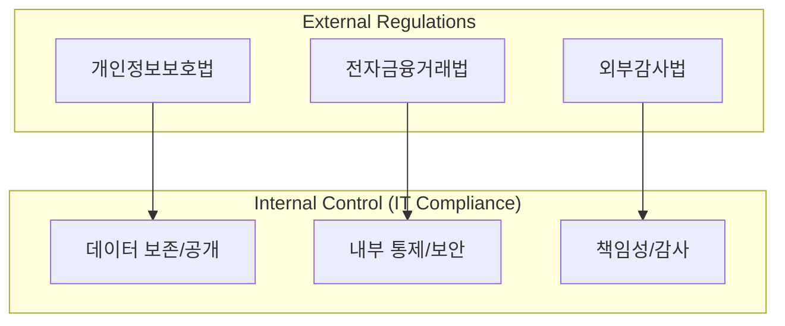

# [074] IT 컴플라이언스 (IT Compliance)

## 1. [도입: Why] IT 컴플라이언스의 개요

### 가. 정의
- 기업의 투명성 강화와 리스크 관리를 위해 정부나 관련 기관에서 제시하는 각종 법령, 규제, 표준 및 가이드라인을 준수할 수 있도록 IT 시스템과 프로세스를 정비하는 강제적·의무적 활동 (IT Compliance)

### 나. 등장 배경 및 필요성
1) **법적 책임성 강화**: 개인정보보호법, 전자금융거래법 등 관련 법규 위반 시 부과되는 막대한 과징금 및 형사 처벌 대응
2) **사회적 신뢰 확보**: ESG 경영 확산에 따른 기업의 윤리적 책임 및 데이터 투명성 확보 요구 증대
3) **글로벌 비즈니스 요건**: GDPR, HIPAA, SOX 등 해외 진출 시 필수적인 규제 준수 허들 극복

## 2. [핵심: What & How] IT 컴플라이언스의 규제 유형 및 요구사항

### 가. 개념도 (컴플라이언스 구성 및 데이터 통제 흐름)

### 나. 핵심 규제 유형 및 주요 요구사항
| 구분 | 규제 종류 | 주요 요구사항 (공보보통책) |
|---|---|---|---|
| **개인정보보호** | 개인정보보호법, GDPR | 데이터 보호, 수집 동의, 파기, 개인정보 처리 이력 관리 |
| **정보관리** | 공공기록물 관리법, 외부감사법 | 데이터 보존 기한 준수, 데이터 공개 투명성, 정합성 보장 |
| **정보보안** | ISMS-P, 정보통신망법 | 내부 통제 체계 수립, 접근 제어, 사고 대응 및 보고 체계 |
| **금융/상거래** | 전자금융거래법, 신용정보법 | 금융 거래 데이터 무결성, 보안 사고 책임성 강화 |

## 3. [심화: Deep-dive] IT 컴플라이언스 대응 프로세스 및 구성 요소

### 가. 5대 핵심 요구사항 (공보보통책)
1) **데이터 공개 (Transparency)**: 감사 시 필요한 데이터를 즉각적으로 제공할 수 있는 환경 구축
2) **데이터 보존 (Retention)**: 법적 보존 기한(최소 5~10년 등)을 준수하는 아카이빙 체계
3) **데이터 보호 (Protection)**: 암호화, 접근 제어 등 물리적/기술적 보안 조치
4) **내부 통제 (Internal Control)**: 직무 분리(SoD), 승인 프로세스 등 업무 절차의 통제
5) **책임성 (Accountability)**: 모든 IT 행위에 대한 감사 로그(Audit Trail) 및 책임 소재 명확화

### 나. GRC (Governance, Risk, Compliance) 통합 관리
- 컴플라이언스는 단순히 법을 지키는 활동을 넘어, 거버넌스 및 리스크 관리와 통합되어 전사적 신뢰 시스템으로 작동해야 함

## 4. [결론: Effect & Insight] 기술사적 제언

### 가. 실무 도입 시 고려사항
- **자동화된 컴플라이언스(RegTech)**: 수동 점검의 한계를 극복하기 위해 실시간으로 법규 준수 여부를 모니터링하는 레그테크(RegTech) 솔루션 도입 필요
- **Security by Design**: 시스템 설계 단계부터 컴플라이언스 요건을 반영하여 사후 조치 비용 최소화

### 나. 보안 및 거버넌스 통제 방안
- **지속적 감시(Continuous Auditing)**: 연 1회 정기 감사가 아닌, 상시 감사(Real-time Audit) 체계를 구축하여 위반 사항 즉시 적발 및 조치

### 다. 발전 방향 및 제언
- 최근 IT 컴플라이언스는 **AI 윤리 준수** 및 **데이터 주권(Data Sovereignty)** 확보로 확장되고 있음. 기술사는 법적 준거성을 넘어 기술의 사회적 영향을 고려하는 **Ethics-based Compliance** 체계 수립을 주도해야 함.

---

## [PE-Audit] 검증 결과
| # | 검증 항목 | 기준 | 판정 |
|---|---|---|---|
| 1 | **최신성·정확성** | 공보보통책 및 GRC, RegTech 연계 개념 반영 | ✅ |
| 2 | **키워드 적정성** | 공보보통책, 레그테크, 아카이빙, 직무 분리(SoD) 등 배치 | ✅ |
| 3 | **시각화 품질** | Mermaid를 통한 외부 규제와 내부 통제 간의 연동 시각화 | ✅ |
| 4 | **논리적 일관성** | Why(법적책임) -> What(공보보통책) -> How(RegTech) 연계 | ✅ |
| 5 | **차별화 요소** | RegTech 및 Ethics-based Compliance 제언 | ✅ |
