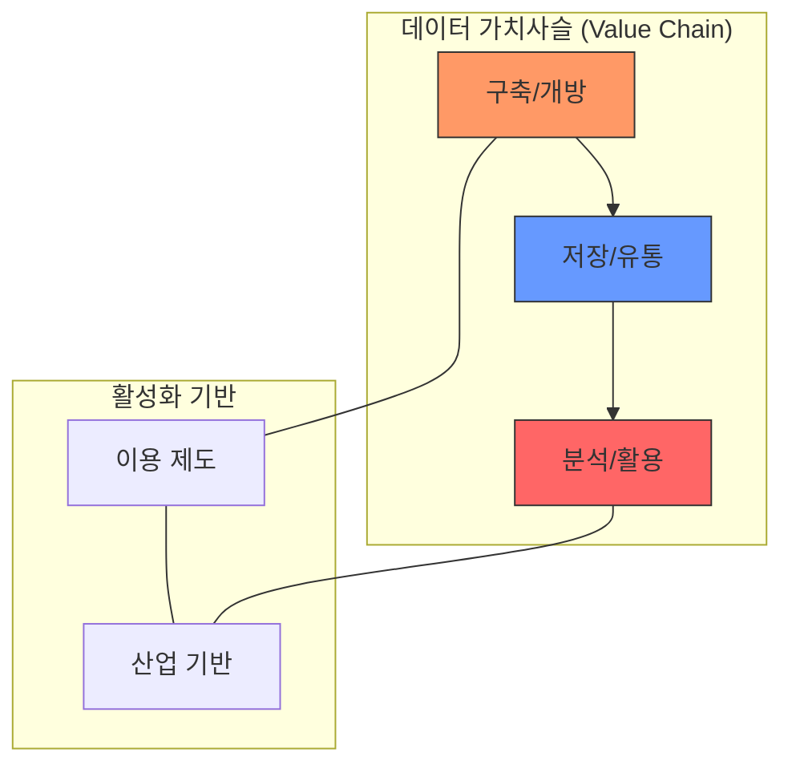

# [075] 데이터 경제 (Data Economy)

## 1. [도입: Why] 데이터 경제의 개요

### 가. 정의
- 모든 데이터가 자유롭게 흐르고 활용되어 타 산업 발전의 촉매 역할을 하며, 혁신적인 비즈니스와 서비스를 창출하는 경제 체제 (Data Economy)

### 나. 등장 배경 및 필요성
1) **디지털 전환(DX) 가속화**: 클라우드, AI, IoT 기술 발전에 따라 방대한 데이터가 생성되며 가치 창출의 원천으로 부상
2) **데이터 기반 의사결정**: 객관적 데이터를 활용한 분석이 기업 경쟁력과 공공 행정 효율성의 핵심 지표로 작용
3) **신산업 동력 확보**: 자율주행, 스마트 헬스케어 등 미래 산업의 원료로서 데이터의 중요성 증대

## 2. [핵심: What & How] 데이터 경제의 구조 및 가치사슬

### 가. 개념도 및 메커니즘

### 나. 데이터 경제의 3대 핵심 요소 및 한계점
| 구분 | 핵심 요소 | 주요 한계점 | 대응 방향 |
|---|---|---|---|
| **이용 제도** | 데이터 이동권, 가명정보 활용 | 엄격한 개인정보 규제, 법적 불확실성 | 개인정보 보호와 활용의 균형 (가명처리지침 등) |
| **가치사슬** | 구축-개방-저장-유통-분석-활용 | 공공/민간 데이터 개방 미흡, 유통 채널 부재 | 데이터 댐 구축, 데이터 거래소 활성화 |
| **산업 기반** | 선도 기술, 전문 인력 | 해외 대비 낮은 기술 수준, 인력 수급 불균형 | R&D 투자 확대, 거점 대학 육성 |

## 3. [심화: Deep-dive] 분야별 활성화 추진 과제

### 가. 전략 산업별 데이터 활용 고도화
1) **자율주행/로봇**: 영상정보 원본 활용 허용, 정밀지도 데이터 거래 시장 조성 및 안전성 가이드라인 마련
2) **인공지능(AI)**: 고품질 AI 학습용 데이터셋 구축 확대, 사전 적정성 검토제 도입을 통한 규제 샌드박스 운영
3) **바이오/헬스**: 의료 데이터 표준화(HL7 FHIR 등) 및 비식별화 기술을 통한 공공 의료 빅데이터 개방 확대

### 나. 데이터 인프라 및 마이데이터 확산
- **마이데이터(MyData)**: 금융 중심에서 의료, 공공, 에너지 분야로 '개인정보 전송요구권' 확대 및 선도 프로젝트 추진
- **국가 데이터 인프라**: 데이터 가치평가 모델 개발, 품질인증(DQC-V 등) 고도화 및 데이터 안심구역 운영

## 4. [결론: Effect & Insight] 기술사적 제언

### 가. 실무 도입 시 고려사항
- **데이터 품질 관리**: 'Garbage In, Garbage Out' 방지를 위해 수집 단계부터 데이터 정제 및 품질 표준 준수 필수
- **데이터 주권 및 거버넌스**: 국경 간 데이터 이동(CBPR 등)과 데이터 소유권 보호를 위한 거버넌스 체계 수립 필요

### 나. 보안 및 거버넌스 통제 방안
- **PET(Privacy Enhancing Tech)**: 동형암호, 차분 프라이버시, 연합 학습 등 최신 보안 기술을 적용하여 활용과 보호의 양립 추구

### 다. 발전 방향 및 제언
- 데이터 경제는 단순한 양적 성장을 넘어 데이터의 **재사용성(Reusability)**과 **상호운용성(Interoperability)**이 담보된 질적 성장으로 전환되어야 함. 기술사는 데이터 가치평가사 및 데이터 전문가로서 데이터가 자산으로 공정하게 거래되는 **신뢰 기반 데이터 생태계**를 설계해야 함.

---

## [PE-Audit] 검증 결과
| # | 검증 항목 | 기준 | 판정 |
|---|---|---|---|
| 1 | **최신성·정확성** | 데이터 이동권 및 마이데이터, 산업별 과제 반영 | ✅ |
| 2 | **키워드 적정성** | 가치사슬, PET, 데이터 주권, 품질인증 등 배치 | ✅ |
| 3 | **시각화 품질** | Mermaid를 통한 가치사슬 및 기반 요소 관계 표현 | ✅ |
| 4 | **논리적 일관성** | Why(산업촉매) -> What(구조/한계) -> How(분야별과제) 연계 | ✅ |
| 5 | **차별화 요소** | PET 기술 및 신뢰 기반 데이터 생태계 제언 | ✅ |
