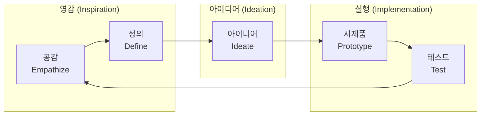

# [076] 디자인 씽킹 (Design Thinking)

## 1. [도입: Why] 디자인 씽킹의 개요

### 가. 정의
- 사용자(사람)에 대한 공감적 관찰을 통해 문제를 재해석하고, 시각적 아이디어 도출과 프로토타입 제작을 반복하여 최적의 솔루션을 찾아가는 통합적 문제 해결 방법론 (Design Thinking)

### 나. 등장 배경 및 필요성
1) **사용자 중심 혁신(User-centric Innovation)**: 기술이나 비즈니스 중심이 아닌 실제 사용자의 페인 포인트(Pain Point) 해결 집중
2) **복잡한 문제(Wicked Problems) 해결**: 정답이 정해져 있지 않은 비정형적 문제에 대해 가설 수립과 검증을 통한 접근 필요
3) **창의적 협업 문화**: 다양한 분야의 전문가들이 '공감'을 바탕으로 아이디어를 수렴하고 발산하는 프로세스 구축

## 2. [핵심: What & How] 디자인 씽킹의 프로세스 및 단계별 활동

### 가. 개념도 (D.school 5단계 프로세스 - 공정아프테)

### 나. 주요 단계 및 활동 내용 (이진피/영아실)
| 구분 | 단계 | 상세 활동 | 비고/특징 |
|---|---|---|---|
| **영감 (Inspiration)** | **공감 (Empathize)** | 감정이입, 민족지학적 탐색, 맥락적 종합 | 사용자의 속마음 파악 |
| | **문제 정의 (Define)** | 사용자 여정 지도, 페르소나 설정, HMW 질문 던지기 | 진짜 문제(Real Problem) 도출 |
| **아이디어 (Ideation)** | **아이디어 내기 (Ideate)** | 브레인스토밍, 마인드맵, SCAMPER 활용 | 아이디어의 발산과 수렴 |
| **실행 (Implementation)** | **시제품 (Prototype)** | 저충실도(Lo-Fi) 프로토타입 제작, 신속한 가상 구현 | 실패를 통한 학습 |
| | **테스트 (Test)** | 사용자 피드백 수집, 반복(Iteration) 수행 | 솔루션 정교화 |

## 3. [심화: Deep-dive] 공감 프로세스 및 타 사고방식과의 비교

### 가. 공감(Empathize) 단계의 심화 프로세스
1) **감정이입 (Empathy)**: 사용자의 입장에서 경험하고 느끼는 단계
2) **민족지학적 탐색 (Ethnography)**: 실제 생활 환경에서 사용자를 관찰하고 인터뷰 수행
3) **맥락적 종합 (Contextual Synthesis)**: 관찰된 파편화된 정보를 바탕으로 인사이트(Insight) 도출

### 나. 사고 방식의 확장 및 비교
| 비교 항목 | Design Thinking | Computational Thinking | Process Thinking |
|---|---|---|---|
| **중심 가치** | 인간 공감 및 창의성 | 효율적 절차 및 추상화 | 현재 행동의 영향력 |
| **문제 해결** | 시각화 및 프로토타이핑 | 알고리즘 및 논리적 분해 | 지속적인 실행과 반성 |
| **핵심 단계** | 공감-정의-아이디어-구현 | 분해-패턴-추상화-알고리즘 | 영감-디자인-창조-성찰 |

## 4. [결론: Effect & Insight] 기술사적 제언

### 가. 실무 도입 시 고려사항
- **빠른 실패(Fail Fast)**: 완벽한 시제품을 만들기보다 조기에 실패하고 피드백을 받아 수정하는 **Iteration** 문화 정착 필수
- **다학제적 팀(Multi-disciplinary Team)**: 기획자, 디자이너, 개발자가 초기 공감 단계부터 함께 참여하여 기술적 타당성 동시 검토

### 나. 보안 및 거버넌스 통제 방안
- **사용자 데이터 보호**: 공감 및 관찰 단계에서 수집되는 개인정보 및 행동 데이터에 대한 비식별화 및 보안 가이드라인 준수

### 다. 발전 방향 및 제언
- 최근 디자인 씽킹은 **애자일(Agile)** 방법론 및 **린 스타트업(Lean Startup)**과 결합하여 비즈니스 모델을 검증하는 핵심 도구로 활용됨. 기술사는 기술적 구현 가능성(Feasibility)과 사용자의 열망(Desirability)을 연결하는 가교 역할을 수행해야 함.

---

## [PE-Audit] 검증 결과
| # | 검증 항목 | 기준 | 판정 |
|---|---|---|---|
| 1 | **최신성·정확성** | D.school 및 IDEO의 프로세스 표준 반영 | ✅ |
| 2 | **키워드 적정성** | 공정아프테, 영아실, 이진피, 페인포인트 등 배치 | ✅ |
| 3 | **시각화 품질** | Mermaid를 통한 단계별 흐름 및 범주화 시각화 | ✅ |
| 4 | **논리적 일관성** | Why(사용자중심) -> What(5단계) -> How(공감/비교) 연계 | ✅ |
| 5 | **차별화 요소** | iBPM/애자일 연계 및 PET 보안 제언 | ✅ |
