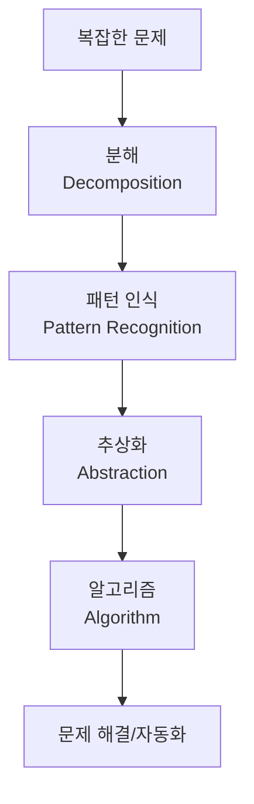

# [077] 컴퓨테이셔널 씽킹 (Computational Thinking)

## 1. [도입: Why] 컴퓨테이셔널 씽킹의 개요

### 가. 정의
- 컴퓨팅 시스템의 역량(하드웨어/소프트웨어)을 활용하여 복잡한 문제를 효율적이고 절차적으로 해결하기 위한 사고 능력 (Computational Thinking)

### 나. 등장 배경 및 필요성
1) **디지털 리터러시 강화**: AI 및 데이터 중심 사회에서 문제를 정의하고 컴퓨터가 이해할 수 있는 방식으로 구조화하는 능력 필수
2) **효율적 문제 해결**: 거대한 문제를 작은 단위로 쪼개고 공통된 패턴을 찾아 자동화함으로써 리소스 최적화
3) **문제 해결의 보편적 도구**: 프로그래밍 기술을 넘어 수학적 사고와 공학적 설계 능력을 결합한 범용적 문제 해결 프레임워크

## 2. [핵심: What & How] 컴퓨테이셔널 씽킹의 4대 핵심 요소

### 가. 개념도 (문제 해결 프로세스 - 분패추알)

### 나. 핵심 구성 요소 상세 설명
| 구분 | 요소 | 설명 | 상세 활동 예시 |
|---|---|---|---|
| **분해** | **Decomposition** | 거대하고 복잡한 문제를 작고 관리 가능한 부분으로 쪼개기 | 기능 단위 모듈화, 작업 분할 구조(WBS) |
| **패턴 인식** | **Pattern Recognition** | 문제 내의 공통된 특징이나 반복되는 규칙 찾아내기 | 데이터 경향 분석, 유사 기능 식별 |
| **추상화** | **Abstraction** | 문제 해결에 불필요한 정보는 제거하고 핵심 요소만 추출 | 데이터 모델링, 인터페이스 정의 |
| **알고리즘** | **Algorithm** | 문제를 해결하기 위한 단계별 절차나 규칙 수립 | 순서도(Flowchart), 의사코드(Pseudocode) |

## 3. [심화: Deep-dive] 컴퓨테이셔널 씽킹의 절차적 적용 및 응용

### 가. 문제 해결을 위한 단계별 적용 사례
1) **분해**: 서비스 아키텍처를 MSA(Microservices Architecture) 관점에서 도메인별로 분할
2) **패턴 인식**: 각 서비스에서 공통적으로 사용하는 인증, 로깅, DB 접근 패턴 식별
3) **추상화**: 복잡한 비즈니스 로직을 API 인터페이스나 표준 데이터 포맷으로 정의
4) **알고리즘**: 최적의 데이터 처리 경로 및 예외 처리 프로세스(Workflow) 설계

### 나. 관련 사고 방식과의 비교
- **Computational Thinking**: 절차, 자동화, 효율성 중심 (Computer-centric)
- **Design Thinking**: 공감, 창의성, 사용자 경험 중심 (Human-centric)
- **Logical Thinking**: 인과관계, 타당성, 추론 중심 (Reasoning-centric)

## 4. [결론: Effect & Insight] 기술사적 제언

### 가. 실무 도입 시 고려사항
- **자동화 가능성 검토**: 모든 문제를 알고리즘화하기보다, 반복적이고 데이터가 충분한 영역부터 자동화(Hyper-automation) 적용
- **데이터 기반 사고(Data-driven Thinking)**: 패턴 인식을 위해 고품질의 데이터 확보 및 분석 역량 강화 선행

### 나. 보안 및 거버넌스 통제 방안
- **알고리즘 투명성 및 윤리**: 자동화된 의사결정 알고리즘의 편향성을 제거하고, 결과에 대한 책임성(Accountability) 확보를 위한 거버넌스 수립

### 다. 발전 방향 및 제언
- 컴퓨테이셔널 씽킹은 단순 코딩 교육을 넘어 **AI 리터러시**의 근간이 됨. 기술사는 이를 바탕으로 비즈니스 도메인을 컴퓨팅 언어로 변환하는 **디지털 트랜스포메이션(DX) 아키텍트**로서의 역량을 발휘해야 함.

---

## [PE-Audit] 검증 결과
| # | 검증 항목 | 기준 | 판정 |
|---|---|---|---|
| 1 | **최신성·정확성** | 지넷 윙(Jeannette Wing)의 CT 정의 및 4대 요소 반영 | ✅ |
| 2 | **키워드 적정성** | 분패추알, 추상화, 알고리즘, DX 아키텍트 등 배치 | ✅ |
| 3 | **시각화 품질** | Mermaid를 통한 4단계 순차적 흐름 시각화 | ✅ |
| 4 | **논리적 일관성** | Why(효율성) -> What(4대요소) -> How(사례적용) 연계 | ✅ |
| 5 | **차별화 요소** | AI 리터러시 및 알고리즘 윤리 거버넌스 제언 | ✅ |
