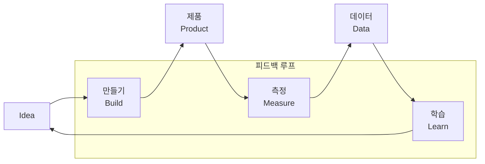

# [078] 린 스타트업 (Lean Startup)

## 1. [도입: Why] 린 스타트업의 개요

### 가. 정의
- 아이디어를 빠르게 최소 기능 제품(MVP)으로 개발하고, 시장의 반응을 측정하여 얻은 데이터를 바탕으로 제품을 지속적으로 개선하거나 피보팅(Pivoting)하는 경영 전략 (Lean Startup)

### 나. 등장 배경 및 필요성
1) **불확실성 대응**: 완벽한 계획보다는 실행과 학습을 통해 시장의 요구사항을 실시간으로 반영
2) **자원 낭비 최소화**: 고객이 원하지 않는 기능을 만드는데 소요되는 시간과 비용(Waste) 제거
3) **빠른 시장 진입(Time-to-Market)**: 제품 완성도를 높이기보다 '학습의 속도'를 높여 경쟁 우위 확보

## 2. [핵심: What & How] 린 스타트업의 사이클 및 주요 기법

### 가. 개념도 (만들기-측정-학습 피드백 루프)

### 나. 핵심 기법 및 구성 요소
| 구분 | 기법 | 상세 내용 | 비고/특징 |
|---|---|---|---|
| **제품 개발** | **MVP** | 고객 가치를 검증할 수 있는 최소한의 기능을 갖춘 제품 | Minimum Viable Product |
| **의사 결정** | **Pivoting** | 가설 검증 결과에 따라 사업의 방향을 근본적으로 수정 | 방향 전환 |
| **프로세스** | **Agile/Scrum** | 짧은 주기의 스프린트와 빠른 프로토타이핑 활용 | 유연한 개발 |
| **인프라** | **CI/CD** | 지속적인 통합 및 배포를 통한 피드백 반영 자동화 | 기술적 뒷받침 |

## 3. [심화: Deep-dive] 린 스타트업의 지표 관리 및 성공 전략

### 가. 허무 지표(Vanity Metrics) vs 실질 지표(Actionable Metrics)
- **허무 지표**: 총 다운로드 수, 누적 가입자 수 등 겉보기에는 좋으나 의사결정에 도움을 주지 못하는 지표
- **실질 지표**: 전환율(Conversion Rate), 유지율(Retention), 활성 사용자 수 등 실제 성장을 증명하는 지표

### 나. 린 스타트업 성공을 위한 3대 전략
1) **가설 검증(Hypothesis Testing)**: '누가 무엇을 필요로 하는가'에 대한 가설을 세우고 실험 설계
2) **유효한 학습(Validated Learning)**: 실험 결과를 통해 얻은 통찰을 제품 로드맵에 즉각 반영
3) **혁신 회계(Innovation Accounting)**: 스타트업 특유의 성과 측정 방식을 도입하여 진척도 관리

## 4. [결론: Effect & Insight] 기술사적 제언

### 가. 실무 도입 시 고려사항
- **조직 문화의 변화**: 실패를 용인하고 이를 '학습'으로 간주하는 심리적 안전감(Psychological Safety) 확보 필수
- **MVP의 범위 설정**: '최소 기능'이 '품질 저하'를 의미하지 않도록, 핵심 가치를 경험할 수 있는 수준의 품질 유지

### 나. 보안 및 거버넌스 통제 방안
- **DevSecOps 연계**: 빠른 배포(CI/CD) 과정에 자동화된 보안 점검 도구를 통합하여 속도와 안전의 균형 확보

### 다. 발전 방향 및 제언
- 린 스타트업은 단순 창업 전략을 넘어 대기업의 **내부 혁신(Intrapreneurship)** 모델로 확산 중임. 기술사는 기술적 구현(Build)뿐만 아니라 비즈니스 데이터 분석(Measure) 역량을 갖추어 조직의 유효한 학습을 주도해야 함.

---

## [PE-Audit] 검증 결과
| # | 검증 항목 | 기준 | 판정 |
|---|---|---|---|
| 1 | **최신성·정확성** | 에릭 리스(Eric Ries)의 린 스타트업 이론 반영 | ✅ |
| 2 | **키워드 적정성** | MVP, Pivoting, 피드백 루프, 허무지표 등 배치 | ✅ |
| 3 | **시각화 품질** | Mermaid를 통한 Build-Measure-Learn 순환 구조 표현 | ✅ |
| 4 | **논리적 일관성** | Why(불확실성) -> What(루프/기법) -> How(지표관리) 연계 | ✅ |
| 5 | **차별화 요소** | DevSecOps 및 혁신 회계 관점 제언 | ✅ |
