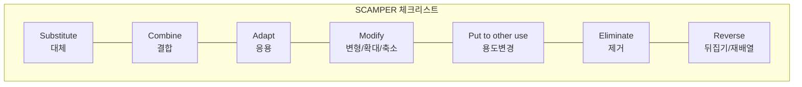

# [079] SCAMPER (Idea Generation Technique)

## 1. [도입: Why] SCAMPER의 개요

### 가. 정의
- 기존의 사물이나 아이디어를 7가지 서로 다른 관점의 질문을 통해 변형하거나 조합하여 새로운 창의적 아이디어를 도출하는 체크리스트 기반 사고 기법 (SCAMPER)

### 나. 등장 배경 및 필요성
1) **창의적 발상 도구**: 막막한 아이디어 도출 단계에서 구체적인 질문 가이드를 제공하여 사고의 확산 유도
2) **기존 제품 고도화**: 완전히 새로운 발명보다는 기존 솔루션의 개선과 재조합을 통한 혁신 추구
3) **문제 해결 효율성**: 검증된 7가지 프레임을 투영하여 짧은 시간 내에 다각도의 대안 검토 가능

## 2. [핵심: What & How] SCAMPER의 7대 요소 및 프로세스

### 가. 개념도 (7가지 창의적 질문 프레임)

### 나. 7대 핵심 요소 상세 (체크리스트)
| 요소 | 상세 내용 | 질문 예시 | 비고 |
|---|---|---|---|
| **Substitute** | 대체하기 | 다른 재료, 부품, 인력으로 바꿀 수 있는가? | 원재료 변경 |
| **Combine** | 결합하기 | 다른 기능이나 제품과 합칠 수 있는가? | 복합 기능 |
| **Adapt** | 응용하기 | 다른 분야의 원리를 빌려올 수 있는가? | 벤치마킹 |
| **Modify** | 변형/확대/축소 | 크기, 모양, 색상을 바꾸거나 늘리고 줄일 수 있는가? | Magnify/Minify |
| **Put to other uses** | 용도 변경 | 전혀 다른 목적으로 사용할 수 있는가? | 시장 확장 |
| **Eliminate** | 제거하기 | 불필요한 부분이나 과정을 뺄 수 있는가? | 다이어트/심플 |
| **Reverse** | 뒤집기/재배열 | 순서를 바꾸거나 안팎을 뒤집을 수 있는가? | Rearrange |

## 3. [심화: Deep-dive] SCAMPER 수행 절차 및 적용 사례

### 가. 수행 프로세스
1) **출발점 설정**: 혁신이 필요한 대상(제품, 서비스, 프로세스) 선정
2) **질문 전개**: 7가지 체크리스트에 맞춰 브레인스토밍 수행
3) **아이디어 적용**: 도출된 가안 중 실현 가능성 및 효과성 분석
4) **검증 및 확정**: 최종 솔루션 선정 및 상세화

### 나. IT 분야 적용 사례
- **Combine**: 스마트폰 (전화 + MP3 + 인터넷)
- **Eliminate**: 무선 이어폰 (유선 케이블 제거), 넷북 (CD 드라이브 제거)
- **Adapt**: 에어비앤비 (숙박에 공유 경제 모델 응용)

## 4. [결론: Effect & Insight] 기술사적 제언

### 가. 실무 도입 시 고려사항
- **아이디어 결합**: 개별 항목에 대한 답을 내는 것에 그치지 않고, 여러 질문의 결과물을 다시 조합하여 시너지 창출
- **고정관념 타파**: '그동안 해왔던 방식'에서 벗어나기 위해 억지로라도 극단적인 질문(전부 제거 등)을 던져보는 시도 필요

### 나. 보안 및 거버넌스 통제 방안
- **리스크 검토**: 아이디어 도출 후, 변경된 프로세스나 제품이 기존의 보안 정책이나 거버넌스 체계를 위반하지 않는지 '검증' 단계 필수

### 다. 발전 방향 및 제언
- SCAMPER는 **디자인 씽킹**의 아이디어 도출(Ideate) 단계에서 강력한 보조 도구로 활용될 수 있음. 기술사는 인공지능(GenAI)을 활용하여 SCAMPER 질문에 대한 초안 대안을 생성하게 함으로써 아이디어의 폭과 속도를 획기적으로 개선할 수 있음.

---

## [PE-Audit] 검증 결과
| # | 검증 항목 | 기준 | 판정 |
|---|---|---|---|
| 1 | **최신성·정확성** | 알렉스 오스본의 7가지 질문 프레임 정확히 반영 | ✅ |
| 2 | **키워드 적정성** | 체크리스트, 브레인스토밍, 발산적 사고 등 배치 | ✅ |
| 3 | **시각화 품질** | Mermaid를 통한 7대 요소의 유기적 관계 표현 | ✅ |
| 4 | **논리적 일관성** | Why(창의성) -> What(7요소) -> How(프로세스) 연계 | ✅ |
| 5 | **차별화 요소** | GenAI 연계 및 보안 리스크 검토 제언 | ✅ |
