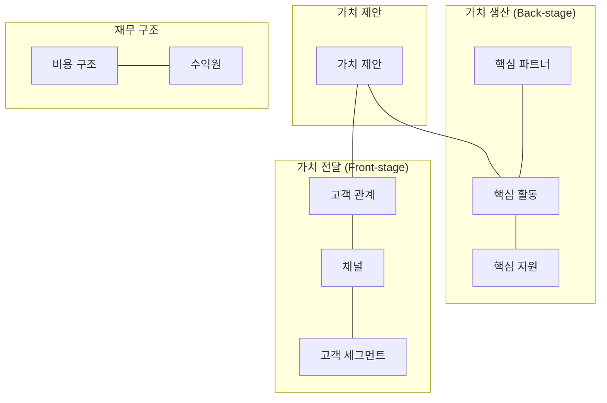

# [080] 비즈니스 모델 캔버스 (Business Model Canvas)

## 1. [도입: Why] 비즈니스 모델 캔버스의 개요

### 가. 정의
- 기업이 가치를 창출하고, 전달하며, 획득하는 과정을 9개의 핵심 블록으로 구성하여 한 장의 캔버스에 도식화한 비즈니스 모델 프레임워크 (Business Model Canvas)

### 나. 등장 배경 및 필요성
1) **전략의 가시화**: 복잡한 비즈니스 구조를 직관적으로 파악하여 이해관계자 간의 원활한 소통 지원
2) **BM의 타당성 검증**: 아이디어 단계에서 비즈니스의 논리적 결함이나 누락 요소를 사전에 식별
3) **신규 기회 포착**: 9개 블록 간의 상호 작용을 분석하여 새로운 수익 모델이나 프로세스 혁신 도출

## 2. [핵심: What & How] 비즈니스 모델 캔버스의 9개 블록 구조

### 가. 개념도 (9 Blocks 매트릭스)

### 나. 9개 핵심 블록 상세 설명
| 구분 | 블록 명칭 | 설명 | 키워드 |
|---|---|---|---|
| **가치 제안** | **Value Proposition** | 고객에게 제공하는 차별화된 가치와 해결책 | 상품, 서비스 |
| **가치 전달** | **Customer Segments** | 타겟 고객층 분류 및 정의 | 페르소나 |
| (전달/감성) | **Channels** | 고객과 만나는 접점 및 가치 전달 경로 | 마케팅, 유통 |
| [고채관수] | **Customer Relationships** | 고객을 획득, 유지, 확장하기 위한 관계 방식 | CRM, 커뮤니티 |
| | **Revenue Streams** | 고객으로부터 창출되는 현금 흐름 | 가격 모델 |
| **가치 생산** | **Key Activities** | 비즈니스 모델 운영을 위한 필수 활동 | 운영, 생산 |
| (생산/논리) | **Key Resources** | 비즈니스 수행에 필요한 핵심 물리적/지적 자산 | 인프라, 특허 |
| [제활자파비] | **Key Partnerships** | 협력 관계를 맺는 외부 업체 및 파트너 | 아웃소싱 |
| | **Cost Structure** | 비즈니스 운영에 발생하는 모든 비용 합계 | 고정비, 변동비 |

## 3. [심화: Deep-dive] BM 분석 및 평가 방법론

### 가. 분석 및 도출 방식
1) **하향식 (Top-down)**: 문제가 주어지고 해법을 찾는 전통적 방식 (문제탐색-정의-해결-검증)
2) **상향식 (Bottom-up)**: 데이터를 기반으로 문제를 재정의하는 방식 (공감-정의-아이디어-구현-테스트)

### 나. 비즈니스 모델 평가 (정량/정성)
- **정량적 평가**: 경제성 평가(ROI/NPV), 기술 가치 평가, 제약성 분석
- **정성적 평가**: SWOT 분석, 전문가 평가, 시나리오 평가, AHP 분석

## 4. [결론: Effect & Insight] 기술사적 제언

### 가. 실무 도입 시 고려사항
- **동적 캔버스 활용**: 고정된 문서가 아닌, 시장 변화에 따라 지속적으로 업데이트(Pivot)하는 도구로 활용
- **블록 간 정렬(Alignment)**: 예를 들어, 프리미엄 가치 제안(VP)을 하면서 저가 경쟁 중심의 비용 구조(CST)를 설계하는 등의 논리적 모순 제거

### 나. 보안 및 거버넌스 통제 방안
- **핵심 자산 및 파트너 보안**: Key Resources(데이터 등)와 Key Partnerships 간의 정보 공유 시 보안 가이드라인(NDA 등) 수립 필수

### 다. 발전 방향 및 제언
- 최근 디지털 비즈니스 환경에서는 데이터 중심의 **데이터 비즈니스 모델 캔버스**나 ESG 가치를 반영한 **Sustainable BMC**로 확장되는 추세임. 기술사는 기술적 아키텍처가 비즈니스 모델의 'Key Activities'를 어떻게 최적으로 지원할지 아키텍처 관점에서 설계해야 함.

---

## [PE-Audit] 검증 결과
| # | 검증 항목 | 기준 | 판정 |
|---|---|---|---|
| 1 | **최신성·정확성** | 알렉산더 오스터왈더의 9 Blocks 표준 반영 | ✅ |
| 2 | **키워드 적정성** | 고채관수, 제활자파비, 가치제안, 하향식/상향식 등 배치 | ✅ |
| 3 | **시각화 품질** | Mermaid를 통한 9개 블록의 유기적 관계 표현 | ✅ |
| 4 | **논리적 일관성** | Why(가시화) -> What(9블록) -> How(분석/평가) 연계 | ✅ |
| 5 | **차별화 요소** | Sustainable BMC 및 데이터 중심 확장 제언 | ✅ |
