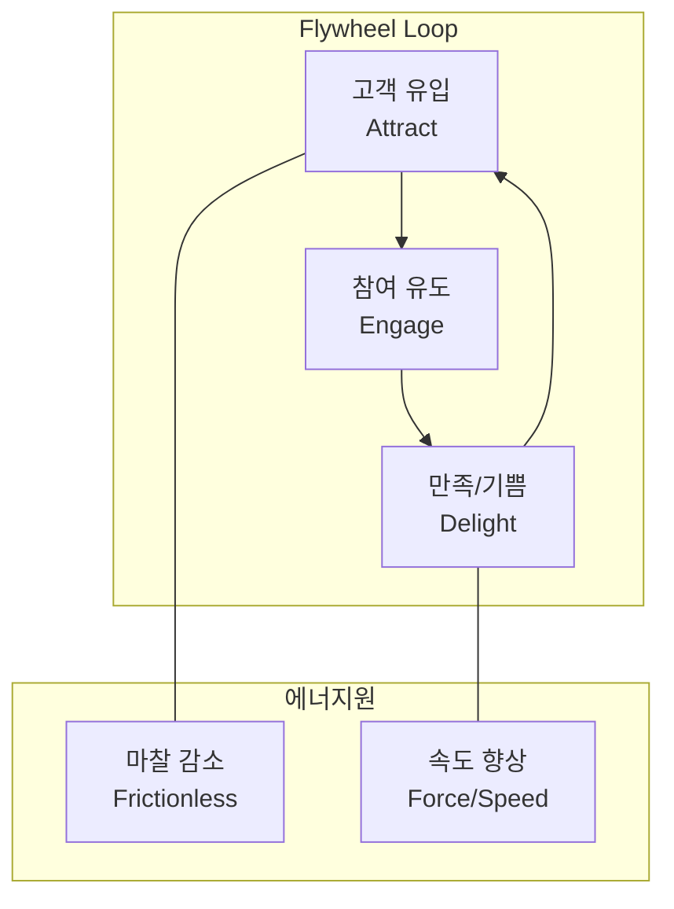

# [081] 플라이휠 프레임워크 (Flywheel Framework)

## 1. [도입: Why] 플라이휠 프레임워크의 개요

### 가. 정의
- 성장을 중심으로 고객 경험, 비즈니스 활동들이 유기적으로 연결되어, 초기에는 가속도가 붙기 힘들지만 일단 회전하기 시작하면 스스로 추진력을 얻어 시너지를 극대화하는 선순환 전략 모델 (Flywheel Framework)

### 나. 등장 배경 및 필요성
1) **퍼널(Funnel) 모델의 한계**: 고객을 획득하고 끝나는 깔때기 모델과 달리, 획득한 고객을 다시 에너지원으로 활용하는 지속 가능성 강조
2) **고객 경험(CX) 중시**: 만족한 고객이 신규 고객을 불러오는 추천(Referral) 및 바이럴 효과를 성장의 핵심 동력으로 활용
3) **비즈니스 복합 시너지**: 다양한 비즈니스 유닛(BU)이 상호 보완하며 전체 기업 가치를 높이는 구조 설계 필요

## 2. [핵심: What & How] 플라이휠의 구조 및 성공 원칙

### 가. 개념도 (성장의 선순환 루프)

### 나. 핵심 구성 요소 및 성공 원칙
| 구분 | 요소 | 설명 | 비고 |
|---|---|---|---|
| **Attract (유입)** | 가치 제공 | 유용한 콘텐츠와 기술로 잠재 고객의 관심을 끄는 단계 | 마케팅 |
| **Engage (참여)** | 관계 형성 | 고객의 타임라인과 채널에 맞춰 구매 여정을 돕는 단계 | 세일즈 |
| **Delight (만족)** | 가치 실현 | 기대 이상의 경험을 제공하여 고객이 성공하도록 돕는 단계 | 서비스/CS |
| **Friction (마찰)** | 장애물 제거 | 선순환을 방해하는 비효율적 프로세스 및 기술 부채 제거 | 마찰 최소화 |
| **Force (동력)** | 가속도 | 마케팅 투자, 신기능 출시 등 루프의 속도를 높이는 활동 | 추진력 확보 |

## 3. [심화: Deep-dive] 플라이휠의 적용 사례 분석

### 가. 국내외 주요 사례
1) **아마존(Amazon)**: 저가격 -> 고객 방문 증대 -> 판매자 증대 -> 규모의 경제 -> 더 낮은 가격 (무한 루프)
2) **당근마켓**: 동네 인증 기반 신뢰 -> 사용자 유입 -> 거래 활성화 -> 커뮤니티 확장 -> 지역 비즈니스 시너지
3) **스타벅스**: 최상의 커피/공간 경험 -> 고객 충성도 -> 사이렌 오더/선불 충전 -> 데이터 확보 -> 맞춤형 혜택

### 나. 플라이휠 성공을 위한 3대 원칙
- **방향성 수립**: 모든 비즈니스 활동이 하나의 방향(고객 성공 등)을 향하도록 정렬
- **목표 고객 정의**: 플라이휠의 에너지가 집중될 명확한 타겟 페르소나 설정
- **적절한 도구 활용**: 고객 여정을 실시간으로 트래킹하고 자동화할 수 있는 마케팅/데이터 솔루션 도입

## 4. [결론: Effect & Insight] 기술사적 제언

### 가. 실무 도입 시 고려사항
- **데이터 기반 의사결정**: 루프의 어느 지점에서 마찰(Friction)이 발생하는지 데이터(LTV, CAC 등)를 통해 실시간 파악 및 개선
- **개인정보 보호와 균형**: 플라이휠의 핵심 동력인 고객 데이터를 수집할 때, 프라이버시 보호 및 투명한 거버넌스 준수 필수

### 나. 보안 및 거버넌스 통제 방안
- **고객 데이터 주권**: 마이데이터(MyData)와 연계하여 고객이 자신의 데이터를 통제하면서도 혜택을 누릴 수 있는 신뢰 기반 아키텍처 구축

### 다. 발전 방향 및 제언
- 최근 플라이휠은 **AI 기반 초개인화**와 결합하여 루프의 회전 속도를 획기적으로 높이고 있음. 기술사는 단순히 프로세스를 만드는 것을 넘어, 데이터 흐름이 끊기지 않는 **Data-Flywheel** 관점의 전사적 인프라를 설계해야 함.

---

## [PE-Audit] 검증 결과
| # | 검증 항목 | 기준 | 판정 |
|---|---|---|---|
| 1 | **최신성·정확성** | 짐 콜린스(Jim Collins) 및 허브스팟의 이론 반영 | ✅ |
| 2 | **키워드 적정성** | Attract-Engage-Delight, 마찰 제거, 선순환 등 배치 | ✅ |
| 3 | **시각화 품질** | Mermaid를 통한 루프 및 가속/마찰 요소 표현 | ✅ |
| 4 | **논리적 일관성** | Why(퍼널한계) -> What(3단계) -> How(사례/원칙) 연계 | ✅ |
| 5 | **차별화 요소** | Data-Flywheel 및 마이데이터 연계 제언 | ✅ |
