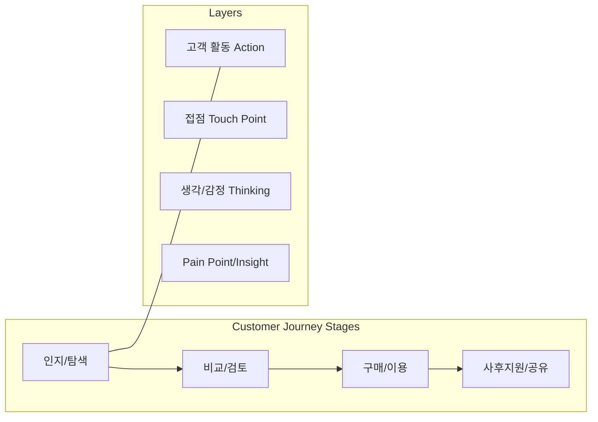

# [082] 고객 여정 지도 (Customer Journey Map, CJM)

## 1. [도입: Why] 고객 여정 지도의 개요

### 가. 정의
- 고객이 서비스를 이용하는 과정에서 브랜드와 상호작용하는 모든 접점(Touch Point)을 시간 순서대로 나열하고, 각 단계별 행동, 감정, Pain Point를 생생하게 시각화한 분석 도구 (Customer Journey Map)

### 나. 등장 배경 및 필요성
1) **사용자 경험(UX) 통합 관리**: 파편화된 서비스 경험을 고객의 관점에서 일관된 흐름으로 재구성
2) **Pain Point 포착**: 고객이 서비스 이용 중 겪는 불편함이나 단절을 시각적으로 식별하여 개선 우선순위 도출
3) **협업 가시성 확보**: 기획, 디자인, 개발, 운영팀이 동일한 고객 시나리오를 공유하여 서비스 품질 상향 평준화

## 2. [핵심: What & How] 고객 여정 지도의 구조 및 구성 요소

### 가. 개념도 (CJM 프레임워크)

### 나. 7대 핵심 구성 요소
| 구분 | 요소 | 설명 | 비고 |
|---|---|---|---|
| **스테이지** | **Stage** | 고객 여정의 주요 단계 (예: 인지-구매-유지) | 타임라인 |
| **행동/이벤트** | **Action** | 각 단계에서 고객이 실제로 하는 활동 | 구체적 행위 |
| **터치 포인트** | **Touch Point** | 고객과 브랜드가 만나는 매체 및 채널 | 앱, 웹, 콜센터 |
| **생각/감정** | **Mindset** | 특정 접점에서 고객이 느끼는 심리적 상태 | 이모지 활용 |
| **페인 포인트** | **Pain Point** | 여정의 흐름을 방해하는 문제점 및 장애물 | 개선 대상 |
| **인사이트** | **Insight** | 문제를 해결하거나 가치를 높일 수 있는 기회 | 기회 요인 |
| **페르소나** | **Persona** | 여정 지도의 주인공이 되는 가상의 전형적 고객 | 유저 타입 |

## 3. [심화: Deep-dive] 고객 여정 지도 작성 절차 및 활용

### 가. 작성 프로세스 (정페핵행포인평)
1) **정보 수집**: 데이터 분석, 인터뷰, 설문 등을 통해 고객 데이터 확보
2) **페르소나 결정**: 지도의 주인공이 될 타겟 고객의 특성 정의
3) **핵심 요소 결정**: 분석할 여정의 범위와 접점(Touch Point) 식별
4) **고객 행동 나열**: 시간 순서에 따른 시나리오 기반 활동 기록
5) **Pain Point & Insight 포착**: 감정 곡선을 그려 병목 지점 및 해결 방안 도출
6) **평가 및 아이디어 도출**: 서비스 개선을 위한 구체적 액션 아이템 생성

### 나. 고객 여정 지도 vs 서비스 블루프린트
| 비교 항목 | 고객 여정 지도 (CJM) | 서비스 블루프린트 (Service Blueprint) |
|---|---|---|
| **중심 관점** | **고객의 경험** 및 감정 중심 | **서비스 운영 프로세스** 및 인프라 중심 |
| **표현 범위** | 고객의 외부적 행동 및 심리 | 내부 가시선(Line of Visibility) 너머의 활동 포함 |
| **주요 목적** | 고객 경험 개선, 공감대 형성 | 프로세스 최적화, 실패 지점 식별 |

## 4. [결론: Effect & Insight] 기술사적 제언

### 가. 실무 도입 시 고려사항
- **데이터 기반의 객관성**: 추측이 아닌 로그 데이터와 실질적인 고객 인터뷰 결과를 바탕으로 작성하여 왜곡 방지
- **동적 관리**: 서비스 개편이나 시장 변화에 따라 주기적으로 지도를 업데이트하여 '살아있는 문서'로 관리

### 나. 보안 및 거버넌스 통제 방안
- **접점 보안(Endpoint Security)**: 여정 지도에서 식별된 각 터치 포인트별 개인정보 노출 위험 및 보안 취약점 사전 점검

### 다. 발전 방향 및 제언
- 최근의 고객 여정 지도는 **실시간 데이터 분석(CDP)**과 결합하여 개별 고객의 여정을 실시간으로 트래킹하고 최적의 메시지를 던지는 **Contextual Marketing**의 기초 인프라로 활용됨. 기술사는 CJM을 통해 기술적 설계가 고객의 가치와 어떻게 연결되는지 증명해야 함.

---

## [PE-Audit] 검증 결과
| # | 검증 항목 | 기준 | 판정 |
|---|---|---|---|
| 1 | **최신성·정확성** | UX/Service Design의 표준 방법론 반영 | ✅ |
| 2 | **키워드 적정성** | 접점, 페인포인트, 페르소나, 가시선 등 배치 | ✅ |
| 3 | **시각화 품질** | Mermaid를 통한 단계 및 레이어 구조 표현 | ✅ |
| 4 | **논리적 일관성** | Why(공감) -> What(구성요소) -> How(작성절차) 연계 | ✅ |
| 5 | **차별화 요소** | CDP 연계 및 서비스 블루프린트 비교 제언 | ✅ |
