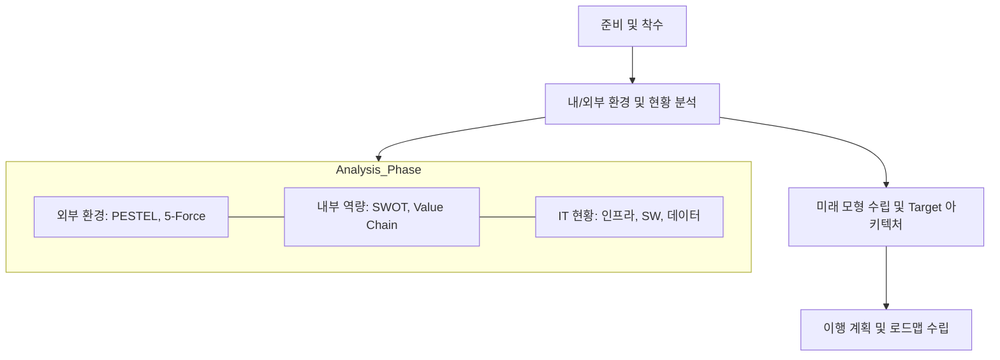

Parent: [[02.MG/GEMINI.MD]]

# 1. 정보전략계획(ISP, Information Strategy Planning)의 개요

## 가. 정의
- 조직의 경영 전략과 목표를 효과적으로 달성하기 위해 **비즈니스 전략과 IT를 정렬(Alignment)**하고, 중장기적 관점에서 정보화 비전과 이행 계획을 수립하는 **전략적 기획 활동**

## 나. 목적
- **전략적 정렬**: 경영 목표 달성을 위한 IT의 역할과 방향성 명확화
- **자원 배분 최적화**: 한정된 IT 자원의 우선순위 결정 및 중복 투자 방지
- **정보화 청사진 제시**: 미래 지향적 정보시스템 아키텍처(To-Be) 도출
- **성과 관리 체계 구축**: IT 투자의 가치 측정 및 성과 관리 기반 마련

# 2. ISP 수행방법론 체계와 절차

## 가. 수행 프로세스 개념도 (환경분석 통합형)

## 나. 단계별 세부 절차 [두음: 준환미이]
| 단계 | 주요 활동 | 핵심 산출물 |
|---|---|---|
| **1. 준비 및 착수** | 프로젝트 범위 설정, 이해관계자 정의, 거버넌스 수립 | 프로젝트 수행계획서 |
| **2. 환경 및 현황 분석** | **[환경분석 통합]** 경영 환경(외부/내부), IT 기술 트렌드, 현행 정보시스템/인프라 분석 | 현황 분석 보고서, 개선 과제(Pain Points) 도출 |
| **3. 미래 모형 수립** | 정보화 비전 설정, To-Be 아키텍처(BA, AA, DA, TA) 설계 | 정보화 전략 및 목표 모델, 아키텍처 설계서 |
| **4. 이행 계획 수립** | 프로젝트 우선순위 선정, 로드맵, 소요 예산 및 ROI 분석 | 이행 로드맵, 정보화 예산 계획서 |

# 3. ISP와 ISMP(Information System Master Plan) 비교 분석

| 비교 항목 | ISP (정보전략계획) | ISMP (정보시스템 마스터플랜) |
|---|---|---|
| **핵심 목적** | 기업 전체의 중장기 정보화 전략 수립 | 특정 사업(프로젝트)의 구체적 이행 계획 수립 |
| **수립 범위** | 조직 전체, 범기관적 아키텍처 | 개별 정보시스템, 특정 사업 단위 |
| **상세 수준** | 전략적 방향성 중심 (Conceptual) | 기술적 명세, 요구사항 정의 중심 (Physical) |
| **주요 활용** | 예산 확보, 투자 우선순위 결정 | RFP(제안요청서) 작성, 제안서 평가 기준 |
| **수행 시점** | 정보화 사업 착수 전 (전략 기획 단계) | 구체적 사업 추진 직전 (실행 설계 단계) |
| **법적 근거** | 국가정보화 기본법 등 | 전자정부법 및 ISP/ISMP 수립 공통 가이드 |

# 4. 기술사적 제언 및 실무 적용 방안

## 가. 실무 도입 시 고려사항
- **민첩한(Agile) ISP**: 급변하는 기술 환경에 대응하기 위해 3~5년 주기의 경직된 ISP보다, 상시 조정 가능한 **Rolling Plan** 방식 도입 필요
- **클라우드 네이티브 전환**: 단순 인프라 이전을 넘어 MSA, 서버리스 등 클라우드 네이티브 아키텍처를 ISP 단계에서부터 고려

## 나. 최신 트렌드와 연계
- **ESG 정보화**: ISP 수립 시 친환경 데이터센터 운영, 투명한 지배구조(Governance)를 위한 IT 전략 반영 확대
- **데이터 기반 의사결정**: 데이터 레이크, AI 분석 플랫폼 구축을 ISP의 핵심 전략 과제로 설정하여 데이터 경제 시대 대응

> [!tip] **기술사 인사이트**
> 과거의 ISP가 '구축'에 집중했다면, 현대의 ISP는 **'비즈니스 가치 창출'**과 **'디지털 전환(DX)'**에 초점을 맞춰야 합니다. 특히 **ISMP**와의 연계를 통해 전략이 실행 단계에서 왜곡되지 않도록 **요구사항의 추적성(Traceability)**을 확보하는 것이 성공의 핵심입니다.

## Related Notes
- [[042.ISP(Information_Strategy_Planning).md]]
- [[042.ISP_ISMP_수립_공통가이드(제9판).md]]
- [[031.SWOT_Analysis.md]]
- [[027.Value_Chain.md]]
