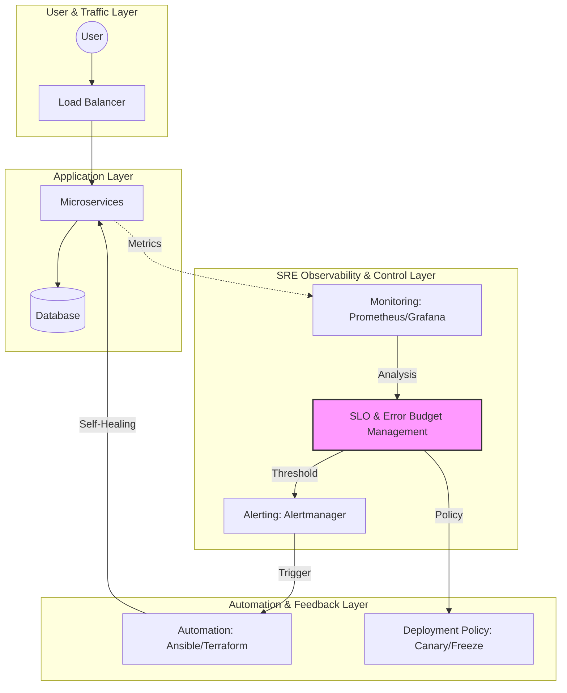

Parent: [[002.DevOps]]

# 1. 사이트 신뢰성 공학(SRE)의 개요 및 배경

### 가. SRE(Site Reliability Engineering)의 정의
- 시스템 운영에 대한 소프트웨어 엔지니어링 접근 방식으로서, **신뢰성(Reliability)**, **에러 예산(Error Budget)**, **수작업 제거(Toil Reduction)**를 핵심 가치로 하는 운영 방법론임
- 구글(Google)에 의해 고안되었으며, "소프트웨어 엔지니어에게 운영을 맡겼을 때 벌어지는 일"로 정의되는 공학적 운영 체계임

### 나. 등장 배경 및 필요성
- **개발과 운영의 갈등**: 기능 배포를 우선하는 개발(Agility)과 안정성을 중시하는 운영(Stability) 간의 목표 상충 해결 필요
- **시스템 복잡도 증가**: MSA, Cloud-Native 환경 확산에 따른 수동 운영의 한계 직면 및 자동화 요구 증대
- **데이터 기반 의사결정**: 정성적인 신뢰성을 정량적인 지표(SLI/SLO)로 전환하여 비즈니스 의사결정의 투명성 확보

# 2. SRE의 아키텍처 및 핵심 메커니즘

### 가. SRE 개념도 및 운영 아키텍처

### 나. 핵심 구성 요소 및 요소 기술
| 구분 | 핵심 요소 | 상세 내용 및 역할 |
| :--- | :--- | :--- |
| **지표 관리** | **SLI / SLO / SLA** | 서비스 수준 지표(SLI), 목표(SLO), 고객 협약(SLA)을 통한 정량적 관리 |
| **예산 기반** | **Error Budget** | 허용 가능한 장애 범위(1 - SLO) 정의, 초과 시 배포 중단 및 안정화 집중 |
| **작업 최적화** | **Toil Reduction** | 반복적이고 창의성 없는 수작업(Toil)을 50% 이하로 제한하고 자동화 추진 |
| **모니터링** | **Golden Signals** | Latency, Traffic, Errors, Saturation의 4대 핵심 지표 집중 관제 |

# 3. SRE의 상세 기술 및 비교 분석

### 가. 상세 동작 메커니즘: 에러 예산(Error Budget) 정책
1) **예산 산정**: 서비스 가용성 목표를 99.9%로 설정 시, 연간 약 8.76시간의 허용 장애 시간(Error Budget) 발생
2) **배포 전략 연계**: 예산이 충분할 경우 적극적인 신규 기능 배포(Agility) 수행
3) **배포 중단(Freeze)**: 예산 소진 시 신규 기능 배포를 전면 중단하고, 신뢰성 향상을 위한 엔지니어링 작업에 전념함

### 나. DevOps와 SRE의 비교 분석
| 비교 항목 | DevOps (문화/철학) | SRE (실천/구현) |
| :--- | :--- | :--- |
| **개념적 관계** | 추상적 인터페이스(Interface) | 구체적인 구현 클래스(Class) |
| **핵심 목표** | 부서 간 사일로(Silo) 제거 | 서비스 가용성 및 신뢰성 극대화 |
| **주요 수단** | 협업, 문화, IaC, CI/CD | SLI/SLO, 에러 예산, 자동화, 포스트모템 |
| **장애 대응** | 공동 책임 문화 형성 | Blameless Post-mortem 기반 시스템 개선 |

# 4. 기술사적 제언 및 실무 적용 방안

### 가. 실무 도입 시 고려사항
- **엔지니어링 역량 확보**: 단순 운영 인력이 아닌, 코딩 능력을 갖춘 SRE 엔지니어 확보가 선행되어야 함
- **조직 간 합의**: 에러 예산 소진 시 배포를 중단하는 정책에 대해 비즈니스 부서와의 강력한 거버넌스 합의 필수

### 나. 거버넌스 및 보안(Security) 통제 방안
- **DevSecOps 통합**: SRE 자동화 파이프라인(CI/CD) 내 보안 취약점 점검 자동화 및 접근 제어(IAM) 강화
- **불변 인프라(Immutable Infrastructure)**: 운영 중인 서버에 직접 접속을 차단하고 코드를 통해서만 변경을 허용하여 보안 사고 방지

### 다. 최신 트렌드와 연계한 발전 방향
- **AIOps 연계**: 기계 학습을 활용하여 이상 징후를 사전에 탐지하고, 장애 복구를 자동화하는 지능형 SRE로 진화 중
- **NoOps 지향**: 클라우드 네이티브 기술(Serverless, Managed Service)을 극대화하여 운영 부담을 제로화하는 방향으로 발전

> [!tip] **기술사 차별화 포인트**
> SRE의 핵심은 "실패를 수용하는 문화(Accepting Failure as Normal)"에 있습니다. 에러 예산은 실패를 단순히 방어하는 것이 아니라, 허용된 범위 내에서 최대한의 속도를 낼 수 있게 하는 **가속 페달**의 역할을 수행한다는 점을 강조해야 합니다.

## Related Notes
- [[002.DevOps]]
- [[003.IaC(Infrastructure as Code)]]
- [[005.CI_CD]]
- [[009.Microservices_Architecture]]
- [[019.Service_Mesh]]

