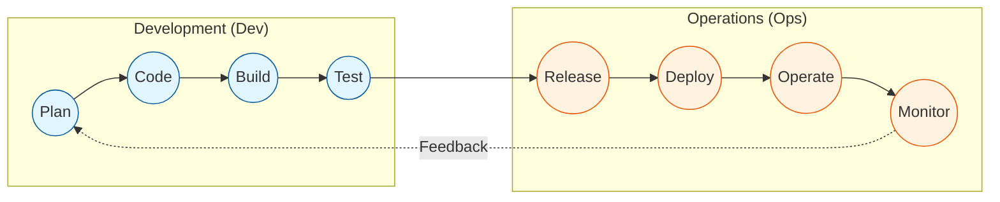

Parent: [[007.형상관리(Configuration Management)]]

# 1. DevOps(데브옵스)의 개요 및 배경

### 가. DevOps의 정의
- 소프트웨어 개발(Development)과 IT 운영(Operations)을 통합하여, 제품의 신속한 출시(Agility)와 안정적 운영(Stability)을 동시에 달성하려는 **조직 문화이자 방법론**임
- 단순한 도구 도입을 넘어, 개발-테스트-배포-운영 전 과정을 하나의 라이프사이클로 연결하는 **협업 모델**임

### 나. 등장 배경 및 필요성
- **전통적 사일로(Silo) 타파**: 개발팀(변경 위주)과 운영팀(안정 위주) 간의 목표 상충 및 소통 단절 해결 필요
- **Time-to-Market 단축**: 비즈니스 요구사항을 실제 서비스에 반영하는 리드 타임(Lead Time)의 획기적 개선 요구
- **품질 및 복원력 강화**: 자동화된 테스트와 지속적 피드백 루프를 통해 장애 발생률을 낮추고 빠른 복구 체계 구축

# 2. DevOps의 아키텍처 및 핵심 메커니즘

### 가. DevOps 개념도 및 라이프사이클 (Infinity Loop)

### 나. DevOps의 5대 핵심 가치 (CALMS 프레임워크)
| 요소 | 핵심 가치 | 상세 설명 |
| :--- | :--- | :--- |
| **C**ulture | **문화** | 부서 간 벽을 허물고 공동의 책임 의식을 공유하는 협업 문화 조성 |
| **A**utomation | **자동화** | CI/CD 파이프라인, IaC(인프라 코드화)를 통한 수동 작업의 최소화 |
| **L**ean | **린(Lean)** | 낭비 요소 제거, 작은 배치(Small Batch) 단위의 빈번한 배포 지향 |
| **M**easurement | **측정** | KPI, 로그, 메트릭 수집을 통한 데이터 기반의 객관적 성과 관리 |
| **S**haring | **공유** | 성공/실패 사례, 기술 지식, 도구의 전사적 공유를 통한 동반 성장 |

# 3. DevOps의 상세 기술 및 비교 분석

### 가. DevOps 구현을 위한 주요 기술 요소 (Toolchain)
1) **CI/CD**: 지속적 통합(Jenkins, GitHub Actions) 및 지속적 배포(ArgoCD, GitLab) 자동화
2) **IaC(Infrastructure as Code)**: Terraform, Ansible을 활용한 선언적 인프라 구성 및 관리
3) **Microservices (MSA)**: 독립적인 배포 단위를 확보하여 DevOps의 유연성 극대화
4) **Observability**: Prometheus, ELK Stack을 활용한 전방위적 모니터링 및 가시성 확보

### 나. Agile과 DevOps의 비교 분석
| 비교 항목 | Agile (애자일) | DevOps (데브옵스) |
| :--- | :--- | :--- |
| **관점 범위** | 소프트웨어 개발 중심 (Planning ~ Dev) | 전체 IT 가치 사슬 (Dev ~ Ops) |
| **핵심 가치** | 상호작용, 동작하는 SW, 변화 대응 | 자동화, 협업, 신뢰성, 공유 |
| **주요 산출물** | User Story, Backlog, Increment | Deployment Pipeline, Service Stability |
| **상호 관계** | **"무엇"**을 민첩하게 만들 것인가 | **"어떻게"** 빠르게 안정적으로 전달할 것인가 |

# 4. 기술사적 제언 및 실무 적용 방안

### 가. 실무 도입 시 고려사항 (문화적 접근)
- **비난 없는 문화(Blameless)**: 장애 발생 시 개인을 문책하기보다 시스템적 결함을 찾아 개선하는 문화 정착이 최우선임
- **거버넌스 정립**: 자율적인 팀 운영과 기업 표준(Standard) 사이의 균형을 맞추는 DevOps 거버넌스 수립 필요

### 나. DevSecOps로의 확장 및 보안 통제
- **Shift-Left Security**: 보안 검토를 배포 마지막 단계가 아닌, 개발 초기 단계(CI)부터 내재화하여 리스크 조기 발견
- **자동화된 규정 준수(Compliance as Code)**: 보안 정책을 코드로 정의하여 파이프라인 내에서 자동으로 검증 수행

### 다. 향후 발전 방향 (Platform Engineering)
- **AIOps 통합**: 머신러닝 기반의 이상 탐지 및 자동 복구(Auto-Remediation)를 통한 운영 효율 극대화
- **내부 개발자 플랫폼(IDP)**: 개발자가 운영 지식 없이도 셀프 서비스로 인프라를 활용할 수 있게 하는 플랫폼 엔지니어링으로 진화 중

> [!tip] **기술사 인사이트**
> DevOps의 성공은 도구(Tool)가 아닌 **사람(People)**과 **프로세스(Process)**의 변화에 달려 있습니다. 단순히 Jenkins를 도입하는 것이 아니라, "개발자가 운영의 안정성을 고민하고, 운영자가 개발의 신속성을 지원하는" 공통의 목표 의식이 DevOps의 본질입니다.

## Related Notes
- [[001.SRE(Site Reliability Engineering)]]
- [[004.DevSecOps]]
- [[005.CI_CD]]
- [[003.IaC(Infrastructure as Code)]]
- [[009.Microservices_Architecture]]