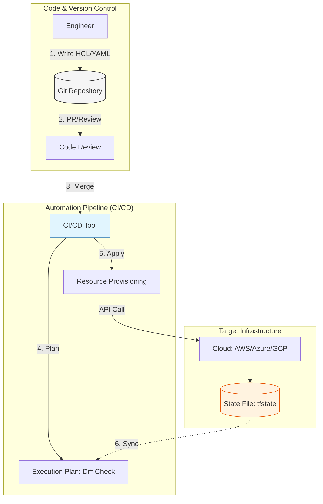

Parent: [[002.DevOps]]

# 1. IaC(Infrastructure as Code)의 개요 및 배경

### 가. IaC(Infrastructure as Code)의 정의
- 인프라 리소스(서버, 네트워크, 스토리지 등)의 구성 및 프로비저닝을 수동 설정이 아닌 **기계가 읽을 수 있는 정의 파일(코드)**을 통해 자동화하는 방식임
- 소프트웨어 개발의 베스트 프랙티스(버전 관리, 테스트, CI/CD)를 인프라 영역에 적용한 **선언적 운영 기술**임

### 나. 등장 배경 및 필요성
- **Configuration Drift(설정 드리프트) 해결**: 수동 관리로 인해 환경별(개발/운영) 설정이 불일치하는 현상 방지 필요
- **Snowflake Server(눈송이 서버) 방지**: 특정 담당자만 아는 유일무이한 서버 구성을 배제하고 표준화된 환경 복제 지향
- **Agility(민첩성) 극대화**: 클라우드 환경에서 대규모 리소스를 수분 내에 배포하고 확장하기 위한 필수 요건임
- **추적성(Traceability) 확보**: 인프라 변경 이력을 Git 등 버전 관리 시스템을 통해 투명하게 관리하고 롤백 보장

# 2. IaC의 아키텍처 및 핵심 메커니즘

### 가. IaC 운영 개념도 및 프로세스

### 나. 핵심 구성 요소 및 요소 기술
| 구분 | 핵심 요소 | 상세 내용 및 역할 |
| :--- | :--- | :--- |
| **작성 방식** | **선언형(Declarative)** | "무엇(What)"을 원하는지 최종 상태 정의 (예: Terraform, CloudFormation) |
| **상태 관리** | **State File** | 현재 인프라 상태와 코드 간의 정합성을 유지하기 위한 매핑 데이터 파일 |
| **실행 특성** | **Idempotency(멱등성)** | 동일한 코드를 여러 번 실행해도 항상 같은 인프라 상태를 보장하는 특성 |
| **운영 방식** | **Immutable Infra** | 기존 인프라 수정 대신, 새로운 코드가 적용된 자원을 신규 생성 후 교체 |

# 3. IaC의 상세 기술 및 비교 분석

### 가. IaC 도구의 유형별 분류
1) **Provisioning(프로비저닝)**: 인프라 자체를 생성 (Terraform, AWS CloudFormation)
2) **Config Management(구성 관리)**: 서버 내 OS 설정 및 S/W 설치 (Ansible, Chef, Puppet)
3) **Language-based**: 범용 언어(TypeScript, Python)로 인프라 정의 (AWS CDK, Pulumi)

### 나. 선언형(Declarative) vs 명령형(Imperative) 비교
| 비교 항목 | 선언형 (What) | 명령형 (How) |
| :--- | :--- | :--- |
| **핵심 개념** | 목표 상태(Desired State) 정의 | 실행 순서(Step-by-Step) 정의 |
| **멱등성 확보** | 도구 차원에서 기본 보장 | 스크립트 내 조건문 등으로 직접 구현 필요 |
| **유지 보수** | 상태 관리가 용이하여 대규모에 적합 | 변경 시마다 스크립트 수정 필요, 복잡도 높음 |
| **대표 도구** | Terraform, Kubernetes Manifest | Shell Script, Ansible(일부) |

# 4. 기술사적 제언 및 실무 적용 방안

### 가. 실무 도입 시 고려사항
- **State 파일 보안**: 민감 정보가 포함된 State 파일은 원격 백엔드(S3, DynamoDB 등)에 암호화하여 저장하고 접근 제어(IAM)를 강화해야 함
- **모듈화 전략**: 리소스 간 의존성을 고려하여 네트워크, DB, 앱 레이어별로 모듈을 분리하여 재사용성 및 가독성 확보 필수

### 나. 거버넌스 및 보안(Security) 통제 방안
- **Policy as Code (PaC)**: 인프라가 배포되기 전, 보안 규정(예: 공인 IP 노출 금지)을 코드로 검증하는 단계(Sentinel, OPA)를 파이프라인에 통합
- **Drift Detection**: 코드와 실제 인프라 상태가 달라지는 것을 실시간 감지하여 자동 복구하거나 알람을 발생시키는 통제 체계 구축

### 다. 향후 발전 방향 (GitOps & AI)
- **GitOps 확산**: Git을 단일 진실 공급원(SSOT)으로 삼아, Pull 방식으로 인프라와 상태를 동기화하는 GitOps 모델이 표준으로 정착 중
- **AI-driven IaC**: 생성형 AI를 활용하여 자연어로 인프라를 정의하고, 최적화된 아키텍처 코드를 생성/검토하는 자동화 수준 고도화 기대

> [!tip] **기술사 인사이트**
> IaC는 단순한 자동화 도구가 아니라 **"인프라의 소프트웨어화"**를 의미합니다. 이는 인프라 엔지니어에게 개발자 수준의 역량을 요구하며, 결과적으로 **GitOps**와 **DevSecOps**를 실현하는 가장 강력한 토대가 됩니다.

## Related Notes
- [[002.DevOps]]
- [[005.CI_CD]]
- [[006.GitOps]]
- [[007.형상관리(Configuration Management)]]
- [[008.무중단배포(Zero-Downtime_Deployment)]]

