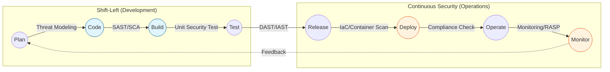

Parent: [[002.DevOps]]

# 1. DevSecOps(데브섹옵스)의 개요 및 배경

### 가. DevSecOps의 정의
- 개발(Development), 보안(Security), 운영(Operations)을 통합하여 소프트웨어 개발 생명주기(SDLC) 전 과정에 **보안을 내재화(Embedded)**하고 **자동화(Automated)**하는 문화 및 프랙티스임
- 보안을 독립적인 단계가 아닌 전체 프로세스의 기본 요소로 취급하여, 안전한 소프트웨어를 신속하게 배포하는 것을 목표로 함

### 나. 등장 배경 및 필요성
- **DevOps의 속도와 보안의 충돌**: 기존의 사후 보안 검토 방식은 빠른 배포 주기(CI/CD)의 병목 현상으로 작용하여 이를 해결할 통합 모델 필요
- **Shift-Left Security 실현**: 개발 초기 단계에서 취약점을 발견하여 수정 비용을 최소화하고 보안 사고 리스크를 조기 차단
- **공동 책임(Shared Responsibility)**: 보안은 특정 팀의 업무가 아니라 개발, 운영, 보안 담당자 모두의 공통 책임이라는 문화적 전환 요구

# 2. DevSecOps의 아키텍처 및 핵심 메커니즘

### 가. DevSecOps 파이프라인 개념도

### 나. 핵심 구성 요소 및 단계별 보안 활동
| 단계 | 핵심 활동 | 주요 보안 기술 및 도구 |
| :--- | :--- | :--- |
| **Code/Build** | **정적 분석 및 의존성 검사** | **SAST**(Checkmarx, SonarQube), **SCA**(Snyk, BlackDuck) |
| **Test/Release** | **동적 분석 및 취약점 진단** | **DAST**(OWASP ZAP), **IAST**(Contrast Security) |
| **Deploy** | **인프라 및 컨테이너 보안** | **IaC Scanning**(Checkov, tfsec), **Image Scanning**(Trivy) |
| **Operate** | **런타임 보호 및 모니터링** | **RASP**(Runtime App Self-Protection), **CSPM**(Prisma Cloud) |

# 3. DevSecOps의 상세 기술 및 비교 분석

### 가. 주요 보안 테스트 기술 (SAST vs DAST vs IAST)
1) **SAST (Static)**: 소스 코드를 실행하지 않고 분석. 개발 초기 적용 가능하나 오탐(False Positive) 발생 가능성 높음
2) **DAST (Dynamic)**: 실행 중인 앱을 외부 공격자 시각으로 테스트. 환경 설정 오류 탐지에 강하나 실행 시간 소요
3) **IAST (Interactive)**: 앱 내부 에이전트를 통해 실시간 분석. SAST와 DAST의 장점을 결합하여 정확도 향상

### 나. 전통적 보안 vs DevSecOps 비교
| 비교 항목 | 전통적 보안 (Water-fall형) | DevSecOps (Agile/DevOps형) |
| :--- | :--- | :--- |
| **개입 시점** | 개발 완료 후 배포 직전 (Right-side) | SDLC 전체 단계 (Shift-Left) |
| **수행 방식** | 전문가에 의한 수동 점검 및 승인 | 자동화된 도구 및 파이프라인 통합 |
| **수정 비용** | 장애 발견 시 재개발 수준의 고비용 발생 | 실시간 피드백을 통한 즉각 수정, 저비용 |
| **문화적 특징** | 보안팀의 독점적 통제 및 승인 | 개발/운영/보안팀의 협업 및 책임 공유 |

# 4. 기술사적 제언 및 실무 적용 방안

### 가. 실무 도입 시 고려사항
- **점진적 자동화**: 초기에는 오탐률이 낮은 SCA(오픈소스 취약점)부터 적용하고, 점진적으로 SAST/DAST로 확장하여 개발자 피로도 감소
- **Actionable Feedback**: 보안 도구의 결과가 단순히 목록화되는 것이 아니라, 개발자의 IDE나 PR 코멘트로 즉시 전달되어야 함

### 나. 거버넌스 및 보안(Security) 통제 방안
- **Security as Code**: 보안 정책(Compliance)을 코드로 정의하여 파이프라인에서 자동으로 검증(Policy Enforcement) 수행
- **보안 챔피언(Security Champions)**: 각 개발팀 내 보안 역량을 갖춘 멤버를 지정하여 팀 내 보안 문화를 전파하고 가이드 수행

### 다. 최신 트렌드와 연계한 발전 방향
- **AI 기반 자동 수정(Auto-Remediation)**: LLM 기술을 활용하여 탐지된 취약점에 대해 보안 패치 코드를 자동으로 생성하고 제안하는 기술 도입
- **CNAPP(Cloud Native App Protection Platform)**: 파편화된 보안 도구들을 단일 플랫폼으로 통합하여 클라우드 전반의 가시성 확보

> [!tip] **기술사 인사이트**
> DevSecOps의 핵심은 보안이 속도를 늦추는 "검문소"가 아니라, 안전한 배포를 보장하는 **"가드레일"**이 되는 것입니다. 이를 위해 보안 도구의 정교한 튜닝(Tuning)과 개발자의 보안 인식 제고가 도구 도입보다 선행되어야 합니다.

## Related Notes
- [[002.DevOps]]
- [[005.CI_CD]]
- [[003.IaC(Infrastructure as Code)]]
- [[001.SRE(Site Reliability Engineering)]]
- [[007.형상관리(Configuration Management)]]