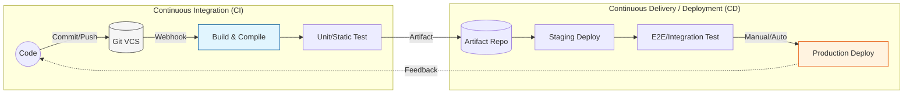

Parent: [[002.DevOps]]

# 1. CI/CD(지속적 통합 및 배포)의 개요 및 배경

### 가. CI/CD의 정의
- 애플리케이션 개발 단계를 자동화하여 개발 주기를 단축하고 사용자에게 신속하게 가치를 전달하는 **지속적 통합(CI)**과 **지속적 제공/배포(CD)**의 결합 모델임
- 코드 병합부터 빌드, 테스트, 릴리스, 실제 운영 환경 배포까지의 전 과정을 자동화된 **파이프라인(Pipeline)**으로 관리하는 체계임

### 나. 등장 배경 및 필요성
- **통합의 지옥(Integration Hell) 해소**: 여러 개발자의 코드를 한꺼번에 합칠 때 발생하는 충돌과 버그를 조기에 발견하고 수정하기 위해 빈번한 통합 필요
- **Time-to-Market 극대화**: 비즈니스 요구사항을 즉각적으로 서비스에 반영하여 시장 경쟁력을 확보하기 위한 배포 가속화 요구
- **배포 리스크 완화**: 변경 단위를 작게 유지하고 자동화된 테스트를 거침으로써 대규모 배포 시의 장애 발생 가능성 최소화

# 2. CI/CD의 아키텍처 및 핵심 메커니즘

### 가. CI/CD 파이프라인 개념도 및 프로세스

### 나. 핵심 구성 요소 및 단계별 활동
| 구분 | 핵심 단계 | 상세 활동 및 역할 |
| :--- | :--- | :--- |
| **CI** | **지속적 통합** | 공유 브랜치에 코드 수시 병합, 자동 빌드, 단위 테스트 및 정적 분석(SAST) 수행 |
| **Delivery** | **지속적 제공** | 빌드된 결과물(Artifact)을 스테이징 환경에 자동 배포하고 수동 승인 후 운영 배포 준비 |
| **Deployment** | **지속적 배포** | 테스트를 통과한 코드를 인간의 개입 없이 실제 운영 환경(Production)까지 자동 배포 |
| **Strategy** | **무중단 배포** | 배포 시 가용성을 유지하기 위한 전략(Blue-Green, Canary, Rolling Update) 적용 |

# 3. CI/CD의 상세 기술 및 비교 분석

### 가. 무중단 배포 전략의 심화 비교
1) **Blue-Green**: 구버전(Blue)과 신버전(Green)을 동시에 띄워 로드밸런서로 트래픽을 일괄 전환함. 빠른 롤백이 가능하나 리소스가 2배 필요함
2) **Canary**: 특정 소수 사용자에게만 먼저 신버전을 노출하고 점진적으로 트래픽을 확대함. 실제 사용자 반응 기반 안정성 검증에 유리함
3) **Rolling**: 서버를 순차적으로 신버전으로 교체함. 추가 리소스가 적게 드나 배포 중 구/신버전이 공존하여 호환성 문제 주의 필요

### 나. 지속적 제공(Delivery) vs 지속적 배포(Deployment) 비교
| 비교 항목 | Continuous Delivery | Continuous Deployment |
| :--- | :--- | :--- |
| **운영 배포 방식** | 수동 승인(Manual Trigger) 후 배포 | 자동화된 파이프라인(Auto Trigger) 배포 |
| **주요 적용 분야** | 금융, 의료 등 안정성/규제 준수 중요 분야 | 웹 서비스, 스타트업 등 빠른 실험 중시 분야 |
| **리스크 제어** | 배포 전 최종 검토 단계 존재 | 완벽한 테스트 자동화(E2E)에 의존 |
| **비즈니스 가치** | "언제든 배포 가능한 상태" 유지 | "수시로 배포되는 상태" 유지 |

# 4. 기술사적 제언 및 실무 적용 방안

### 가. 실무 도입 시 고려사항
- **테스트 신뢰성 확보**: 파이프라인의 가치는 테스트 자동화 수준에 달려 있음. Flaky Test(간헐적 실패)를 배제하고 높은 테스트 커버리지 유지가 필수적임
- **Pipeline as Code (PaC)**: 파이프라인 설정(Jenkinsfile, YAML 등) 자체를 코드로 관리하여 버전 관리 및 재사용성을 확보해야 함

### 나. 거버넌스 및 보안(Security) 통제 방안
- **DevSecOps 통합**: CI 단계에 정적 분석(SAST)과 오픈소스 취약점 스캐닝(SCA)을, CD 단계에 동적 분석(DAST)을 내재화하여 보안 가드레일 구축
- **승인 프로세스 체계화**: 운영 환경 배포 시 ITIL 기반의 변경 관리 절차와 연동하거나, 다중 승인(Multi-Approver) 체계 마련

### 다. 향후 발전 방향 (GitOps & MLOps)
- **GitOps 모델 확산**: 선언적 인프라와 애플리케이션 상태를 Git으로 관리하고, Pull 방식으로 상태를 동기화하는 GitOps(예: ArgoCD)가 차세대 표준으로 정착
- **MLOps 확장**: 데이터 가공부터 모델 학습, 평가, 서빙까지 아우르는 머신러닝 전용 CI/CD(MLOps) 파이프라인으로의 도메인 확장 가속화

> [!tip] **기술사 인사이트**
> CI/CD의 본질은 "속도"가 아닌 **"피드백의 빈도"**에 있습니다. 실패를 빠르게 발견하고(Fail Fast) 이를 즉각적으로 개선할 수 있는 구조를 만드는 것이 비즈니스 민첩성(Business Agility)을 확보하는 지름길입니다.

## Related Notes
- [[002.DevOps]]
- [[004.DevSecOps]]
- [[003.IaC(Infrastructure as Code)]]
- [[006.GitOps]]
- [[008.무중단배포(Zero-Downtime_Deployment)]]
- [[007.형상관리(Configuration Management)]]