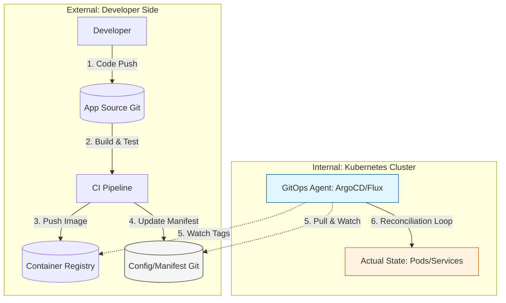

Parent: [[005.CI_CD]]

# 1. GitOps(깃옵스)의 개요 및 배경

### 가. GitOps의 정의
- 인프라 및 애플리케이션의 배포 구성(Manifest)을 **Git 저장소**에 선언적으로 저장하고, 이를 시스템의 **단일 진실 공급원(SSOT)**으로 삼아 운영하는 방식임
- Git의 상태(Desired State)와 실제 클러스터 상태(Actual State)를 지속적으로 동기화(Reconciliation)하는 **Pull 기반 배포 모델**임

### 나. 등장 배경 및 필요성
- **클라우드 네이티브 복잡성 해결**: 쿠버네티스 등 분산 환경의 매니페스트 관리가 복잡해짐에 따라 버전 관리 및 추적성 확보 필요
- **CIOps(Push 기반)의 한계**: 외부 CI 서버가 운영 클러스터의 관리 권한(Kubeconfig)을 직접 보유함에 따른 보안 취약점 개선 요구
- **Configuration Drift(설정 드리프트) 방지**: 수동 변경(ClickOps)을 원천 차단하고, 장애 발생 시 Git 기반의 신속한 롤백 및 복구 체계 구축

# 2. GitOps의 아키텍처 및 핵심 메커니즘

### 가. GitOps Pull 기반 배포 아키텍처

### 나. GitOps의 4대 핵심 원칙
| 원칙 | 상세 내용 | 비고 |
| :--- | :--- | :--- |
| **선언적 기술** | 시스템의 전체 상태가 YAML, Helm 등 선언적 코드로 명시되어야 함 | Desired State |
| **버전 관리** | 선언적 명세는 Git과 같은 시스템에서 불변성과 이력을 관리해야 함 | SSOT 확보 |
| **자동 적용** | Git의 변경 사항은 승인(Merge) 후 시스템에 자동으로 반영되어야 함 | Automation |
| **지속적 조정** | 소프트웨어 에이전트가 목표 상태와 실제 상태를 상시 비교/수정함 | Reconciliation |

# 3. GitOps의 상세 기술 및 비교 분석

### 가. 주요 상세 기술 요소
1) **Configuration Repository**: 앱 소스와 배포 환경(Dev/Prod) 매니페스트를 분리하여 보안 및 관리 효율성 극대화
2) **GitOps Agent**: 클러스터 내에서 동작하며 상태 차이(Drift)를 감지하는 핵심 컨트롤러 (ArgoCD, Flux)
3) **Secret Management**: 민감 정보를 암호화하여 Git에 안전하게 저장 (Sealed Secrets, External Secrets Operator)

### 나. CIOps(Push) vs GitOps(Pull) 비교 분석
| 비교 항목 | CIOps (Push 기반) | GitOps (Pull 기반) |
| :--- | :--- | :--- |
| **배포 주체** | 외부 CI 서버 (Jenkins, GitHub Actions) | 클러스터 내부 에이전트 (ArgoCD, Flux) |
| **클러스터 권한** | CI 서버가 클러스터 관리 권한 보유 (취약) | 내부 에이전트만 보유, 외부 노출 없음 (강력) |
| **상태 관리** | 일회성 명령어 실행 위주 | 지속적인 상태 감시 및 자동 복구(Self-healing) |
| **복구 용이성** | 파이프라인 재실행 필요 | Git Revert 시 즉각적인 롤백 수행 |
| **보안성** | 방화벽 Inbound 허용 필요 (CI -> Cluster) | Outbound만 허용 (Cluster -> Git), 보안 우수 |

# 4. 기술사적 제언 및 실무 적용 방안

### 가. 실무 도입 시 고려사항 (Governance)
- **수동 변경 원천 차단**: 직접적인 `kubectl` 명령 실행을 금지하고, 모든 변경은 Git PR(Pull Request)을 통해서만 이루어지는 통제 체계 구축
- **저장소 구조 설계**: 환경별(Namespace) 또는 서비스별로 저장소를 분리하여 영향도(Blast Radius) 최소화

### 나. 거버넌스 및 보안(Security) 통제 방안
- **Access Control (RBAC)**: Git 저장소의 Merge 권한을 가진 사용자(Approver)를 엄격히 관리하여 배포 권한 통제
- **Policy as Code (PaC)**: 배포 전 K8s 규정(Resource Limit 등)을 코드로 검사하는 Admission Controller(OPA, Kyverno) 연계

### 다. 최신 트렌드와 연계한 발전 방향
- **Platform Engineering 연계**: 개발자가 셀프 서비스로 인프라를 프로비저닝할 수 있는 내부 플랫폼(IDP)의 핵심 엔진으로 GitOps 활용
- **GitOps for IaC**: 테라폼(Terraform)과 같은 인프라 코드까지 GitOps 방식으로 관리하여 전체 가시성 통합 (Terraform Controller)

> [!tip] **기술사 인사이트**
> GitOps는 단순한 CD 도구를 넘어 **"운영의 소프트웨어화"**를 완성하는 프레임워크입니다. 특히 쿠버네티스의 선언적 특성을 극대화하여 **가시성(Visibility)**과 **신뢰성(Reliability)**을 동시에 확보할 수 있는 현대적 운영의 표준입니다.

## Related Notes
- [[005.CI_CD]]
- [[002.DevOps]]
- [[003.IaC(Infrastructure as Code)]]
- [[001.SRE(Site Reliability Engineering)]]
- [[009.Microservices_Architecture]]
