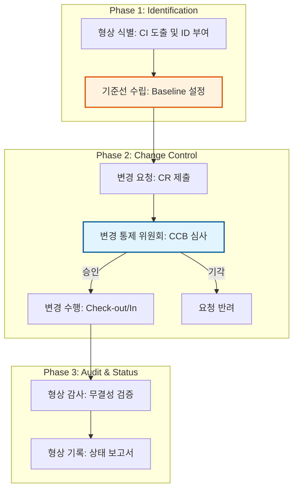

Parent: [[002.DevOps]]

# 1. 소프트웨어 형상관리(SCM)의 개요 및 배경

### 가. 형상관리(Software Configuration Management)의 정의
- 소프트웨어 개발 생명주기(SDLC) 전 과정에서 발생하는 모든 산출물의 변경 사항을 체계적으로 식별, 통제, 감사, 기록하여 **무결성(Integrity)**과 **일관성(Consistency)**을 유지하는 품질 보증 활동임
- 단순한 버전 관리를 넘어, 소프트웨어의 형상을 가시화하고 추적성을 확보하는 **관리적/기술적 통제 체계**임

### 나. 등장 배경 및 필요성
- **변경의 필연성**: 요구사항 변경, 유지보수, 결함 수정 등 지속적인 소프트웨어 진화에 따른 통제 필요
- **협업 복잡성 증가**: 다수의 개발자가 참여하는 대규모 프로젝트에서 소스 코드 충돌 방지 및 동기화 요구
- **추적성(Traceability) 확보**: "누가, 언제, 왜, 무엇을" 변경했는지 기록하여 장애 발생 시 원인 파악 및 롤백 보장
- **품질 보증**: 승인된 기준선(Baseline)을 기반으로 소프트웨어 제품의 신뢰성을 확보하기 위함

# 2. 형상관리의 아키텍처 및 핵심 메커니즘

### 가. 형상관리 프로세스 및 변경 통제 흐름도

### 나. 형상관리의 5대 핵심 활동 [두음: 식통감기계]
| 활동 | 핵심 내용 | 상세 역할 |
| :--- | :--- | :--- |
| **형상 식별** | 관리 대상 정의 | 형상 항목(CI) 도출, 명명 규칙 수립, 기준선(Baseline) 설정 |
| **형상 통제** | 변경 승인 및 반영 | 변경 요청(CR) 검토, **CCB** 운영, 버전 관리 및 릴리스 통제 |
| **형상 감사** | 무결성 및 적절성 검토 | 기준선 대비 변경 내용의 일치 여부 검토, 기술적/관리적 검사 |
| **형상 기록** | 상태 보고 및 추적 | 변경 이력 기록, 형상 통계 보고, 추적성 매트릭스 관리 |
| **형상 계획** | 전략 및 조직 수립 | 형상관리 계획서 작성, 조직 구성, 도구 및 절차 정의 |

# 3. 형상관리의 상세 기술 및 비교 분석

### 가. SDLC 단계별 기준선(Baseline) 종류 [두음: 기분설시제운]
1) **기능적 기준선**: 계획 단계 (시스템 명세서)
2) **분배적 기준선**: 요구 분석 단계 (요구사항 명세서)
3) **설계적 기준선**: 설계 단계 (설계 명세서, ERD)
4) **시험 기준선**: 구현 단계 (소스 코드, 유닛 테스트 결과)
5) **제품 기준선**: 테스트/인계 단계 (통합 테스트 결과, 설치 패키지)
6) **운용 기준선**: 운영 단계 (사용자 매뉴얼, 운영 이력)

### 나. 버전관리 시스템(VCS)의 유형별 비교 분석
| 비교 항목 | 중앙집중형 (CVCS) | 분산형 (DVCS) |
| :--- | :--- | :--- |
| **저장소 구조** | 중앙 서버에만 전체 이력 존재 | 모든 사용자 로컬에 전체 이력 복제 (Clone) |
| **오프라인 작업** | 불가능 (서버 연결 필수) | 가능 (로컬 Commit 후 나중에 Push) |
| **장애 복구** | 서버 장애 시 이력 손실 위험 높음 | 각 로컬이 백업 역할을 하여 복구 용이 |
| **브랜치/병합** | 비교적 느리고 복잡함 | 매우 빠르고 강력함 (Git Flow 지원) |
| **대표 도구** | SVN, CVS | **Git**, Mercurial |

# 4. 기술사적 제언 및 실무 적용 방안

### 가. 실무 도입 시 고려사항
- **거버넌스 기반 CCB 운영**: 형식적인 승인이 아닌, 영향도 분석(Impact Analysis)을 기반으로 한 실질적 의사결정 기구로서의 CCB 운영 필수
- **브랜칭 전략(Branching Strategy)**: Git Flow, GitHub Flow 등 프로젝트 특성에 맞는 전략을 수립하여 소스 통합 리스크 최소화

### 나. 보안(Security) 및 통제 방안
- **Access Control**: 형상 항목별 접근 권한(RBAC)을 철저히 관리하여 인가되지 않은 변경 방지
- **Secret Scanning**: 소스 코드 내 API Key, 패스워드 등 민감 정보가 포함되지 않도록 자동화된 스캐닝 도구 연계 (DevSecOps 통합)

### 다. 최신 트렌드와 연계한 발전 방향
- **GitOps 확산**: 인프라(IaC)와 애플리케이션 상태를 Git으로 일원화하여 관리하는 GitOps가 형상관리의 새로운 패러다임으로 정착
- **AI 기반 형상관리**: 생성형 AI를 활용하여 코드 변경에 따른 영향도를 자동 분석하고, 충돌 가능성을 사전에 예측하는 지능형 SCM으로 진화 중

> [!tip] **기술사 인사이트**
> 형상관리의 핵심은 **"가시성(Visibility)"**과 **"추적성(Traceability)"**입니다. 단순히 코드를 저장하는 것을 넘어, 요구사항부터 설계, 코드, 테스트까지의 전 과정을 연결하는 디지털 스레드(Digital Thread)를 형성하는 것이 진정한 SCM의 가치입니다.

## Related Notes
- [[002.DevOps]]
- [[005.CI_CD]]
- [[006.GitOps]]
- [[003.IaC(Infrastructure as Code)]]
- [[008.무중단배포(Zero-Downtime_Deployment)]]
