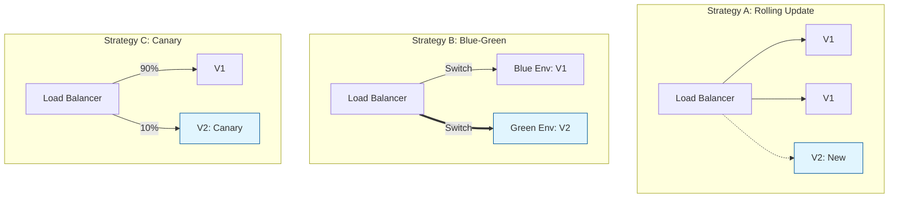

Parent: [[005.CI_CD]]

# 1. 무중단 배포(Zero-Downtime Deployment)의 개요 및 배경

### 가. 무중단 배포의 정의
- 새로운 버전의 소프트웨어를 운영 환경에 배포할 때, 서비스 중단(Downtime) 없이 사용자에게 지속적인 서비스를 보장하는 **가용성 확보 배포 전략**임
- 로드밸런서나 오케스트레이션 도구를 활용하여 구버전과 신버전을 교체하는 과정에서 트래픽을 유연하게 제어하는 기술임

### 나. 등장 배경 및 필요성
- **비즈니스 연속성(BCP) 확보**: 글로벌 서비스 확대 및 24/365 상시 접속 요구에 따라 서비스 중단에 따른 매출 손실 방지
- **배포 리스크 완화**: 장애 발생 시 즉각적인 롤백(Rollback) 환경을 제공하여 시스템 안정성 강화
- **Agility(민첩성) 증대**: 배포에 대한 부담(점검 공지 등)을 제거하여 기능 출시 주기를 단축하고 경쟁 우위 확보

# 2. 무중단 배포의 아키텍처 및 핵심 메커니즘

### 가. 무중단 배포 전략별 개념도

### 나. 핵심 3대 배포 전략 비교
| 전략 | 핵심 메커니즘 | 장점 | 단점 |
| :--- | :--- | :--- | :--- |
| **Rolling** | 서버를 순차적으로(1대씩) 교체 | 추가 자원 최소화 | 배포 중 구/신버전 공존, 롤백 복잡 |
| **Blue-Green** | 동일 환경 2배 구성 후 일괄 전환 | 즉각적인 롤백, 버전 충돌 없음 | 인프라 자원 비용 2배 발생 |
| **Canary** | 일부 트래픽 선적용 후 점진적 확대 | 실제 운영 환경 안정성 검증 | 트래픽 제어 로직 복잡성 증가 |

# 3. 무중단 배포의 상세 기술 및 비교 분석

### 가. 성공적인 무중단 배포를 위한 요소 기술
1) **Service Discovery**: 동적으로 변하는 신버전 서버의 위치(IP/Port)를 자동으로 감지하여 로드밸런서에 등록
2) **Health Check**: 애플리케이션이 트래픽을 받을 준비가 되었는지(Readiness) 확인 후 트래픽 유입 결정
3) **Circuit Breaker**: 배포 중 신버전에 장애 발생 시 호출을 차단하여 장애 전파 방지

### 나. 데이터베이스 및 세션 처리 전략 (핵심 도전 과제)
- **Database Migration**: **Expand-Contract 패턴** 활용. 먼저 컬럼을 추가하고(Expand), 구/신버전이 호환되게 만든 후, 최종적으로 구버전 컬럼 삭제(Contract)
- **Session Clustering**: 특정 서버에 종속되지 않도록 외부 저장소(Redis 등)를 활용한 **Stateless** 구조 지향
- **Backward Compatibility**: 구버전 앱이 신버전 DB 스키마에서도 정상 동작할 수 있도록 하위 호환성 유지 설계 필수

# 4. 기술사적 제언 및 실무 적용 방안

### 가. 실무 도입 시 고려사항
- **인프라 자동화 필수**: 수동 배포 환경에서 무중단 배포는 인적 오류 가능성이 높으므로, 반드시 **CI/CD** 및 **IaC** 기반의 자동화가 전제되어야 함
- **모니터링 강화**: 배포 중 에러율, 응답 시간 등을 실시간 감시하여 임계치 초과 시 자동 롤백(Auto-Rollback) 체계 구축

### 나. 거버넌스 및 보안(Security) 통제 방안
- **Access Control**: 배포 승인 절차를 체계화하고, 배포 권한이 있는 사용자(Approver)에 대한 철저한 감사 로그 기록
- **Zero Trust 연계**: 배포되는 컨테이너 이미지의 서명 검증 및 런타임 보안 스캐닝을 파이프라인에 통합

### 다. 향후 발전 방향 (Progressive Delivery)
- **Service Mesh 기반 제어**: Istio, Linkerd 등을 활용하여 L7 계층에서 정교한 트래픽 미러링 및 가중치 배포 수행
- **지능형 자동 배포**: AI가 배포 중 메트릭을 분석하여 이상 징후 감지 시 스스로 배포를 중단하고 원복하는 지능형 운영 체계로 진화

> [!tip] **기술사 인사이트**
> 무중단 배포의 핵심은 "기술"보다 **"데이터의 영속성 관리"**에 있습니다. 애플리케이션은 무상태(Stateless)로 쉽게 교체 가능하지만, 데이터베이스 스키마와 세션 정보의 정합성을 어떻게 유지하느냐가 성공의 임계 경로(Critical Path)입니다.

## Related Notes
- [[005.CI_CD]]
- [[002.DevOps]]
- [[009.Microservices_Architecture]]
- [[003.IaC(Infrastructure as Code)]]
- [[006.GitOps]]
