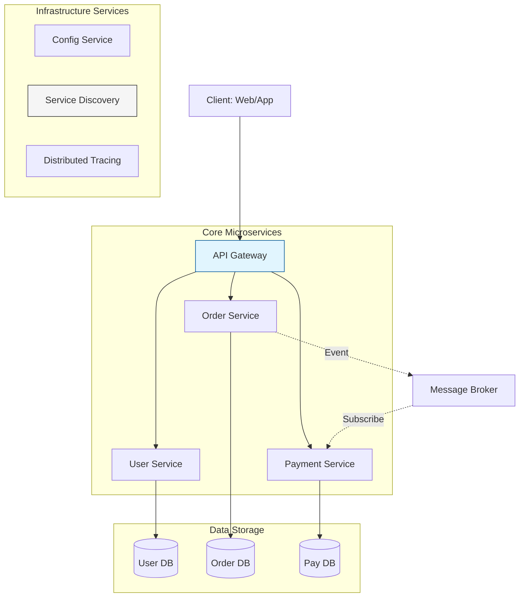

Parent: [[011.클린_아키텍처(Clean_Architecture)]]

# 1. 마이크로서비스 아키텍처(MSA)의 개요 및 배경

### 가. MSA(Microservices Architecture)의 정의
- 단일 애플리케이션을 작고, 독립적으로 배포 가능한 서비스들의 집합으로 구성하여, 각 서비스가 독자적인 프로세스로 실행되고 경량화된 프로토콜(HTTP, gRPC)로 통신하는 **컴포넌트 중심 아키텍처**임
- 비즈니스 역량(Business Capability)을 중심으로 서비스를 분할하고, 자동화된 배포 체계와 분산 관리를 특징으로 함

### 나. 등장 배경 및 필요성
- **Monolithic의 한계 극복**: 거대 코드베이스로 인한 빌드/배포 속도 저하, 수정 시 영향도 파악 곤란, 부분적 확장 불가의 한계 직면
- **Cloud Native 환경 최적화**: 클라우드 인프라의 유연성을 극대화하고, 서비스 단위의 탄력적 스케일링(Scale-out) 요구 증대
- **Agility 및 기술 다양성**: 서비스별 최적의 기술 스택(Polyglot)을 적용하고, 독립적 배포를 통해 시장 대응 속도(Time-to-Market) 향상

# 2. MSA의 아키텍처 및 핵심 메커니즘

### 가. MSA 표준 아키텍처 구성도

### 나. MSA의 핵심 구성 요소 및 기술
| 영역 | 핵심 요소 | 주요 역할 및 기술 |
| :--- | :--- | :--- |
| **진입점** | **API Gateway** | 인증/인가, 라우팅, 로드밸런싱, 로깅 (Spring Cloud Gateway, Kong) |
| **관리/탐색** | **Service Discovery** | 서비스 인스턴스의 위치(IP/Port) 동적 관리 및 조회 (Eureka, Consul) |
| **결합도 완화** | **Message Broker** | 서비스 간 비동기 이벤트 기반 통신 지원 (Kafka, RabbitMQ) |
| **장애 전파 방지** | **Circuit Breaker** | 장애 서비스 격리 및 빠른 실패 처리 (Resilience4j, Hystrix) |
| **데이터 정합성** | **Saga Pattern** | 분산 환경에서의 최종적 일관성 확보 및 보상 트랜잭션 수행 |

# 3. MSA의 상세 기술 및 비교 분석

### 가. 상세 동작 메커니즘: 분산 데이터 관리
1) **Database per Service**: 각 서비스는 독자적인 DB를 소유하며, 외부 접근은 오직 API를 통해서만 허용하여 결합도 최소화
2) **CQRS 패턴**: 명령(Command)과 조회(Query) 모델을 분리하여 각 도메인 특성에 맞는 성능 최적화 수행
3) **Event Driven**: 상태 변경 시 이벤트를 발행하고 타 서비스가 이를 구독하여 데이터 동기화 수행 (Eventual Consistency)

### 나. Monolithic vs Microservices 비교 분석
| 비교 항목 | Monolithic Architecture | Microservices Architecture |
| :--- | :--- | :--- |
| **배포 단위** | 전체 시스템 일괄 배포 (Big-bang) | 개별 서비스 독립 배포 (Small-batch) |
| **기술 스택** | 단일 기술 스택에 종속적 | 서비스별 최적의 언어/DB 선택 가능 (Polyglot) |
| **확장성** | 시스템 전체 스케일링 (비효율) | 필요한 기능만 선택적 스케일링 (효율적) |
| **장애 영향** | 하나의 오류가 전체 시스템 중단 유발 | 장애 격리를 통해 타 서비스 영향 최소화 |
| **복잡도 관점** | 코드 레벨의 복잡도 높음 | 인프라 및 네트워크 운영 복잡도 매우 높음 |

# 4. 기술사적 제언 및 실무 적용 방안

### 가. 실무 도입 시 고려사항 (은통알 금지)
- **성숙도 진단**: 조직의 DevOps 역량과 자동화 인프라가 갖추어지지 않은 상태에서의 도입은 "분산 모놀리스"라는 재앙을 초래함
- **서비스 분할 기준**: 단순 크기가 아닌 **도메인 주도 설계(DDD)**의 바운디드 컨텍스트(Bounded Context)를 기준으로 응집도 높게 설계해야 함

### 나. 거버넌스 및 보안(Security) 통제 방안
- **분산 추적(Tracing)**: 요청의 전체 경로를 시각화하는 Zipkin/Jaeger 구축 및 Correlation ID 부여 필수
- **서비스 간 인증(mTLS)**: Service Mesh를 활용하여 서비스 간 통신 시 상호 인증 및 암호화 적용으로 보안성 강화

### 다. 향후 발전 방향 (Service Mesh & Serverless)
- **Service Mesh로의 위임**: 공통 네트워크 로직(통신, 보안, 관측)을 사이드카 프록시로 위임하여 개발 생산성 극대화
- **Serverless MSA**: 트래픽에 따라 자동으로 함수 단위 실행이 이루어지는 서버리스(Lambda/Knative) 기반 MSA로의 진화

> [!tip] **기술사 인사이트**
> MSA 도입은 기술적 결정이 아닌 **"비즈니스 민첩성을 위한 투자"**입니다. 운영 비용(Ops Tax)을 지불할 가치가 있는 비즈니스 영역을 선별하여 적용하는 '선택과 집중'의 아키텍처 전략이 필요합니다.

## Related Notes
- [[010.도메인_주도_설계(DDD)]]
- [[012.서킷_브레이커(Circuit_Breaker)]]
- [[014.API_게이트웨이(API_Gateway)]]
- [[015.사가_패턴(Saga_Pattern)]]
- [[019.서비스_메시(Service_Mesh)]]
