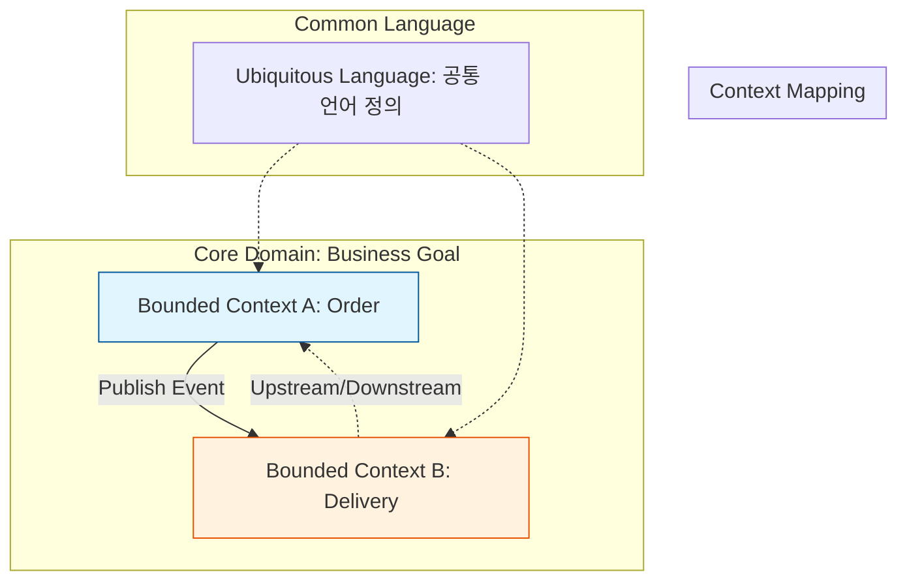

Parent: [[009.Microservices_Architecture]]

# 1. 도메인 주도 설계(DDD)의 개요 및 배경

### 가. DDD(Domain-Driven Design)의 정의
- 소프트웨어의 복잡성을 해결하기 위해 기술보다 **비즈니스 도메인(Domain)** 자체를 설계의 중심에 두고, 도메인 전문가와 개발자가 협력하여 모델을 구축하는 설계 방법론임
- 비즈니스 문제 해결을 위한 지식을 모델에 투입하고, 코드 구조가 비즈니스 논리와 일치하도록 만드는 접근법임

### 나. 등장 배경 및 필요성
- **의사소통 단절 해결**: 개발자(기술 중심)와 비즈니스 이해관계자(업무 중심) 간의 언어 장벽을 허물고 **유비쿼터스 언어** 구축 필요
- **복잡성 관리**: 거대한 시스템을 논리적인 경계(**Bounded Context**)로 나누어 응집도를 높이고 복잡도를 제어
- **MSA 설계 가이드**: 마이크로서비스를 나누는 가장 강력하고 이상적인 기준을 제공하여 "잘못된 분할" 방지

# 2. DDD의 아키텍처 및 핵심 메커니즘

DDD는 거시적인 **전략적 설계**와 구체적인 **전술적 설계**로 구성됩니다.

### 가. 전략적 설계(Strategic Design) 개념도

### 나. 핵심 구성 요소 (전략적 vs 전술적)
| 구분 | 핵심 요소 | 상세 내용 및 역할 |
| :--- | :--- | :--- |
| **전략적 설계** | **Ubiquitous Language** | 전사적으로 공유되는 공통 언어, 코드와 문서에 동일하게 적용 |
| | **Bounded Context** | 도메인 모델이 유효한 논리적 경계, 모델 간의 정합성 유지 단위 |
| **전술적 설계** | **Entity / Value Object** | 식별자 기반 객체(Entity)와 속성 기반 불변 객체(VO) |
| | **Aggregate** | 데이터 변경의 단위가 되는 연관 객체 묶음, **Aggregate Root**를 통한 접근 |
| | **Repository / Service** | 객체의 영속화(저장) 담당 인터페이스 및 무상태 비즈니스 로직 수행 |

# 3. DDD의 상세 기술 및 비교 분석

### 가. 상세 동작 메커니즘: 애그리거트(Aggregate) 제어
1) **트랜잭션 일관성**: 한 트랜잭션 내에서는 하나의 애그리거트만 수정하는 것을 원칙으로 하여 동시성 제어 및 복잡도 감소
2) **루트 참조**: 애그리거트 외부에서는 오직 애그리거트 루트(Root)만을 참조하며, 내부 객체로의 직접 접근을 차단하여 불변식 유지
3) **도메인 이벤트**: 애그리거트 간의 상태 변경 전파는 도메인 이벤트를 활용한 최종적 일관성(Eventual Consistency) 방식으로 처리

### 나. 데이터 주도 설계 vs 도메인 주도 설계 비교
| 비교 항목 | 데이터 주도 설계 (Data-Driven) | 도메인 주도 설계 (Domain-Driven) |
| :--- | :--- | :--- |
| **설계의 시작** | DB 스키마 및 ERD 설계 | 비즈니스 도메인 모델링 |
| **코드의 특징** | getter/setter 위주의 빈약한 도메인 모델 | 행위(Behavior)가 포함된 풍성한 도메인 모델 |
| **핵심 가치** | 효율적인 데이터 저장 및 조회 | 비즈니스 로직의 명확한 표현 및 유지보수 |
| **변경 영향** | DB 스키마 변경이 코드 전체에 영향 | 도메인 로직 보호 (기술 종속성 배제) |
| **적합성** | 단순 CRUD 기반 시스템 | 복잡한 비즈니스 규칙을 가진 대규모 시스템 |

# 4. 기술사적 제언 및 실무 적용 방안

### 가. 실무 도입 시 고려사항
- **이벤트 스토밍(Event Storming)**: 모든 이해관계자가 참여하여 시스템의 이벤트를 도출하고 바운디드 컨텍스트를 찾아가는 워크숍 기법 적극 활용
- **오버엔지니어링 주의**: 모든 서비스에 DDD를 적용하기보다, 비즈니스 가치가 높은 **핵심 도메인(Core Domain)**에 집중 투자

### 나. 거버넌스 및 보안(Security) 통제 방안
- **Anti-Corruption Layer (ACL)**: 레거시 시스템이나 외부 컨테이너의 모델이 신규 도메인 모델을 오염시키지 않도록 중간 변환 계층 구축
- **Access Policy**: 바운디드 컨텍스트 간의 데이터 접근 권한을 명확히 정의하고, API 게이트웨이와 연계한 보안 통제 실시

### 다. 최신 트렌드와 연계한 발전 방향
- **Clean Architecture 연계**: 도메인 계층이 프레임워크나 DB 기술에 의존하지 않도록 격리하는 아키텍처와 시너지 극대화
- **EDA(Event-Driven Architecture)**: 도메인 이벤트를 기반으로 서비스 간 결합도를 극한으로 낮춘 비동기 아키텍처로의 발전 가속화

> [!tip] **기술사 인사이트**
> DDD의 본질은 "코딩 패턴"이 아닌 **"의사소통의 방식"**입니다. 기술적 세부 사항(DB, UI)은 언제든 변할 수 있지만, 비즈니스의 본질인 도메인 모델을 견고하게 구축하는 것이 소프트웨어의 수명을 결정짓는 핵심 성공 요인입니다.

## Related Notes
- [[009.Microservices_Architecture]]
- [[011.클린_아키텍처(Clean_Architecture)]]
- [[016.이벤트_스토밍(Event_Storming)]]
- [[017.헥사고날_아키텍처(Hexagonal_Architecture)]]
