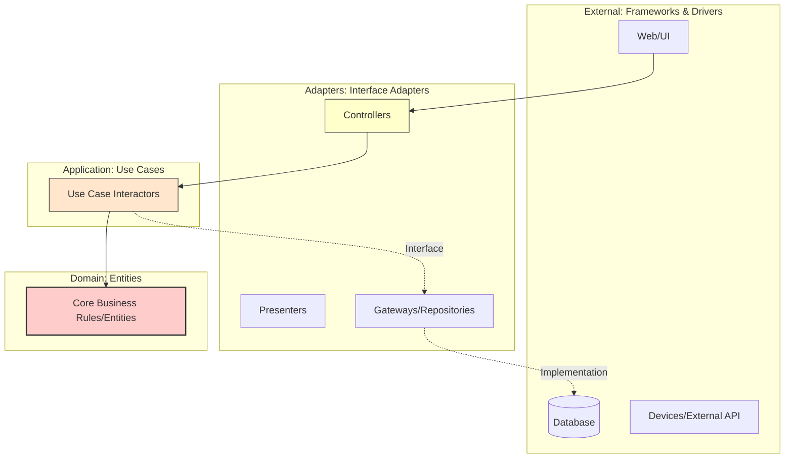

Parent: [[010.도메인_주도_설계(DDD)]]

# 1. 클린 아키텍처(Clean Architecture)의 개요 및 배경

### 가. 클린 아키텍처의 정의
- 로버트 C. 마틴(Robert C. Martin)이 제안한 설계 원칙으로, 소프트웨어의 관심사를 계층별로 분리하여 **프레임워크, UI, 데이터베이스 등 외부 요소로부터 비즈니스 로직을 독립**시키는 아키텍처임
- **의존성 규칙(Dependency Rule)**을 통해 제어 흐름과 상관없이 소스 코드의 의존성은 반드시 안쪽(고수준 정책)으로만 향하게 하는 설계 방식임

### 나. 등장 배경 및 필요성
- **강결합(Tight Coupling) 해소**: 전통적 계층형 아키텍처에서 비즈니스 로직이 DB나 특정 프레임워크에 종속되어 발생하는 변경 취약성 극대화 해결 필요
- **테스트 용이성(Testability) 확보**: 외부 환경(DB, 웹 서버) 없이도 핵심 비즈니스 로직을 독립적으로 검증할 수 있는 환경 요구
- **유지보수성 극대화**: 프레임워크나 외부 라이브러리의 교체 시에도 핵심 도메인 로직에 영향이 없도록 격리하여 소프트웨어 수명 연장

# 2. 클린 아키텍처의 구조 및 핵심 메커니즘

### 가. 클린 아키텍처의 계층 구조 및 의존성 흐름

### 나. 핵심 4계층 구성 요소
| 계층 | 명칭 | 상세 역할 및 특징 |
| :--- | :--- | :--- |
| **Entities** | **엔티티** | 전사적인 핵심 비즈니스 규칙 캡슐화, 외부 변화에 가장 무관한 고수준 정책 |
| **Use Cases** | **유스케이스** | 애플리케이션 특화 비즈니스 규칙, 엔티티를 조작하여 시스템의 목적 달성 |
| **Adapters** | **인터페이스 어댑터** | 유스케이스/엔티티 데이터를 외부(DB, Web) 형식으로 변환 (Controller, Repository) |
| **Frameworks** | **프레임워크 & 드라이버** | 가장 바깥쪽 계층, 웹 프레임워크/DB 등 구체적인 세부 기술(Detail) 위치 |

# 3. 상세 기술 및 비교 분석

### 가. 핵심 메커니즘: 의존성 역전 원칙(DIP)의 활용
1) **인터페이스 정의**: 고수준 계층(Use Case)에서 필요한 데이터 접근 방식을 인터페이스(Port)로 정의함
2) **구현체 주입**: 저수준 계층(Adapter)에서 해당 인터페이스를 구현(Implementation)함
3) **역전 현상**: 제어 흐름은 `안쪽 -> 바깥쪽`이지만, 소스 코드의 의존성은 `바깥쪽 -> 안쪽`으로 유지되어 결합도 제거

### 나. 계층형 아키텍처 vs 클린 아키텍처 비교
| 비교 항목 | 계층형 아키텍처 (Layered) | 클린 아키텍처 (Clean) |
| :--- | :--- | :--- |
| **의존성 방향** | 상위 계층 ➔ 하위 계층(DB 중심) | 외부 계층 ➔ 내부 도메인(정책 중심) |
| **DB 종속성** | 비즈니스 로직이 DB 스키마에 종속 | DB는 단순한 세부 사항(Detail)일 뿐임 |
| **테스트 방식** | 통합 테스트 위주 (DB 연동 필수) | 순수 단위 테스트 가능 (Mock 불필요) |
| **핵심 가치** | 구조적 계층화 및 개발 편의성 | 도메인 보호 및 기술 독립성 확보 |

# 4. 기술사적 제언 및 실무 적용 방안

### 가. 실무 도입 시 고려사항 (Pragmatic Approach)
- **보일러플레이트 코드 증가**: 계층 간 데이터 이동 시 DTO 매핑 등 파일 수가 급격히 늘어나므로 초기 개발 비용 및 러닝 커브 고려 필요
- **과도한 추상화 경계**: 단순 CRUD 시스템에는 오히려 오버엔지니어링이 될 수 있으므로, 도메인 복잡도에 따른 선별적 적용 전략 수립

### 나. 거버넌스 및 보안(Security) 통제 방안
- **계층 간 경계 침범 방지**: 정적 분석 도구(ArchUnit 등)를 활용하여 의존성 규칙 위반 사례(예: Entity가 Web DTO 참조) 자동 탐지 및 통제
- **Access Control**: 내부 도메인 모델에 대한 접근을 유스케이스를 통해서만 허용하여 데이터 무결성 및 보안 정책 일원화

### 다. 향후 발전 방향 (Hexagonal & MSA)
- **헥사고날 아키텍처 통합**: 포트 앤 어댑터(Ports & Adapters) 패턴과 결합하여 외부 인터페이스의 유연성 극대화
- **MSA 내부 설계 표준**: 각 마이크로서비스 내부를 클린 아키텍처로 설계하여 서비스 간 결합도는 낮추고 내부 응집도는 높이는 표준 모델로 정착 중

> [!tip] **기술사 인사이트**
> 클린 아키텍처의 정수는 "의존성의 방향"을 통제하는 것입니다. 기술은 언제든 변하지만 비즈니스의 본질(도메인)은 보존되어야 한다는 **"기술 독립성"**의 철학을 견지하는 것이 현대 엔터프라이즈 아키텍처의 핵심 성공 요인입니다.

## Related Notes
- [[010.도메인_주도_설계(DDD)]]
- [[017.헥사고날_아키텍처(Hexagonal_Architecture)]]
- [[009.Microservices_Architecture]]
- [[011.클린_아키텍처(Clean_Architecture)]]
