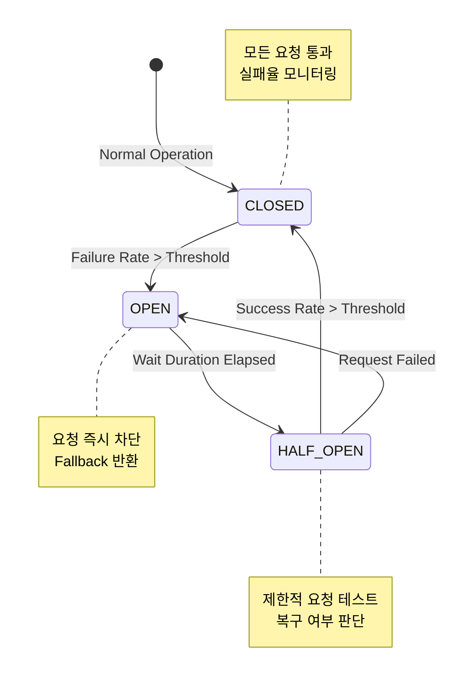

Parent: [[009.Microservices_Architecture]]

# 1. 서킷 브레이커(Circuit Breaker)의 개요 및 배경

### 가. 서킷 브레이커의 정의
- 분산 시스템 환경에서 특정 서비스의 장애나 지연이 다른 서비스로 전파되는 **연쇄 장애(Cascading Failure)**를 방지하기 위해, 호출을 일시적으로 차단하고 빠른 실패(Fail Fast)를 반환하는 **장애 격리(Isolation) 패턴**임
- 전기 회로의 차단기 원리를 차용하여, 시스템의 복원력(Resilience)을 확보하는 핵심 메커니즘임

### 나. 등장 배경 및 필요성
- **MSA의 복잡성**: 서비스 간 원격 호출(RPC/HTTP)이 급증함에 따라 특정 지점의 장애가 전체 시스템 다운으로 이어질 리스크 증대
- **리소스 고갈 방지**: 타겟 서비스의 응답 지연 시 호출 측의 스레드(Thread)가 계속 대기하며 스레드 풀이 고갈되는 현상 차단 필요
- **자가 치유(Self-healing) 시간 확보**: 장애 발생 서비스에 지속적인 부하를 주지 않음으로써 해당 서비스가 스스로 복구될 수 있는 여유 제공

# 2. 서킷 브레이커의 아키텍처 및 핵심 메커니즘

### 가. 서킷 브레이커의 3가지 상태 및 전이도

### 나. 상태별 상세 동작 및 특징
| 상태 | 명칭 | 상세 동작 메커니즘 | 비고 |
| :--- | :--- | :--- | :--- |
| **CLOSED** | **닫힘** | 모든 요청을 타겟 서비스로 전달하며 실패율을 기록함 | 정상 상태 |
| **OPEN** | **열림** | 요청을 즉시 차단하고 에러 또는 **Fallback** 데이터를 반환함 | 장애 상태 |
| **HALF-OPEN** | **반열림** | 설정된 시간 경과 후 소량의 요청만 허용하여 복구 여부를 검증함 | 복구 확인 |

# 3. 서킷 브레이커의 상세 기술 및 심화 분석

### 가. 실패율 계산 방식: 슬라이딩 윈도우(Sliding Window)
1) **Count-based Window**: 최근 N개의 호출 결과를 기반으로 실패율을 계산하여 상태 전환 여부 결정
2) **Time-based Window**: 최근 N초 동안 발생한 호출 결과의 통계를 바탕으로 임계치 초과 여부 판단

### 나. 주요 보완 패턴 및 라이브러리 비교
| 구분 | Netflix Hystrix | Resilience4j | Service Mesh (Istio) |
| :--- | :--- | :--- | :--- |
| **구현 방식** | 라이브러리 기반 (스레드 격리) | 라이브러리 기반 (함수형) | 사이드카 프록시 기반 (인프라) |
| **장점** | 초기 MSA 표준, 풍부한 대시보드 | 경량화, Java 8+ 최적화 | 언어 독립성, 코드 수정 불필요 |
| **단점** | 유지보수 중단 (Deprecated) | 특정 언어(Java)에 종속적 | 운영 복잡도 상승 (Envoy 제어) |
| **격리 방식** | Thread Pool 분리 | Semaphore / Count 기반 | L7 트래픽 제어 |

# 4. 기술사적 제언 및 실무 적용 방안

### 가. 실무 도입 시 고려사항 (Best Practices)
- **적절한 임계치 설정**: 너무 낮은 임계치는 일시적 네트워크 떨림에도 서킷을 열어 가용성을 낮추고, 너무 높으면 장애 전파를 막지 못하므로 정교한 튜닝 필요
- **Fallback 전략 수립**: 서킷이 열렸을 때 사용자에게 에러 화면 대신 정적 데이터나 캐시된 정보를 보여주어 UX 저하를 최소화해야 함

### 나. 거버넌스 및 보안(Security) 통제 방안
- **관측성(Observability) 확보**: 서킷의 상태 변화를 실시간으로 모니터링하고 알람 체계를 구축하여 운영 가시성 확보
- **보안 가용성 통제**: 고의적인 트래픽 주입을 통한 서킷 개방 시도(DoS 공격의 일종)를 차단하기 위해 API 게이트웨이의 Rate Limiting과 연계 필수

### 다. 향후 발전 방향: 지능형 자가 치유(Adaptive Resilience)
- **AIOps 기반 튜닝**: 과거 장애 데이터를 학습한 AI가 서비스 부하 상황에 따라 서킷 브레이커의 임계치를 실시간으로 자동 조절하는 지능형 복원력 강화
- **Chaos Engineering 연계**: 의도적으로 장애를 주입하여 서킷 브레이커의 동작을 주기적으로 검증함으로써 시스템의 견고함(Robustness) 상시 확인

> [!tip] **기술사 인사이트**
> 서킷 브레이커의 핵심은 "실패를 수용하는 설계(Design for Failure)"에 있습니다. 100% 가용성을 보장할 수 없는 분산 환경에서 **부분적 장애를 인정**하고 이를 전체로 확산시키지 않는 것이 현대 아키텍처의 필수 덕목입니다.

## Related Notes
- [[009.Microservices_Architecture]]
- [[013.Service_Discovery]]
- [[014.API_Gateway]]
- [[019.Service_Mesh]]
