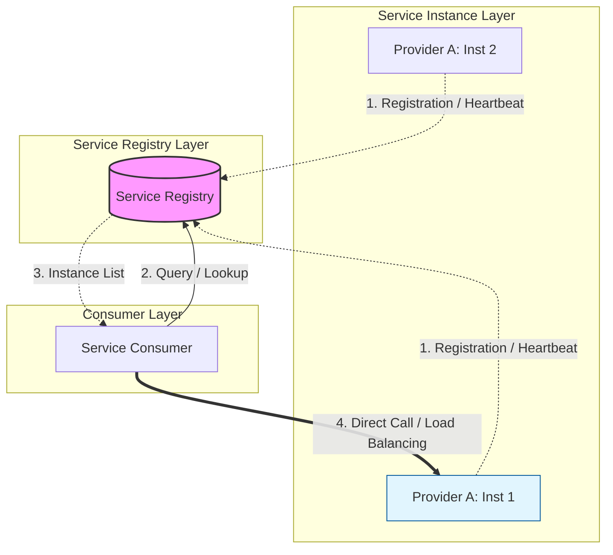

Parent: [[009.Microservices_Architecture]]

# 1. 서비스 디스커버리(Service Discovery)의 개요 및 배경

### 가. 서비스 디스커버리의 정의
- 분산 시스템 및 클라우드 환경에서 네트워크 상에 동적으로 생성되고 소멸하는 서비스 인스턴스들의 **네트워크 위치(IP 주소와 포트 번호)를 자동으로 탐색**하고 관리하는 메커니즘임
- 서비스 간 통신 시 정적 설정이 아닌, 중앙 집중화된 **서비스 레지스트리(Service Registry)**를 통해 가용한 서비스 목록을 조회하는 기술임

### 나. 등장 배경 및 필요성
- **동적 IP 환경 대응**: 컨테이너(Docker, K8s) 및 오토 스케일링 환경에서 수시로 변하는 인스턴스 IP를 실시간으로 추적하기 위함
- **서비스 가용성 확보**: 주기적인 **헬스 체크(Health Check)**를 통해 장애가 발생한 인스턴스를 즉시 목록에서 제외하여 트래픽 전송 방지
- **유연한 확장성(Scalability)**: 새로운 인스턴스가 투입될 때 별도의 설정 변경 없이 자동으로 트래픽을 분산(Load Balancing) 받을 수 있는 구조 제공

# 2. 서비스 디스커버리의 아키텍처 및 핵심 메커니즘

### 가. 서비스 디스커버리 개념도 및 구성 요소

### 나. 배포 패턴별 분류: Client-side vs Server-side
| 패턴 | 핵심 메커니즘 | 장점 | 단점 |
| :--- | :--- | :--- | :--- |
| **Client-side** | 클라이언트가 직접 레지스트리에서 목록을 조회하고 로드밸런싱 수행 | 중간 홉(Hop)이 없어 성능 우수, 세밀한 제어 가능 | 언어/프레임워크 종속성 발생 (Netflix Eureka 등) |
| **Server-side** | 클라이언트는 LB로 요청을 보내고, LB가 레지스트리를 조회하여 라우팅 | 클라이언트가 단순해짐, 언어 독립적 (K8s Service, AWS ELB) | LB 자체의 병목 가능성 및 추가적인 네트워크 홉 발생 |

# 3. 서비스 디스커버리의 상세 기술 및 비교 분석

### 가. 상세 기술 요소: 헬스 체크 및 레지스트리 관리
1) **Self-Registration**: 서비스 기동 시 자신의 메타데이터를 레지스트리에 직접 등록하고 하트비트를 전송함
2) **Third-party Registration**: Registrar가 외부에서 서비스의 상태를 감시하며 레지스트리를 갱신함 (K8s 내장 방식)
3) **Health Check**: 단순히 프로세스 생존뿐만 아니라 DB 연결, 메모리 임계치 등 비즈니스 가용성(Deep Health Check)을 종합적으로 판단함

### 나. 주요 솔루션 및 도구 비교 분석
| 비교 항목 | Netflix Eureka | HashiCorp Consul | Apache Zookeeper | Kubernetes DNS |
| :--- | :--- | :--- | :--- | :--- |
| **CAP 정리** | **AP** (가용성 중시) | **CP** (일관성 중시) | **CP** (일관성 중시) | - |
| **통신 프로토콜** | REST API | HTTP / DNS | Custom / TCP | DNS |
| **특징** | AWS/Spring 최적화 | Multi-DC 지원, KV 저장 | 설정 관리 범용성 | K8s 내장, 인프라 중심 |
| **로드밸런싱** | Ribbon 연계(Client) | 자체 Proxy / DNS | 클라이언트 직접 구현 | Kube-proxy / CoreDNS |

# 4. 기술사적 제언 및 실무 적용 방안

### 가. 실무 도입 시 고려사항
- **CAP 트레이드오프**: 레지스트리 장애 시 전체 시스템 마비를 막기 위해 **가용성(AP)**을 선택할 것인지, 데이터 무결성을 위해 **일관성(CP)**을 선택할 것인지 비즈니스 특성에 맞게 결정해야 함
- **클라이언트 캐싱**: 레지스트리 서버 다운 시에도 시스템이 동작할 수 있도록 조회된 목록을 로컬에 캐싱하는 복원력(Resilience) 설계 필수

### 나. 거버넌스 및 보안(Security) 통제 방안
- **통신 암호화(mTLS)**: 레지스트리와 서비스 간, 그리고 서비스 상호 간 통신 시 TLS 인증을 적용하여 비인가된 서비스 등록 및 데이터 탈취 방지
- **ACL(Access Control List)**: 레지스트리 접근 권한을 엄격히 통제하여 서비스 목록 조작 및 정보 유출을 차단하는 보안 거버넌스 수립

### 다. 최신 트렌드와 연계한 발전 방향
- **Service Mesh로의 통합**: 애플리케이션 코드에서 디스커버리 로직을 제거하고, Istio와 같은 서비스 매시의 **컨트롤 플레인**이 이를 투명하게 처리하는 방식으로 진화 중
- **Cloud-Native 표준화**: 특정 벤더 라이브러리에 의존하지 않고 쿠버네티스 서비스(K8s Service)와 같은 표준 인프라 기술을 활용하는 서버 사이드 디스커버리가 실무 표준으로 정착

> [!tip] **기술사 인사이트**
> 서비스 디스커버리의 본질은 **"위치 투명성(Location Transparency)"** 확보에 있습니다. 서비스의 물리적 위치에 상관없이 논리적 이름으로 통신할 수 있는 환경을 구축함으로써, 인프라의 유연성을 극대화하고 개발자가 비즈니스 로직에만 집중하게 만드는 것이 핵심 가치입니다.

## Related Notes
- [[009.Microservices_Architecture]]
- [[014.API_Gateway]]
- [[012.서킷_브레이커(Circuit_Breaker)]]
- [[019.Service_Mesh]]
