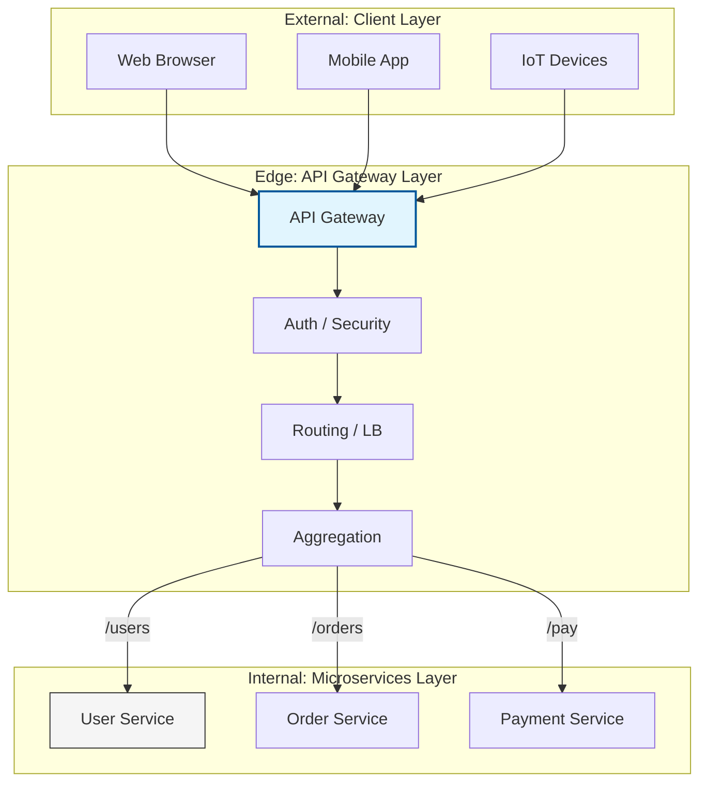

Parent: [[009.Microservices_Architecture]]

# 1. API 게이트웨이(API Gateway)의 개요 및 배경

### 가. API 게이트웨이의 정의
- 클라이언트와 백엔드 서비스(마이크로서비스) 사이에서 모든 요청을 받아 적절한 서비스로 전달하는 **단일 진입점(Single Point of Entry)**이자 프록시 서버임
- 인증, 인가, 라우팅, 로드밸런싱 등 분산 시스템에서 공통적으로 필요한 기능을 중앙에서 일괄 처리하는 **에지(Edge) 서비스**임

### 나. 등장 배경 및 필요성
- **클라이언트 복잡성 해소**: 수많은 마이크로서비스의 엔드포인트를 클라이언트가 직접 관리해야 하는 부담 제거 필요
- **공통 관심사(Cross-cutting Concerns) 분리**: 개별 서비스마다 중복 구현되던 인증, 로깅, SSL 터미네이션 등을 중앙화하여 개발 효율성 제고
- **내부 구조 캡슐화**: 내부 네트워크 구조와 서비스의 물리적 위치를 외부에 노출하지 않음으로써 보안성 강화 및 유연한 구조 변경 지원

# 2. API 게이트웨이의 아키텍처 및 핵심 메커니즘

### 가. API 게이트웨이 운영 아키텍처 개념도

### 나. 핵심 기능 및 메커니즘
| 기능 | 상세 내용 | 비고 |
| :--- | :--- | :--- |
| **인증/인가** | JWT, OAuth2 기반의 토큰 검증 및 사용자 권한 확인 절차 수행 | 보안 중앙화 |
| **동적 라우팅** | 서비스 레지스트리(Eureka 등)와 연계하여 요청 경로에 따른 서비스 매핑 | 위치 투명성 |
| **API 조합** | 여러 서비스의 응답을 하나로 통합(Aggregation)하여 클라이언트 왕복 횟수 감소 | 성능 최적화 |
| **비율 제한** | 특정 클라이언트의 과도한 요청(DoS)을 차단하는 Throttling 및 Rate Limiting | 가용성 보호 |

# 3. API 게이트웨이의 상세 기술 및 비교 분석

### 가. 백엔드 포 프론트엔드(BFF: Backend For Frontend) 패턴
1) **개념**: 클라이언트 종류(Web, iOS, Android)별로 특화된 전용 게이트웨이를 두어 최적화된 API를 제공하는 패턴
2) **효과**: 모바일 기기의 대역폭 절약(필드 필터링), 프론트엔드 요구사항 변화에 유연하게 대응 가능

### 나. 주요 API 게이트웨이 솔루션 비교 분석
| 비교 항목 | Spring Cloud Gateway | Kong Gateway | AWS API Gateway |
| :--- | :--- | :--- | :--- |
| **기반 기술** | Java / Netty (Non-blocking) | Nginx / Lua | Cloud Native (Managed) |
| **장점** | Spring 에코시스템과 완벽 통합 | 가볍고 매우 빠름, 다양한 플러그인 | 관리 부담 없음, Serverless(Lambda) 연계 |
| **커스터마이징** | Java 코드로 유연하게 구현 | Lua 스크립트 기반 확장 | 콘솔 설정 위주, 확장성 제한적 |
| **적합 분야** | 복잡한 비즈니스 필터 필요 시 | 대규모 트래픽 처리가 최우선인 환경 | AWS 클라우드 기반 신속한 구축 |

# 4. 기술사적 제언 및 실무 적용 방안

### 가. 실무 도입 시 고려사항 및 주의점
- **단일 장애점(SPOF) 대응**: 게이트웨이 장애 시 전체 시스템이 마비되므로, 반드시 이중화(HA) 구성 및 자동 확장(Auto-scaling) 체계 구축 필수
- **비즈니스 로직 배제**: 게이트웨이에 도메인 로직이 포함되면 과거의 무거운 미들웨어(ESB)처럼 변질되므로, 오직 **공통 기능**만 처리하도록 제어

### 나. 거버넌스 및 보안(Security) 통제 방안
- **SSL 터미네이션**: 게이트웨이에서 SSL 인증서를 관리하고 내부망은 HTTP로 통신하여 개별 서비스의 성능 부담 완화(보안 이슈 검토 필요)
- **그레이스풀 셧다운(Graceful Shutdown)**: 게이트웨이 배포 시 진행 중인 요청을 안전하게 처리한 후 종료하는 무중단 배포 전략 수립

### 다. 향후 발전 방향: Service Mesh와의 협력
- **North-South vs East-West**: 외부 트래픽(North-South)은 API 게이트웨이가, 내부 서비스 간 통신(East-West)은 서비스 매시(Istio 등)가 담당하는 역할 분담 모델이 표준으로 정착 중
- **Ingress Controller로의 진화**: 쿠버네티스 환경에서 게이트웨이의 역할이 인그레스 컨트롤러와 통합되어 인프라 레벨에서 투명하게 관리되는 추세

> [!tip] **기술사 인사이트**
> API 게이트웨이는 MSA의 **"현관문"**입니다. 현관문이 튼튼해야 내부 자산이 안전하듯, 강력한 보안 정책과 유연한 라우팅 설계를 통해 시스템의 견고함과 민첩성을 동시에 확보하는 것이 아키텍트의 핵심 역량입니다.

## Related Notes
- [[009.Microservices_Architecture]]
- [[013.Service_Discovery]]
- [[012.서킷_브레이커(Circuit_Breaker)]]
- [[019.Service_Mesh]]
