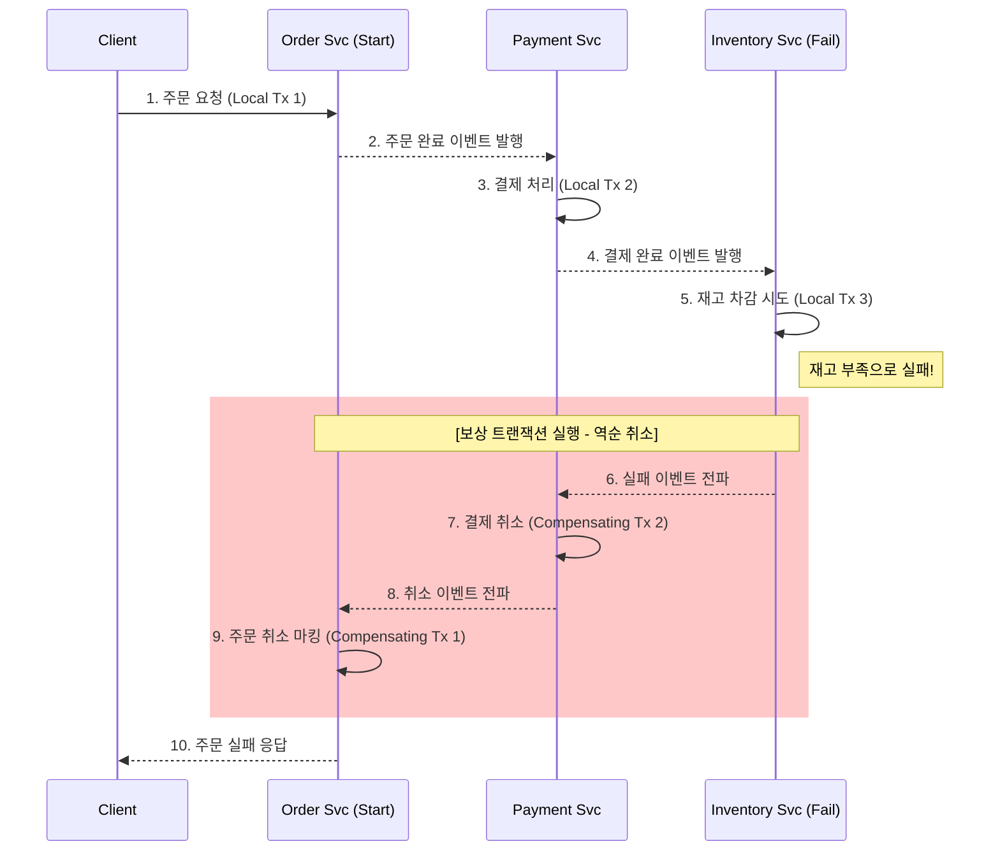

Parent: [[009.Microservices_Architecture]]

# 1. 사가 패턴(Saga Pattern)의 개요 및 배경

### 가. 사가 패턴의 정의
- 마이크로서비스 아키텍처(MSA) 환경에서 데이터의 일관성(Consistency)을 유지하기 위해, 긴 비즈니스 프로세스를 여러 개의 **로컬 트랜잭션 체인**으로 분리하여 관리하는 **분산 트랜잭션 관리 패턴**임
- 각 단계의 로컬 트랜잭션이 완료되면 이벤트를 발행하여 다음 단계를 트리거하며, 실패 시 **보상 트랜잭션(Compensating Transaction)**을 통해 원상 복구함

### 나. 등장 배경 및 필요성
- **분산 DB 환경의 한계**: 서비스별 전용 DB(Database per Service) 구조에서는 단일 DB의 ACID 트랜잭션 보장이 불가능함
- **2PC(2-Phase Commit)의 제약**: 동기식 분산 트랜잭션 방식인 2PC는 모든 참여 서비스가 응답할 때까지 **글로벌 락(Global Lock)**을 유발하여 성능 및 가용성을 극도로 저하시킴
- **최종적 일관성(Eventual Consistency) 요구**: 실시간 동기화 대신, 결과적으로 데이터의 정합성을 맞추는 **BASE** 철학 기반의 비동기 처리 체계 필요

# 2. 사가 패턴의 아키텍처 및 핵심 메커니즘

### 가. 사가 패턴 운영 개념도 (주문-결제-재고 시나리오)

### 나. 핵심 구성 요소 및 기술
| 구분 | 핵심 요소 | 상세 역할 및 기술 |
| :--- | :--- | :--- |
| **트랜잭션** | **로컬 트랜잭션** | 개별 서비스 내에서 수행되는 원자적(Atomic) 작업 단위 |
| **실패 처리** | **보상 트랜잭션** | 이미 커밋된 작업을 논리적으로 취소하기 위한 반대 성격의 작업 |
| **메시징** | **이벤트/메시지 큐** | 서비스 간 비동기 통신 및 트리거를 위한 매개체 (Kafka, RabbitMQ) |
| **상태 관리** | **Saga Log / State** | 현재 사가의 진행 상태 및 이력을 기록하여 장애 복구 시 활용 |

# 3. 사가 패턴의 상세 기술 및 비교 분석

### 가. 사가 구현 방식의 상세 분류 (Choreography vs Orchestration)
1) **코레오그래피(Choreography)**: 중앙 통제자 없이 각 서비스가 이벤트를 구독/발행하며 자율적으로 수행. 결합도가 낮으나 흐름 파악이 어려움
2) **오케스트레이션(Orchestration)**: 중앙 '사가 오케스트레이터'가 각 서비스에 명령(Command)을 내리고 상태를 제어. 복잡한 워크플로우 관리에 유리함

### 나. 2PC(동기식) vs Saga Pattern(비동기식) 비교 분석
| 비교 항목 | 2PC (Two-Phase Commit) | Saga Pattern |
| :--- | :--- | :--- |
| **일관성 모델** | **ACID** (강한 일관성) | **BASE** (최종적 일관성) |
| **락(Lock) 범위** | 글로벌 락 (모든 자원 점유) | 로컬 락 (해당 서비스만 점유) |
| **가용성** | 낮음 (참여 서비스 중 하나라도 장애 시 마비) | **높음** (비동기 처리로 타 서비스 독립성 보장) |
| **실패 복구** | DB 엔진의 자동 Rollback | 개발자가 정의한 **보상 트랜잭션** 수동 수행 |
| **적합 분야** | 고도의 정합성이 필요한 금융 계정계 등 | 대규모 MSA, 전자상거래 주문 처리 등 |

# 4. 기술사적 제언 및 실무 적용 방안

### 가. 실무 도입 시 고려사항
- **멱등성(Idempotency) 보장**: 메시지 중복 전달에 대비하여 동일한 보상 트랜잭션이 여러 번 실행되어도 결과가 같도록 설계 필수
- **격리성 부족(Lost Update) 대응**: 사가 진행 중 데이터가 다른 트랜잭션에 노출되므로, `PENDING` 상태 마킹 등 **시맨틱 락(Semantic Lock)** 기법 적용

### 나. 거버넌스 및 보안(Security) 통제 방안
- **Transactional Outbox 패턴**: 로컬 DB 갱신과 이벤트 발행을 하나의 트랜잭션으로 묶어 메시지 유실 방지 및 무결성 확보
- **분산 추적(Distributed Tracing)**: 사가의 흐름을 추적하기 위해 상관관계 ID(Correlation ID)를 부여하고 가시화 도구(Zipkin 등) 연계

### 다. 최신 트렌드와 연계한 발전 방향
- **워크플로우 엔진 도입**: 사가의 복잡도를 줄이기 위해 AWS Step Functions, Temporal 등 외부 오케스트레이션 엔진을 활용한 관리 자동화 확산
- **이벤트 소싱(Event Sourcing) 결합**: 상태 변화 자체를 이벤트로 기록하여 사가의 상태 복원력을 극대화하는 아키텍처로 진화 중

> [!tip] **기술사 인사이트**
> 사가 패턴은 분산 환경의 필연적 한계인 **"CAP 정리"**에서 가용성(A)과 분할 내성(P)을 선택하고 일관성(C)을 타협한 산물입니다. 무조건적인 적용보다는 비즈니스 허용 범위를 고려하여 **최종적 일관성**이 수용 가능한 영역에 우선적으로 도입해야 합니다.

## Related Notes
- [[009.Microservices_Architecture]]
- [[018.MSA_트랜잭션_관리]]
- [[022.MSA_보상_트랜잭션]]
- [[016.이벤트_스토밍(Event_Storming)]]
