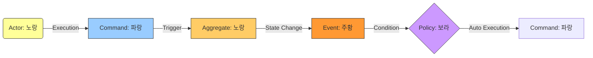

Parent: [[010.도메인_주도_설계(DDD)]]

# 1. 이벤트 스토밍(Event Storming)의 개요 및 배경

### 가. 이벤트 스토밍의 정의
- 복잡한 비즈니스 도메인을 분석하기 위해 모든 이해관계자가 참여하여, 시스템에서 발생하는 **도메인 이벤트(Domain Event)**를 중심으로 비즈니스 흐름을 시각화하는 **워크숍 기반 모델링 기법**임
- 알베르토 브란돌리니(Alberto Brandolini)가 제안하였으며, 포스트잇을 활용하여 직관적이고 빠르게 도메인을 탐색하는 방법론임

### 나. 등장 배경 및 필요성
- **의사소통 단절 해소**: 개발자 중심의 UML이나 문서 대신, 현업 전문가(Domain Expert)와 함께 소통할 수 있는 직관적 도구 필요
- **유비쿼터스 언어(Ubiquitous Language) 정립**: 전사적으로 합의된 비즈니스 용어를 코드와 설계에 그대로 반영하기 위함
- **MSA 서비스 경계 식별**: 이벤트의 흐름과 응집도를 분석하여 **바운디드 컨텍스트(Bounded Context)**를 도출하는 가장 실용적인 수단임

# 2. 이벤트 스토밍의 아키텍처 및 핵심 메커니즘

### 가. 이벤트 스토밍의 주요 구성 요소 (포스트잇 색상 규칙)
| 요소 | 색상 | 상세 내용 및 역할 |
| :--- | :--- | :--- |
| **Domain Event** | **주황색** | 비즈니스적으로 의미 있는 상태의 변화 (과거형으로 기술) |
| **Command** | **파란색** | 이벤트를 발생시키는 사용자의 의도나 시스템 명령 |
| **Aggregate** | **노란색(대)** | 데이터 변경의 단위이자 비즈니스 규칙의 결합체 |
| **Policy** | **보라색** | 이벤트 발생 시 자동으로 실행되는 후속 비즈니스 규칙 |
| **External System** | **분홍색** | 시스템 외부에 존재하는 연동 대상 (PG사, 외부 API 등) |
| **Read Model** | **초록색** | 사용자가 커맨드를 결정하기 위해 필요한 정보(조회용 뷰) |

### 나. 도메인 모델링 흐름도 (Sequence)

# 3. 이벤트 스토밍의 단계별 절차 및 심화 분석

### 가. 이벤트 스토밍 수행 5단계 절차
1) **이벤트 도출(Chaos Exploration)**: 도메인 이벤트를 시간 순서대로 무작위로 나열함
2) **타임라인 정렬**: 중복 제거 및 선후 관계를 정리하며 비즈니스 흐름을 구조화함
3) **커맨드 및 액터 부착**: 이벤트를 유발하는 주체와 명령을 식별하여 연결함
4) **애그리거트 도출**: 도메인 규칙을 보호하는 단위인 애그리거트를 정의함
5) **바운디드 컨텍스트 경계 확정**: 응집된 요소들을 그룹화하여 마이크로서비스의 경계로 삼음

### 나. 전통적 분석(UML) vs 이벤트 스토밍 비교
| 비교 항목 | UML / 유스케이스 | 이벤트 스토밍 |
| :--- | :--- | :--- |
| **참여자 범위** | 분석가, 설계자 위주 | 비즈니스 전문가 포함 전원 참여 |
| **중점 관점** | 정적 구조 및 절차 중심 | 동적 비즈니스 흐름(이벤트) 중심 |
| **도구/방식** | 전용 툴 및 표준 기호 | 포스트잇, 마커, 넓은 벽면 |
| **산출물 활용** | 상세 설계서 및 명세서 | MSA 서비스 경계 및 EDA 설계도 |

# 4. 기술사적 제언 및 실무 적용 방안

### 가. 실무 도입 시 고려사항
- **퍼실리테이터(Facilitator)의 역량**: 기술적 논쟁에 매몰되지 않도록 비즈니스 관점의 대화를 유도하는 중재자 역할이 핵심임
- **핫스팟(Hot Spot) 활용**: 논쟁이 길어지는 이슈는 빨간색 포스트잇(Hot Spot)으로 마킹하여 나중에 논의함으로써 워크숍의 흐름을 유지해야 함

### 나. 거버넌스 및 보안(Security) 통제 방안
- **개인정보 식별**: 이벤트 및 읽기 모델 도출 단계에서 개인정보(PII) 포함 여부를 조기에 식별하여 데이터 보호 체계(DLP 등) 설계에 반영
- **보안 이벤트 도출**: 인증 실패, 이상 징후 탐지 등 보안 관련 이벤트를 도메인 흐름에 포함시켜 탄력적인 보안(Resilience) 확보

### 다. 최신 트렌드와 연계한 발전 방향
- **EDA(Event-Driven Architecture)의 설계도**: 도출된 주황색 이벤트는 Kafka의 Topic이 되고, 보라색 정책은 Consumer 로직이 되어 아키텍처와 직결됨
- **AI 기반 자동화**: 온라인 화이트보드(Miro 등)의 이벤트 스토밍 결과를 분석하여 마이크로서비스의 스켈레톤 코드를 자동 생성하는 기술 도입 가속화

> [!tip] **기술사 인사이트**
> 이벤트 스토밍은 "코드를 짜기 전의 브레인스토밍"이 아니라, **"비즈니스의 복잡성을 시각적으로 정복하는 전략적 도구"**입니다. 특히 MSA 전환 시 서비스 분할의 명확한 근거를 제공하여 아키텍처의 정당성을 확보하는 데 필수적입니다.

## Related Notes
- [[010.도메인_주도_설계(DDD)]]
- [[009.Microservices_Architecture]]
- [[021.Message_Queuing_아키텍처]]
- [[015.사가_패턴(Saga_Pattern)]]
