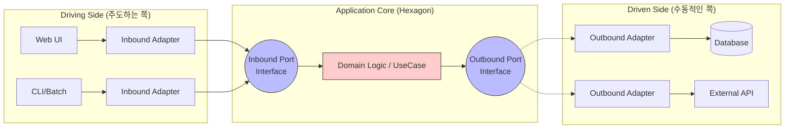

Parent: [[011.클린_아키텍처(Clean_Architecture)]]

# 1. 헥사고날 아키텍처(Hexagonal Architecture)의 개요 및 배경

### 가. 헥사고날 아키텍처의 정의
- 애플리케이션의 핵심 비즈니스 로직을 외부 시스템(UI, DB, 외부 API 등)으로부터 격리하기 위해, **포트(Port)와 어댑터(Adapter)**를 통해 소통하는 소프트웨어 설계 패턴임
- 알리스테어 코오번(Alistair Cockburn)이 제안하였으며, 기술적인 세부 사항이 핵심 도메인을 오염시키지 않도록 보호하는 것이 목적임

### 나. 등장 배경 및 필요성
- **계층형 아키텍처의 한계 극복**: 상위 계층이 하위 계층(특히 DB)에 강하게 의존하는 문제를 해결하고 의존성 방향을 내부로 고정할 필요성 증대
- **유지보수 및 교체 용이성**: 데이터베이스 기술(RDBMS -> NoSQL)이나 프론트엔드 환경이 바뀌어도 핵심 비즈니스 로직 수정 없이 대응 가능하도록 설계
- **테스트 가용성(Testability)**: 외부 시스템 없이도 비즈니스 로직에 대한 순수한 단위 테스트(Unit Test)를 상시 수행할 수 있는 환경 요구

# 2. 헥사고날 아키텍처의 구조 및 핵심 메커니즘

### 가. 포트 앤 어댑터(Ports and Adapters) 개념도

### 나. 핵심 구성 요소 및 역할
| 요소 | 상세 설명 | 비고 |
| :--- | :--- | :--- |
| **Inbound Port** | 외부가 코어의 기능을 호출하기 위해 사용하는 인터페이스 | 입구(Entry) |
| **Inbound Adapter** | 외부 요청(HTTP, gRPC)을 받아 포트 규격에 맞게 코어를 호출함 | 컨트롤러 등 |
| **Outbound Port** | 코어가 외부 인프라를 사용하기 위해 정의한 인터페이스 | 출구(Exit) |
| **Outbound Adapter** | 외부 시스템(DB, API)과 직접 통신하며 포트를 구현함 | 리포지토리 등 |

# 3. 상세 기술 및 비교 분석

### 가. 상세 메커니즘: 대칭적 구조와 의존성 역전(DIP)
1) **인바운드(Driving)**: 외부 사용자나 시스템이 애플리케이션을 제어하며, 어댑터가 포트에 의존함
2) **아웃바운드(Driven)**: 애플리케이션이 외부 인프라를 제어하며, 코어가 정의한 포트를 외부 어댑터가 구현함으로써 **의존성 역전**이 완성됨

### 나. 계층형 아키텍처 vs 헥사고날 아키텍처 비교
| 비교 항목 | 전통적 계층형 (Layered) | 헥사고날 (Ports & Adapters) |
| :--- | :--- | :--- |
| **의존성 방향** | 상위 ➔ 하위 (일방향, DB 종속) | 외부 ➔ 내부 (고수준 정책 중심) |
| **중심 요소** | 데이터베이스 테이블/스키마 | 비즈니스 도메인 모델 |
| **교체 용이성** | 하위 계층 변경 시 상위 영향 큼 | 어댑터만 교체하면 코어 영향 없음 |
| **테스트 범위** | 통합 테스트 위주 (DB 연동 필수) | 도메인 로직 단독 단위 테스트 용이 |

# 4. 기술사적 제언 및 실무 적용 방안

### 가. 실무 도입 시 고려사항
- **매핑(Mapping) 오버헤드**: 계층을 넘나들 때마다 데이터 객체(DTO, Entity, Domain)를 변환해야 하므로 코드 복잡도와 개발 시간이 증가함
- **도메인 복잡도 기반 선택**: 단순 CRUD 위주의 시스템보다는 복잡한 비즈니스 규칙이 포함된 엔터프라이즈 시스템에 도입하는 것이 경제적임

### 나. 거버넌스 및 보안(Security) 통제 방안
- **부패 방지 계층(ACL) 통합**: 외부 어댑터 내에서 외부 데이터 모델을 도메인 모델로 철저히 변환하여 내부 도메인의 순수성 유지
- **인가(Authorization) 통제**: 인바운드 어댑터와 포트 사이에서 사용자 권한을 검증하는 보안 가드레일을 공통화하여 설계

### 다. 향후 발전 방향: 클라우드 네이티브 MSA의 표준
- **서버리스(Serverless) 최적화**: 기술 환경(AWS Lambda, Azure Functions)이 바뀌어도 핵심 로직은 그대로 유지되는 포터블한 설계 지향
- **도메인 격리의 완성**: 헥사고날 아키텍처는 마이크로서비스 내부를 설계하는 가장 강력한 표준 아키텍처로서 **DDD**와 결합하여 실무 표준으로 정착 중

> [!tip] **기술사 인사이트**
> 헥사고날 아키텍처의 핵심 가치는 **"소프트웨어 수명 연장"**입니다. 기술은 빠르게 변하지만 비즈니스 본질은 상대적으로 느리게 변하므로, 본질을 기술로부터 격리하는 것만이 미래의 변화에 유연하게 대응하는 유일한 길입니다.

## Related Notes
- [[011.클린_아키텍처(Clean_Architecture)]]
- [[010.도메인_주도_설계(DDD)]]
- [[009.Microservices_Architecture]]
- [[017.헥사고날_아키텍처(Hexagonal_Architecture)]]
