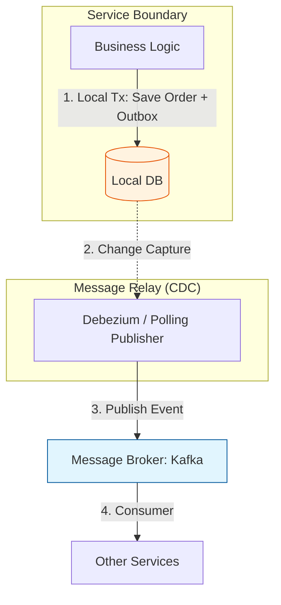

Parent: [[009.Microservices_Architecture]]

# 1. MSA 트랜잭션 관리의 개요 및 배경

### 가. MSA 트랜잭션 관리의 정의
- 데이터베이스가 서비스별로 분산된 환경에서, 여러 마이크로서비스에 걸쳐 발생하는 비즈니스 작업의 **데이터 무결성과 일관성을 보장**하기 위한 아키텍처 기법임
- 강한 일관성(ACID) 대신 가용성과 분할 내성을 고려한 **최종적 일관성(Eventual Consistency)**을 확보하는 체계임

### 나. 등장 배경 및 필요성
- **분산 DB의 한계**: 단일 DB 중심의 ACID 트랜잭션 처리가 불가능해짐에 따라 새로운 정합성 유지 방안 필요
- **CAP 정리의 트레이드오프**: 네트워크 분할(P) 환경에서 일관성(C)보다 가용성(A)을 중시하는 비즈니스 요구사항 증대
- **글로벌 락(Global Lock) 회피**: 2PC와 같은 동기식 분산 트랜잭션의 성능 병목을 해결하고 시스템 처리량(Throughput)을 극대화하기 위함

# 2. MSA 트랜잭션의 핵심 원칙 및 메커니즘

### 가. ACID와 BASE의 비교 분석
| 구분 | ACID (전통적 방식) | BASE (MSA 방식) |
| :--- | :--- | :--- |
| **일관성 수준** | **Strong Consistency** (즉시 일관성) | **Eventual Consistency** (최종적 일관성) |
| **핵심 철학** | 데이터의 완벽한 무결성 보장 | 가용성을 높이고 결과적 정합성 지향 |
| **특성** | Atomicity, Consistency, Isolation, Durability | Basically Available, Soft-state, Eventual Consistency |
| **적합성** | 금융 계정계, 모놀리식 아키텍처 | 전자상거래, 마이크로서비스 아키텍처 |

### 나. 트랜잭셔널 아웃박스(Transactional Outbox) 패턴 아키텍처

# 3. 상세 트랜잭션 처리 패턴 기술 분석

### 가. 주요 분산 트랜잭션 패턴
1) **Saga 패턴**: 로컬 트랜잭션을 체인으로 연결하고, 실패 시 역순으로 **보상 트랜잭션**을 실행하여 일관성 확보
2) **TCC(Try-Confirm/Cancel)**: 자원을 미리 예약(Try)한 후 전체 성공 시 확정(Confirm), 실패 시 취소(Cancel)하는 2단계 API 패턴
3) **2PC(Two-Phase Commit)**: 준비(Prepare)와 확정(Commit)의 2단계로 진행하나, 성능 저하 및 블로킹 문제로 MSA에서는 기피함

### 나. 패턴별 기술적 특성 비교
| 비교 항목 | 2PC (동기) | Saga (비동기) | TCC (동기/예약) |
| :--- | :--- | :--- | :--- |
| **구현 난이도** | 낮음 (지원 DB 필요) | 높음 (보상 로직 필수) | **매우 높음** (3단계 API 구현) |
| **성능/가용성** | 낮음 (Global Lock) | **매우 높음** (비동기) | 중간 |
| **데이터 가시성** | 완벽함 (Isolation) | 낮음 (중간 상태 노출) | 높음 (예약 상태 활용) |
| **롤백 방식** | DB 자동 롤백 | 애플리케이션 보상 트랜잭션 | 애플리케이션 Cancel 호출 |

# 4. 기술사적 제언 및 실무 적용 방안

### 가. 실무 도입 시 고려사항
- **멱등성(Idempotency) 확보**: 중복 메시지 유입에 대비하여 고유 키를 활용한 중복 처리 방어 로직이 모든 API에 전제되어야 함
- **모니터링 강화**: 비동기로 분산된 트랜잭션의 상태를 한눈에 파악할 수 있도록 **분산 추적(Distributed Tracing)** 체계 구축 필수

### 나. 거버넌스 및 보안(Security) 통제 방안
- **격리성 부족 대응**: 사가 진행 중인 데이터에 `PENDING` 등의 상태를 부여하여 타 트랜잭션의 간섭을 차단하는 **시맨틱 락(Semantic Lock)** 적용
- **데이터 감사(Audit)**: 트랜잭션의 전 과정을 감사 로그로 남겨 데이터 불일치 시 사후 분석 및 수동 정합성 보정이 가능하도록 설계

### 다. 최신 트렌드와 연계한 발전 방향
- **워크플로우 엔진 활용**: AWS Step Functions, Temporal 등 오케스트레이션 도구를 활용하여 사가 로직의 복잡도를 인프라 레벨에서 관리
- **이벤트 소싱(Event Sourcing)**: 상태 변경 이력을 모두 저장하여 데이터 무결성을 확보하고, 장애 시 특정 시점으로의 완벽한 복구(Replay) 보장

> [!tip] **기술사 인사이트**
> MSA 트랜잭션의 핵심은 "기술"이 아닌 **"비즈니스의 허용성"**입니다. 모든 데이터가 즉시 일관되어야 한다는 고정관념을 버리고, 비즈니스 영향도에 따라 **최종적 일관성**을 수용하는 설계 역량이 아키텍트의 핵심 차별화 포인트입니다.

## Related Notes
- [[015.사가_패턴(Saga_Pattern)]]
- [[009.Microservices_Architecture]]
- [[022.MSA_보상_트랜잭션]]
- [[023.CQRS_패턴(CQRS_Pattern)]]
