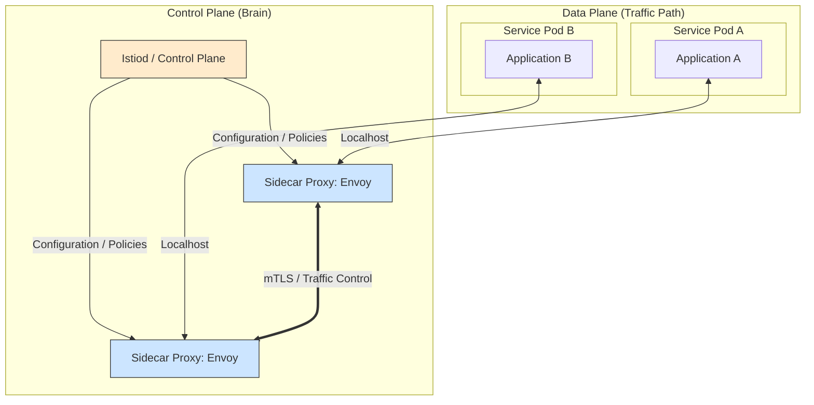

Parent: [[009.Microservices_Architecture]]

# 1. 서비스 메시(Service Mesh)의 개요 및 배경

### 가. 서비스 메시의 정의
- 마이크로서비스 간의 통신(네트워크 트래픽)을 안전하고 신뢰성 있게 제어, 관리, 관찰하기 위한 **전용 인프라스트럭처 계층(Infrastructure Layer)**임
- 애플리케이션 코드와 분리된 **사이드카(Sidecar) 프록시**를 통해 가시성, 보안, 연결성 기능을 제공하는 아키텍처임

### 나. 등장 배경 및 필요성
- **언어 독립성 확보**: 서비스 디스커버리, 서킷 브레이커 등 통신 로직을 코드 내 라이브러리(Spring Cloud 등)에서 분리하여 다국어 환경(Polyglot) 지원 필요
- **비즈니스 로직 집중**: 개발자가 네트워크 장애 처리나 트래픽 제어 로직을 직접 구현하지 않고 비즈니스 가치 창출에만 전념할 수 있는 환경 요구
- **관측성(Observability) 강화**: 수백 개의 서비스 간 복잡한 호출 관계와 지연 시간을 인프라 레벨에서 일관되게 수집 및 시각화하기 위함

# 2. 서비스 메시의 아키텍처 및 핵심 메커니즘

### 가. 서비스 메시 아키텍처 (Control Plane & Data Plane)

### 나. 핵심 구성 요소 및 역할
| 영역 | 구성 요소 | 상세 역할 |
| :--- | :--- | :--- |
| **Data Plane** | **Sidecar Proxy** | 실제 트래픽이 통과하며 라우팅, 암호화, 서킷 브레이커 수행 (Envoy) |
| **Control Plane** | **Istio / Control Plane** | 프록시들에게 정책과 설정을 배포하고, 서비스 디스커버리 정보를 관리함 |
| **Observability** | **Telemetry** | 프록시가 수집한 메트릭(Latency, Error)을 중앙 모니터링 시스템으로 전달 |

# 3. 상세 기술 요소 및 제공 기능 분석

### 가. 서비스 메시의 3대 핵심 기능
1) **트래픽 관리**: 카나리(Canary) 배포, 블루-그린 배포를 위한 정교한 트래픽 분할 및 자동 재시도(Retry) 지원
2) **보안(Security)**: 서비스 간 통신의 **상호 TLS(mTLS)**를 코드 수정 없이 적용하여 제로 트러스트 보안 실현
3) **가시성(Observability)**: 모든 호출 경로에 대한 분산 추적(Distributed Tracing) 및 골든 시그널(Golden Signals) 대시보드 제공

### 나. API 게이트웨이 vs 서비스 메시 비교
| 비교 항목 | API Gateway | Service Mesh |
| :--- | :--- | :--- |
| **주요 범위** | 외부 클라이언트 ↔ 내부 서비스 (Edge) | 내부 서비스 ↔ 내부 서비스 (East-West) |
| **배포 방식** | 중앙 집중형 게이트웨이 서버 | 서비스별 분산된 사이드카 프록시 |
| **핵심 역할** | 인증/인가, 요금제 제어, API 조합 | mTLS, 서킷 브레이커, 세밀한 라우팅 |
| **관점** | 비즈니스 외부 노출 관점 | 인프라 운영 및 가용성 관점 |

# 4. 기술사적 제언 및 실무 적용 방안

### 가. 실무 도입 시 고려사항
- **리소스 오버헤드**: 모든 Pod에 프록시가 추가되므로 CPU/메모리 소모량 증가 및 네트워크 지연(Latency)이 약 수 ms 발생함에 유의
- **운영 복잡도**: 쿠버네티스 외에 서비스 메시라는 거대한 레이어가 추가되므로, 운영 팀의 높은 기술 숙련도가 요구됨

### 나. 거버넌스 및 보안(Security) 통제 방안
- **제로 트러스트 강화**: mTLS를 기본 적용하고, 서비스 간 접근 권한 정책(Authorization Policy)을 코드로 관리하여 보안 거버넌스 수립
- **격리 통제**: 서킷 브레이커 임계치를 서비스 성격에 맞게 중앙에서 제어하여 장애 전파 원천 차단

### 다. 향후 발전 방향: 사이드카리스(Sidecarless)
- **사이드카의 한계 극복**: 프록시 부하를 줄이기 위해 노드당 하나의 프록시를 공유하거나, **eBPF** 기술을 활용하여 커널 레벨에서 메시 기능을 처리하는 기술 부상
- **플랫폼 엔지니어링 통합**: 개발자는 메시 존재를 몰라도 인프라가 자동으로 모든 연결을 보호하고 관찰하는 투명한(Transparent) 서비스 메시 지향

> [!tip] **기술사 인사이트**
> 서비스 메시는 **"네트워크의 소프트웨어화"**를 완성하는 기술입니다. 과거 하드웨어 스위치나 코드 내부 라이브러리가 담당하던 역할을 추상화된 인프라 레이어로 옮김으로써, 마이크로서비스의 복잡성을 관리 가능한 수준으로 제어할 수 있게 합니다.

## Related Notes
- [[009.Microservices_Architecture]]
- [[014.API_Gateway]]
- [[012.서킷_브레이커(Circuit_Breaker)]]
- [[013.Service_Discovery]]
- [[019.Service_Mesh]]
