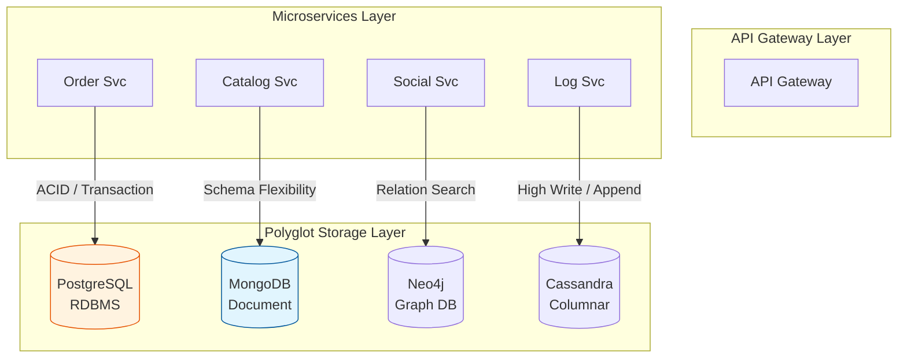

Parent: [[009.Microservices_Architecture]]

# 1. 폴리글랏 퍼시스턴스(Polyglot Persistence)의 개요 및 배경

### 가. 폴리글랏 퍼시스턴스의 정의
- 하나의 애플리케이션이나 시스템에서 단일 데이터베이스 기술만을 고집하지 않고, **데이터의 특성과 비즈니스 요구사항에 따라 최적의 다양한 DB를 혼합하여 사용**하는 전략임
- 마이크로서비스 아키텍처(MSA)의 'Database per Service' 원칙을 실현하는 구체적인 데이터 저장 기술 방법론임

### 나. 등장 배경 및 필요성
- **RDBMS의 한계**: 대규모 트래픽 하에서의 쓰기 성능 병목, 비정형 데이터(JSON) 처리의 비효율성, 복잡한 관계 탐색 시 JOIN 연산 부하 발생
- **데이터 다양성 증가**: 소셜 관계 데이터, 실시간 로그, 전문 검색, 고속 캐싱 등 각기 다른 저장/조회 패턴의 파편화 가속
- **최상의 성능(Best of Breed) 추구**: 특정 도메인의 성능 극대화를 위해 범용적인 RDBMS 대신 특수 목적의 NoSQL 도입 요구 증대

# 2. 폴리글랏 퍼시스턴스의 아키텍처 및 핵심 메커니즘

### 가. 서비스 도메인별 DB 배치 개념도

### 나. 데이터 유형별 데이터베이스 매핑 가이드
| 데이터 유형 | 핵심 요구사항 | 추천 데이터베이스 종류 |
| :--- | :--- | :--- |
| **정형 / 계정** | 강력한 일관성(ACID), 복잡한 쿼리 | **RDBMS** (MySQL, PostgreSQL, Oracle) |
| **비정형 / 카탈로그** | 유연한 스키마 변경, 빠른 개발 | **Document DB** (MongoDB, Couchbase) |
| **초고속 캐싱 / 세션** | 저지연(Low Latency) 읽기/쓰기 | **Key-Value Store** (Redis, Memcached) |
| **소셜 관계 / 추천** | 깊은 연관관계 탐색, 경로 추적 | **Graph DB** (Neo4j, Amazon Neptune) |
| **대용량 로그 / 시계열** | 수평적 확장성, 빠른 쓰기 성능 | **Columnar DB** (Cassandra, HBase, InfluxDB) |

# 3. 상세 기술 및 비교 분석

### 가. 상세 메커니즘: 데이터 정합성 유지 기술
1) **CQRS 패턴**: 쓰기 전용 RDBMS와 조회 전용 NoSQL(또는 검색엔진)을 분리하여 각 모델에 최적화된 성능 제공
2) **CDC(Change Data Capture)**: 메인 DB의 변경 사항을 실시간으로 감지하여 타겟 DB(Elasticsearch 등)에 동기화 (예: Debezium)
3) **이벤트 기반 동기화**: 서비스 간 데이터 공유가 필요할 때 Kafka를 활용하여 비동기적으로 데이터 일치(Eventual Consistency)

### 나. 단일 DB 전략 vs 폴리글랏 퍼시스턴스 비교
| 비교 항목 | 단일 DB 전략 (Monolithic) | 폴리글랏 퍼시스턴스 (Polyglot) |
| :--- | :--- | :--- |
| **관리 편의성** | 매우 높음 (단일 벤더/기술) | 낮음 (다양한 DB 관리 역량 필요) |
| **성능 최적화** | 범용적인 수준에 그침 | 도메인별 **최상의 성능** 도출 가능 |
| **데이터 정합성** | DB 내 JOIN/트랜잭션으로 보장 | 애플리케이션/이벤트 레벨에서 직접 보정 |
| **유연성** | 특정 기술 스택에 종속적 | 비즈니스 변화에 따라 최적의 도구 선택 |

# 4. 기술사적 제언 및 실무 적용 방안

### 가. 실무 도입 시 고려사항 (Ops Tax)
- **운영 복잡성 비용**: 각 DB별 백업, 튜닝, 모니터링 방식이 모두 다르므로 인프라 팀의 운영 부담(Ops Tax)과 비용을 사전에 산정해야 함
- **데이터 고립(Silo)**: 데이터가 여러 DB에 파편화되어 전사 통계 및 분석이 어려워지므로, 이를 통합하는 **데이터 레이크(Data Lake)** 구축 병행 필요

### 나. 거버넌스 및 보안(Security) 통제 방안
- **데이터 암호화 표준**: 서로 다른 종류의 DB 간에도 개인정보 암호화 및 접근 제어 정책이 일관되게 적용되도록 통합 보안 프레임워크 수립
- **일관성 검사**: 비동기 동기화 과정에서 발생할 수 있는 데이터 누락을 감지하기 위한 주기적 정합성 체크 자동화

### 다. 향후 발전 방향: Managed DB & AI 튜닝
- **완전 관리형 서비스(DBaaS)**: 클라우드 벤더가 제공하는 관리형 DB를 활용하여 폴리글랏 운영 부담을 최소화하는 방향으로 진화
- **자율형 데이터베이스**: AI가 쿼리 패턴을 분석하여 최적의 인덱스를 생성하고, 데이터 특성에 맞는 파티셔닝을 스스로 수행하는 지능형 DB 환경 구축

> [!tip] **기술사 인사이트**
> 폴리글랏 퍼시스턴스의 핵심은 "어떤 DB가 최고인가"를 묻는 것이 아니라, **"이 데이터의 비즈니스 가치를 가장 잘 실현할 도구가 무엇인가"**를 결정하는 것입니다. 도구의 다양성보다 데이터의 생명주기를 관리하는 **데이터 거버넌스**가 뒷받침될 때 비로소 진정한 가치가 발휘됩니다.

## Related Notes
- [[009.Microservices_Architecture]]
- [[023.CQRS_패턴(CQRS_Pattern)]]
- [[020.폴리글랏_퍼시스턴스(Polyglot_Persistence)]]
- [[018.MSA_트랜잭션_관리] ]
