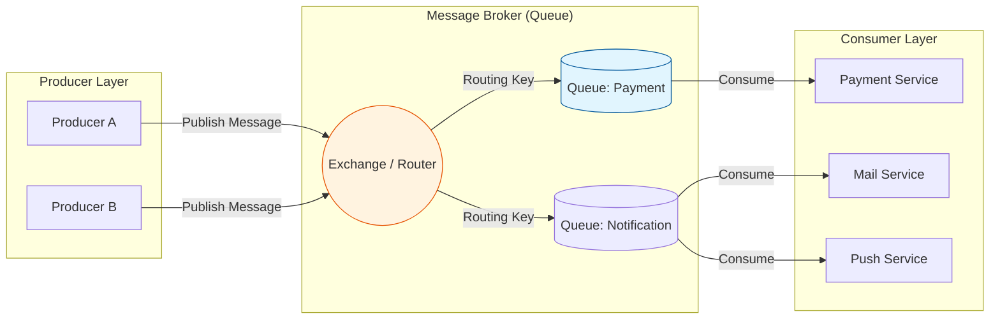

Parent: [[021.Message_Queuing_아키텍처]]

# 1. 메시지 큐(Message Queue) 아키텍처의 개요 및 배경

### 가. 메시지 큐(Message Queue)의 정의
- 프로세스 또는 서비스 간에 데이터를 비동기적으로 교환하기 위해 메시지를 임시로 저장하고 전달하는 **메시지 지향 미들웨어(MOM)** 아키텍처임
- 송신자(Producer)와 수신자(Consumer) 사이의 직접적인 연결을 배제하고 큐(Queue)를 통해 통신을 매개하는 **비동기 통신 체계**임

### 나. 등장 배경 및 필요성
- **시스템 간 결합도(Coupling) 완화**: 동기식(REST/RPC) 호출 시 발생하는 연쇄 장애(Cascading Failure) 차단 필요
- **트래픽 급증(Spike) 대응**: 대규모 요청 발생 시 큐가 버퍼 역할을 수행하여 백엔드 시스템의 부하를 조절하는 **Shock Absorbing** 기능 요구
- **응답 시간(Latency) 개선**: 시간이 오래 걸리는 작업을 비동기로 처리하여 사용자에게 즉각적인 응답 제공 가능

# 2. 메시지 큐의 아키텍처 및 핵심 메커니즘

### 가. 메시지 큐 운영 아키텍처 개념도 (Pub/Sub 모델)

### 나. 핵심 구성 요소 및 역할
| 요소 | 명칭 | 상세 역할 |
| :--- | :--- | :--- |
| **Producer** | **생산자** | 메시지를 생성하여 브로커의 Exchange나 Topic으로 발행하는 주체 |
| **Broker** | **브로커** | 메시지를 수신, 저장, 라우팅 및 관리하는 중앙 미들웨어 (RabbitMQ, Kafka) |
| **Queue / Topic** | **큐 / 토픽** | 메시지가 소비되기 전까지 보관되는 저장소, FIFO 또는 파티션 구조 |
| **Consumer** | **소비자** | 큐를 모니터링하다가 메시지를 가져와 실제 비즈니스 로직을 처리하는 주체 |

# 3. 상세 기술 요소 및 비교 분석

### 가. 메시지 전달 모델 분류
1) **Point-to-Point (P2P)**: 큐에 담긴 하나의 메시지는 오직 한 명의 소비자만 처리 (1:1), 작업 큐에 적합
2) **Publish/Subscribe (Pub/Sub)**: 하나의 이벤트를 다수의 구독자가 동시에 수신하여 처리 (1:N), 이벤트 전파에 적합

### 나. 전통적 MQ와 이벤트 스트리밍(Kafka) 비교
| 비교 항목 | 전통적 Message Broker (RabbitMQ) | Event Streaming (Kafka) |
| :--- | :--- | :--- |
| **주요 목적** | 복잡한 라우팅 및 비동기 작업 지시 | 대용량 실시간 로그 및 이벤트 스트림 처리 |
| **데이터 보관** | 소비 완료(Ack) 시 즉시 삭제 (Transient) | 영구적/장기적 디스크 저장 (Persistent) |
| **재생(Replay)** | 불가능 (일회성 소비) | 가능 (오프셋 조작을 통한 과거 데이터 조회) |
| **성능/확장성** | 상대적으로 낮음 (중앙 집중형) | 매우 높음 (분산 파티셔닝 구조) |

# 4. 기술사적 제언 및 실무 적용 방안

### 가. 실무 도입 시 고려사항
- **멱등성(Idempotency) 보장**: 네트워크 오류로 인한 메시지 중복 전달에 대비하여, 동일 메시지 수신 시 결과가 같도록 설계 필수
- **Dead Letter Queue(DLQ)**: 처리 실패한 메시지를 격리하여 무한 루프를 방지하고 사후 분석을 가능케 하는 관리 체계 구축

### 나. 거버넌스 및 보안(Security) 통제 방안
- **암호화(In-transit/At-rest)**: 메시지 전송 시 TLS 적용 및 브로커 저장 시 데이터 암호화를 통해 민감 정보 유출 차단
- **가용성(HA) 확보**: 브로커의 단일 장애점(SPOF) 방지를 위해 클러스터링 및 미러링 구성 필수

### 다. 최신 트렌드와 연계한 발전 방향
- **Serverless MQ 활용**: AWS SQS, Google Pub/Sub 등 관리 부담이 없는 서버리스 큐 도입으로 운영 효율화
- **EDA(Event-Driven Architecture)의 중추**: 단순 통신 수단을 넘어, 서비스 간 결합도를 극한으로 낮추는 이벤트 중심 아키텍처의 핵심 인프라로 정착

> [!tip] **기술사 인사이트**
> 메시지 큐는 시스템의 **"완충 장치(Shock Absorber)"**입니다. 단순히 데이터를 보내는 통로가 아니라, 분산 시스템의 **탄력성(Resilience)**과 **확장성(Scalability)**을 결정짓는 임계 기술임을 명시해야 합니다.

## Related Notes
- [[009.Microservices_Architecture]]
- [[015.사가_패턴(Saga_Pattern)]]
- [[018.MSA_트랜잭션_관리]]
- [[023.CQRS_패턴(CQRS_Pattern)]]
